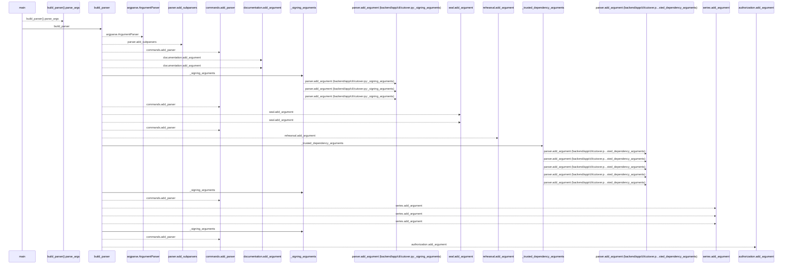
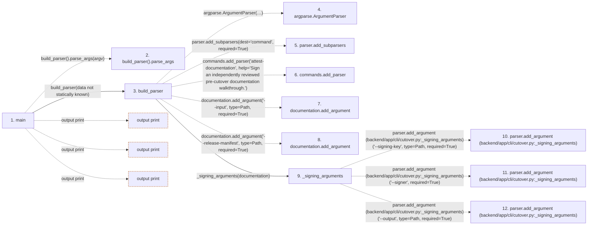

# cutover

**Entry point:** `main` (`process`)
**Source:** [cli_cutover](../modules/cli_cutover.md)
**Modules touched:** [cli_cutover](../modules/cli_cutover.md), [database_migration_cutover](../modules/database_migration_cutover.md), [database_migration_manifest](../modules/database_migration_manifest.md), and 1 more

**Complete modules touched:**

- [cli_cutover](../modules/cli_cutover.md)
- [database_migration_cutover](../modules/database_migration_cutover.md)
- [database_migration_manifest](../modules/database_migration_manifest.md)
- [execution_mode](../modules/execution_mode.md)

**Related modules:** [database_migration_cutover](../modules/database_migration_cutover.md), [database_migration_manifest](../modules/database_migration_manifest.md)

## Call sequence

<!-- Auto-generated from static call edges. Dashed arrows are external or unresolved calls. Reviewed runtime conditions and side effects belong in Behavior. -->

> Call sequence diagram shows 30 of 879 interactions; 849 omitted to keep the visualization within the 30-interaction and generated-diagram limits.

## Data flow

<!-- Auto-generated static analysis. Treat values and boundaries as best-effort hints, not runtime proof. -->

### Step data

| Step | Inputs | Reads | Writes | Returns |
|---|---|---|---|---|
| `main` | `argv: list[str] \| None` | `CutoverEvidenceError`, `ManifestError`, `sys` | - | `0`, `2`, `0`, `2` |
| `build_parser().parse_args` | - | - | - | - |
| `build_parser` | - | `Path`, `Path`, `Path`, `Path`, `Path`, `Path`, `Path`, `Path` | - | `parser` |
| `argparse.ArgumentParser` | - | - | - | - |
| `parser.add_subparsers` | - | - | - | - |
| `commands.add_parser` | - | - | - | - |
| `documentation.add_argument` | - | - | - | - |
| `documentation.add_argument` | - | - | - | - |
| `_signing_arguments` | `parser: argparse.ArgumentParser` | `Path`, `Path` | - | - |
| `parser.add_argument (backend/app/cli/cutover.py:_signing_arguments)` | - | - | - | - |
| `parser.add_argument (backend/app/cli/cutover.py:_signing_arguments)` | - | - | - | - |
| `parser.add_argument (backend/app/cli/cutover.py:_signing_arguments)` | - | - | - | - |

### Call data

| From | To | Line | Call |
|---|---|---:|---|
| main | build_parser().parse_args | 109 | `build_parser().parse_args(argv)` |
| main | build_parser | 109 | `build_parser(data not statically known)` |
| build_parser | argparse.ArgumentParser | 37 | `argparse.ArgumentParser(description='Fail-closed PostgreSQL rehearsal and production-cutover evidence. This command records evidence; it never mutates a database or deployment.')` |
| build_parser | parser.add_subparsers | 43 | `parser.add_subparsers(dest='command', required=True)` |
| build_parser | commands.add_parser | 45 | `commands.add_parser('attest-documentation', help='Sign an independently reviewed pre-cutover documentation walkthrough.')` |
| build_parser | documentation.add_argument | 49 | `documentation.add_argument('--input', type=Path, required=True)` |
| build_parser | documentation.add_argument | 50 | `documentation.add_argument('--release-manifest', type=Path, required=True)` |
| build_parser | _signing_arguments | 51 | `_signing_arguments(documentation)` |
| _signing_arguments | parser.add_argument (backend/app/cli/cutover.py:_signing_arguments) | 31 | `parser.add_argument('--signing-key', type=Path, required=True)` |
| _signing_arguments | parser.add_argument (backend/app/cli/cutover.py:_signing_arguments) | 32 | `parser.add_argument('--signer', required=True)` |
| _signing_arguments | parser.add_argument (backend/app/cli/cutover.py:_signing_arguments) | 33 | `parser.add_argument('--output', type=Path, required=True)` |

### Boundary effects

| Kind | Target | Step | Line |
|---|---|---|---:|
| output | `print` | `main` | 177 |
| output | `print` | `main` | 181 |
| output | `print` | `main` | 193 |

### Static analysis gaps

| Kind | Step | Target | Line |
|---|---|---|---:|
| unresolved_call | `main` | `build_parser().parse_args` | 109 |
| external_call | `build_parser` | `argparse.ArgumentParser` | 37 |
| unresolved_call | `build_parser` | `parser.add_subparsers` | 43 |
| unresolved_call | `build_parser` | `commands.add_parser` | 45 |
| unresolved_call | `build_parser` | `documentation.add_argument` | 49 |
| unresolved_call | `build_parser` | `documentation.add_argument` | 50 |
| unresolved_call | `_signing_arguments` | `parser.add_argument` | 31 |
| unresolved_call | `_signing_arguments` | `parser.add_argument` | 32 |
| unresolved_call | `_signing_arguments` | `parser.add_argument` | 33 |
| step_limit | `main` | `first 12 steps` | 0 |

## Behavior

This flow starts at `main` and is classified as `process`. The generated call and data-flow sections are bounded static projections; runtime conditions and side effects require source-level confirmation.
