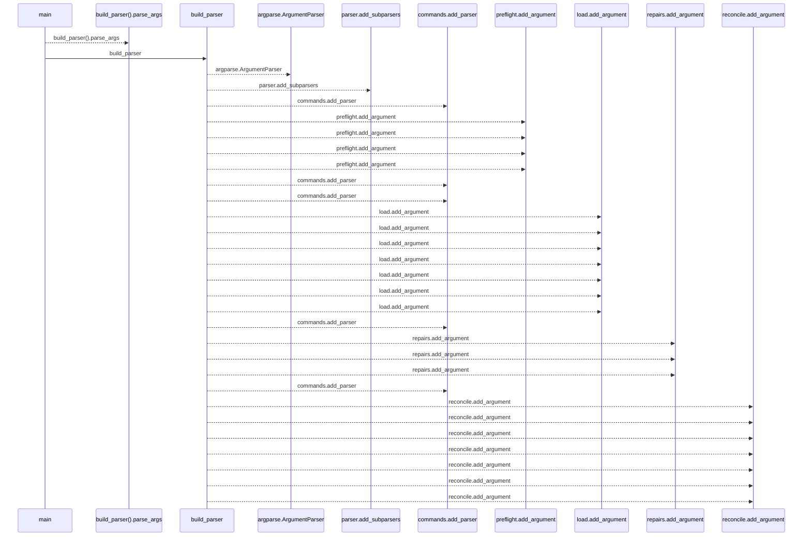
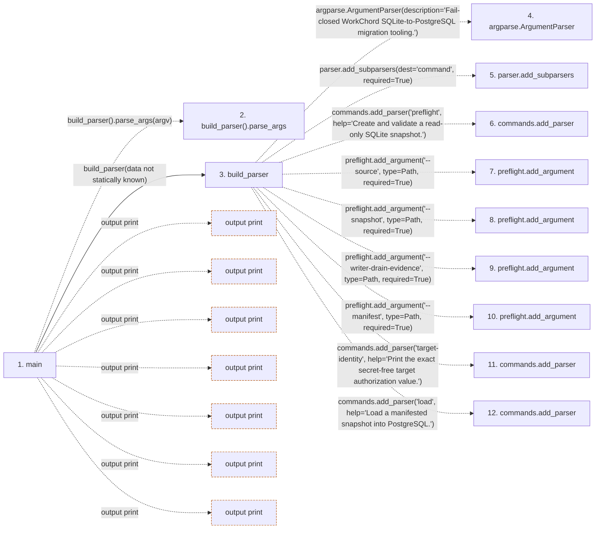

# database_migration

**Entry point:** `main` (`process`)
**Source:** [cli_database_migration](../modules/cli_database_migration.md)
**Modules touched:** [authority](../modules/authority.md), [calendar_service](../modules/calendar_service.md), [catalog](../modules/catalog.md), [cli_database_migration](../modules/cli_database_migration.md), and 17 more

**Complete modules touched:**

- [authority](../modules/authority.md)
- [calendar_service](../modules/calendar_service.md)
- [catalog](../modules/catalog.md)
- [cli_database_migration](../modules/cli_database_migration.md)
- [commands](../modules/commands.md)
- [config](../modules/config.md)
- [database_config](../modules/database_config.md)
- [database_migration_canonical](../modules/database_migration_canonical.md)
- [database_migration_manifest](../modules/database_migration_manifest.md)
- [github_status_automation_service](../modules/github_status_automation_service.md)
- [identity_service](../modules/identity_service.md)
- [label_service](../modules/label_service.md)
- [maintenance](../modules/maintenance.md)
- [models_identity](../modules/models_identity.md)
- [saved_view_service](../modules/saved_view_service.md)
- [source](../modules/source.md)
- [system_settings_service](../modules/system_settings_service.md)
- [template_service](../modules/template_service.md)
- [time](../modules/time.md)
- [transfer](../modules/transfer.md)
- [upgrade_service](../modules/upgrade_service.md)

**Related modules:** [database_migration_manifest](../modules/database_migration_manifest.md), [source](../modules/source.md), [transfer](../modules/transfer.md), [upgrade_service](../modules/upgrade_service.md)

## Call sequence

<!-- Auto-generated from static call edges. Dashed arrows are external or unresolved calls. Reviewed runtime conditions and side effects belong in Behavior. -->

> Call sequence diagram shows 30 of 1119 interactions; 1089 omitted to keep the visualization within the 30-interaction and generated-diagram limits.

> Trace truncated at the depth limit; deeper calls are omitted.

## Data flow

<!-- Auto-generated static analysis. Treat values and boundaries as best-effort hints, not runtime proof. -->

### Step data

| Step | Inputs | Reads | Writes | Returns |
|---|---|---|---|---|
| `main` | `argv: list[str] \| None` | `ManifestError`, `MigrationDataError`, `sys` | - | `0`, `0`, `0`, `0`, `0`, `0`, `2`, `2` |
| `build_parser().parse_args` | - | - | - | - |
| `build_parser` | - | `Path`, `Path`, `Path`, `Path`, `Path`, `Path`, `Path`, `Path` | - | `parser` |
| `argparse.ArgumentParser` | - | - | - | - |
| `parser.add_subparsers` | - | - | - | - |
| `commands.add_parser` | - | - | - | - |
| `preflight.add_argument` | - | - | - | - |
| `preflight.add_argument` | - | - | - | - |
| `preflight.add_argument` | - | - | - | - |
| `preflight.add_argument` | - | - | - | - |
| `commands.add_parser` | - | - | - | - |
| `commands.add_parser` | - | - | - | - |

### Call data

| From | To | Line | Call |
|---|---|---:|---|
| main | build_parser().parse_args | 94 | `build_parser().parse_args(argv)` |
| main | build_parser | 94 | `build_parser(data not statically known)` |
| build_parser | argparse.ArgumentParser | 22 | `argparse.ArgumentParser(description='Fail-closed WorkChord SQLite-to-PostgreSQL migration tooling.')` |
| build_parser | parser.add_subparsers | 25 | `parser.add_subparsers(dest='command', required=True)` |
| build_parser | commands.add_parser | 27 | `commands.add_parser('preflight', help='Create and validate a read-only SQLite snapshot.')` |
| build_parser | preflight.add_argument | 30 | `preflight.add_argument('--source', type=Path, required=True)` |
| build_parser | preflight.add_argument | 31 | `preflight.add_argument('--snapshot', type=Path, required=True)` |
| build_parser | preflight.add_argument | 32 | `preflight.add_argument('--writer-drain-evidence', type=Path, required=True)` |
| build_parser | preflight.add_argument | 33 | `preflight.add_argument('--manifest', type=Path, required=True)` |
| build_parser | commands.add_parser | 35 | `commands.add_parser('target-identity', help='Print the exact secret-free target authorization value.')` |
| build_parser | commands.add_parser | 39 | `commands.add_parser('load', help='Load a manifested snapshot into PostgreSQL.')` |

### Boundary effects

| Kind | Target | Step | Line |
|---|---|---|---:|
| output | `print` | `main` | 103 |
| output | `print` | `main` | 114 |
| output | `print` | `main` | 126 |
| output | `print` | `main` | 137 |
| output | `print` | `main` | 152 |
| output | `print` | `main` | 159 |
| output | `print` | `main` | 163 |

### Static analysis gaps

| Kind | Step | Target | Line |
|---|---|---|---:|
| unresolved_call | `main` | `build_parser().parse_args` | 94 |
| external_call | `build_parser` | `argparse.ArgumentParser` | 22 |
| unresolved_call | `build_parser` | `parser.add_subparsers` | 25 |
| unresolved_call | `build_parser` | `commands.add_parser` | 27 |
| unresolved_call | `build_parser` | `preflight.add_argument` | 30 |
| unresolved_call | `build_parser` | `preflight.add_argument` | 31 |
| unresolved_call | `build_parser` | `preflight.add_argument` | 32 |
| unresolved_call | `build_parser` | `preflight.add_argument` | 33 |
| unresolved_call | `build_parser` | `commands.add_parser` | 35 |
| unresolved_call | `build_parser` | `commands.add_parser` | 39 |
| step_limit | `main` | `first 12 steps` | 0 |
| truncated_flow | `main` | `depth limit` | 0 |

## Behavior

This flow starts at `main` and is classified as `process`. The generated call and data-flow sections are bounded static projections; runtime conditions and side effects require source-level confirmation.
