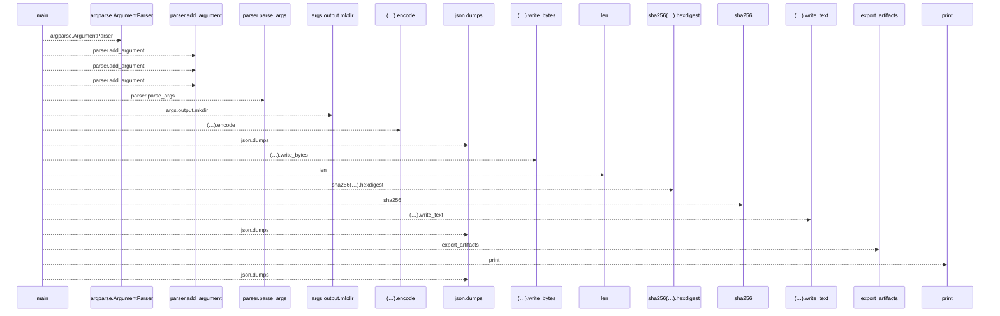
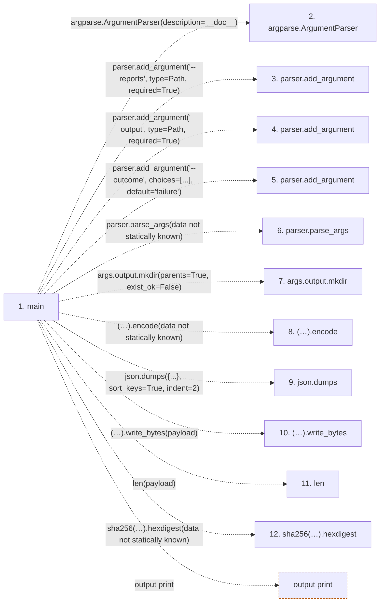

# export_acceptance_artifacts

**Entry point:** `main` (`process`)
**Source:** [export_acceptance_artifacts](../modules/export_acceptance_artifacts.md)
**Modules touched:** [export_acceptance_artifacts](../modules/export_acceptance_artifacts.md)

**Related modules:** [acceptance_artifacts](../modules/acceptance_artifacts.md)

## Call sequence

<!-- Auto-generated from static call edges. Dashed arrows are external or unresolved calls. Reviewed runtime conditions and side effects belong in Behavior. -->

## Data flow

<!-- Auto-generated static analysis. Treat values and boundaries as best-effort hints, not runtime proof. -->

### Step data

| Step | Inputs | Reads | Writes | Returns |
|---|---|---|---|---|
| `main` | - | `Path`, `Path` | - | `2`, `...` |
| `argparse.ArgumentParser` | - | - | - | - |
| `parser.add_argument` | - | - | - | - |
| `parser.add_argument` | - | - | - | - |
| `parser.add_argument` | - | - | - | - |
| `parser.parse_args` | - | - | - | - |
| `args.output.mkdir` | - | - | - | - |
| `(…).encode` | - | - | - | - |
| `json.dumps` | - | - | - | - |
| `(…).write_bytes` | - | - | - | - |
| `len` | - | - | - | - |
| `sha256(…).hexdigest` | - | - | - | - |

### Call data

| From | To | Line | Call |
|---|---|---:|---|
| main | argparse.ArgumentParser | 15 | `argparse.ArgumentParser(description=__doc__)` |
| main | parser.add_argument | 16 | `parser.add_argument('--reports', type=Path, required=True)` |
| main | parser.add_argument | 17 | `parser.add_argument('--output', type=Path, required=True)` |
| main | parser.add_argument | 18 | `parser.add_argument('--outcome', choices=[...], default='failure')` |
| main | parser.parse_args | 19 | `parser.parse_args(data not statically known)` |
| main | args.output.mkdir | 24 | `args.output.mkdir(parents=True, exist_ok=False)` |
| main | (…).encode | 25 | `(json.dumps({'schema_version': 1, 'run_outcome': 'failure', 'complete': False, 'status': 'export-validator-unavailable', 'accepted_as_production_evidence': False}, sort_keys=True, indent=2) + '\n').encode(data not statically known)` |
| main | json.dumps | 25 | `json.dumps({...}, sort_keys=True, indent=2)` |
| main | (…).write_bytes | 28 | `(args.output / 'failure-summary.json').write_bytes(payload)` |
| main | len | 30 | `len(payload)` |
| main | sha256(…).hexdigest | 30 | `sha256(payload).hexdigest(data not statically known)` |

### Boundary effects

| Kind | Target | Step | Line |
|---|---|---|---:|
| output | `print` | `main` | 34 |

### Static analysis gaps

| Kind | Step | Target | Line |
|---|---|---|---:|
| external_call | `main` | `argparse.ArgumentParser` | 15 |
| unresolved_call | `main` | `parser.add_argument` | 16 |
| unresolved_call | `main` | `parser.add_argument` | 17 |
| unresolved_call | `main` | `parser.add_argument` | 18 |
| unresolved_call | `main` | `parser.parse_args` | 19 |
| unresolved_call | `main` | `args.output.mkdir` | 24 |
| unresolved_call | `main` | `(json.dumps({'schema_version': 1, 'run_outcome': 'failure', 'complete': False, 'status': 'export-validator-unavailable', 'accepted_as_production_evidence': False}, sort_keys=True, indent=2) + '\n').encode` | 25 |
| external_call | `main` | `json.dumps` | 25 |
| unresolved_call | `main` | `(args.output / 'failure-summary.json').write_bytes` | 28 |
| unresolved_call | `main` | `sha256(payload).hexdigest` | 30 |
| step_limit | `main` | `first 12 steps` | 0 |

## Behavior

This flow starts at `main` and is classified as `process`. The generated call and data-flow sections are bounded static projections; runtime conditions and side effects require source-level confirmation.
