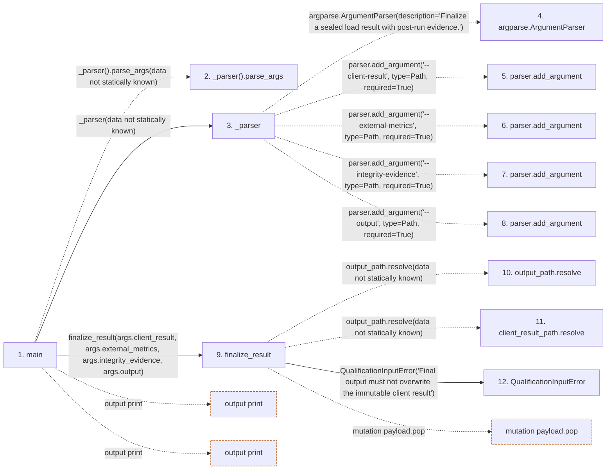

# finalize

**Entry point:** `main` (`process`)
**Source:** [finalize](../modules/finalize.md)
**Modules touched:** [autonomy_canonical](../modules/autonomy_canonical.md), [finalize](../modules/finalize.md), [load_common](../modules/load_common.md), [loader](../modules/loader.md), [result](../modules/result.md)

**Related modules:** [load_common](../modules/load_common.md), [result](../modules/result.md)

## Call sequence

```mermaid
sequenceDiagram
    participant p0 as main
    participant p1 as _parser().parse_args
    participant p2 as _parser
    participant p3 as argparse.ArgumentParser
    participant p4 as parser.add_argument
    participant p5 as finalize_result
    participant p6 as output_path.resolve
    participant p7 as client_result_path.resolve
    participant p8 as QualificationInputError
    participant p9 as read_json_object
    participant p10 as json.loads
    participant p11 as path.read_text
    participant p12 as isinstance (scripts/load/common.py:read_json_object)
    participant p13 as verify_document
    participant p14 as document.get (scripts/load/common.py:verify_document)
    participant p15 as isinstance (scripts/load/common.py:verify_document)
    participant p16 as len (scripts/load/common.py:verify_document)
    participant p17 as dict (scripts/load/common.py:verify_document)
    participant p18 as payload.pop (scripts/load/common.py:verify_document)
    participant p19 as sha256_bytes
    participant p20 as hashlib.sha256(…).hexdigest
    participant p21 as hashlib.sha256
    participant p22 as canonical_json_bytes (scripts/load/common.py)
    participant p23 as json.dumps(…).encode (scripts/load/common.py:canonical_json_bytes)
    participant p24 as json.dumps (scripts/load/common.py:canonical_json_bytes)
    p0-->>p1: _parser().parse_args
    p0->>p2: _parser
    p2-->>p3: argparse.ArgumentParser
    p2-->>p4: parser.add_argument
    p2-->>p4: parser.add_argument
    p2-->>p4: parser.add_argument
    p2-->>p4: parser.add_argument
    p0->>p5: finalize_result
    p5-->>p6: output_path.resolve
    p5-->>p7: client_result_path.resolve
    p5->>p8: QualificationInputError
    p5->>p9: read_json_object
    p9-->>p10: json.loads
    p9-->>p11: path.read_text
    p9->>p8: QualificationInputError
    p9-->>p12: isinstance (scripts/load/common.py:read_json_object)
    p9->>p8: QualificationInputError
    p9->>p13: verify_document
    p13-->>p14: document.get (scripts/load/common.py:verify_document)
    p13-->>p15: isinstance (scripts/load/common.py:verify_document)
    p13-->>p16: len (scripts/load/common.py:verify_document)
    p13->>p8: QualificationInputError
    p13-->>p17: dict (scripts/load/common.py:verify_document)
    p13-->>p18: payload.pop (scripts/load/common.py:verify_document)
    p13->>p19: sha256_bytes
    p19-->>p20: hashlib.sha256(…).hexdigest
    p19-->>p21: hashlib.sha256
    p13->>p22: canonical_json_bytes (scripts/load/common.py)
    p22-->>p23: json.dumps(…).encode (scripts/load/common.py:canonical_json_bytes)
    p22-->>p24: json.dumps (scripts/load/common.py:canonical_json_bytes)
```

<!-- Auto-generated from static call edges. Dashed arrows are external or unresolved calls. Reviewed runtime conditions and side effects belong in Behavior. -->

> Call sequence diagram shows 30 of 390 interactions; 360 omitted to keep the visualization within the 30-interaction and generated-diagram limits.

> Trace truncated at the depth limit; deeper calls are omitted.

## Data flow

<!-- Auto-generated static analysis. Treat values and boundaries as best-effort hints, not runtime proof. -->

### Step data

| Step | Inputs | Reads | Writes | Returns |
|---|---|---|---|---|
| `main` | - | `QualificationInputError`, `sys` | - | `...`, `2` |
| `_parser().parse_args` | - | - | - | - |
| `_parser` | - | `Path`, `Path`, `Path`, `Path` | - | `parser` |
| `argparse.ArgumentParser` | - | - | - | - |
| `parser.add_argument` | - | - | - | - |
| `parser.add_argument` | - | - | - | - |
| `parser.add_argument` | - | - | - | - |
| `parser.add_argument` | - | - | - | - |
| `finalize_result` | `client_result_path: Path`, `external_metrics_path: Path`, `integrity_path: Path`, `output_path: Path` | - | `payload[...]`, `payload[...]`, `payload[...]`, `payload[...]` | `finalized` |
| `output_path.resolve` | - | - | - | - |
| `client_result_path.resolve` | - | - | - | - |
| `QualificationInputError` | - | - | - | - |

### Call data

| From | To | Line | Call |
|---|---|---:|---|
| main | _parser().parse_args | 114 | `_parser().parse_args(data not statically known)` |
| main | _parser | 114 | `_parser(data not statically known)` |
| _parser | argparse.ArgumentParser | 103 | `argparse.ArgumentParser(description='Finalize a sealed load result with post-run evidence.')` |
| _parser | parser.add_argument | 106 | `parser.add_argument('--client-result', type=Path, required=True)` |
| _parser | parser.add_argument | 107 | `parser.add_argument('--external-metrics', type=Path, required=True)` |
| _parser | parser.add_argument | 108 | `parser.add_argument('--integrity-evidence', type=Path, required=True)` |
| _parser | parser.add_argument | 109 | `parser.add_argument('--output', type=Path, required=True)` |
| main | finalize_result | 116 | `finalize_result(args.client_result, args.external_metrics, args.integrity_evidence, args.output)` |
| finalize_result | output_path.resolve | 44 | `output_path.resolve(data not statically known)` |
| finalize_result | client_result_path.resolve | 44 | `output_path.resolve(data not statically known)` |
| finalize_result | QualificationInputError | 45 | `QualificationInputError('Final output must not overwrite the immutable client result')` |

### Boundary effects

| Kind | Target | Step | Line |
|---|---|---|---:|
| output | `print` | `main` | 122 |
| output | `print` | `main` | 128 |
| mutation | `payload.pop` | `finalize_result` | 78 |

### Static analysis gaps

| Kind | Step | Target | Line |
|---|---|---|---:|
| unresolved_call | `main` | `_parser().parse_args` | 114 |
| external_call | `_parser` | `argparse.ArgumentParser` | 103 |
| unresolved_call | `_parser` | `parser.add_argument` | 106 |
| unresolved_call | `_parser` | `parser.add_argument` | 107 |
| unresolved_call | `_parser` | `parser.add_argument` | 108 |
| unresolved_call | `_parser` | `parser.add_argument` | 109 |
| unresolved_call | `finalize_result` | `output_path.resolve` | 44 |
| unresolved_call | `finalize_result` | `client_result_path.resolve` | 44 |
| step_limit | `main` | `first 12 steps` | 0 |
| truncated_flow | `main` | `depth limit` | 0 |

## Behavior

This flow starts at `main` and is classified as `process`. The generated call and data-flow sections are bounded static projections; runtime conditions and side effects require source-level confirmation.
