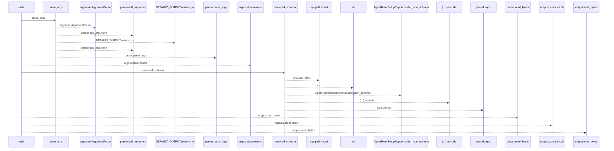
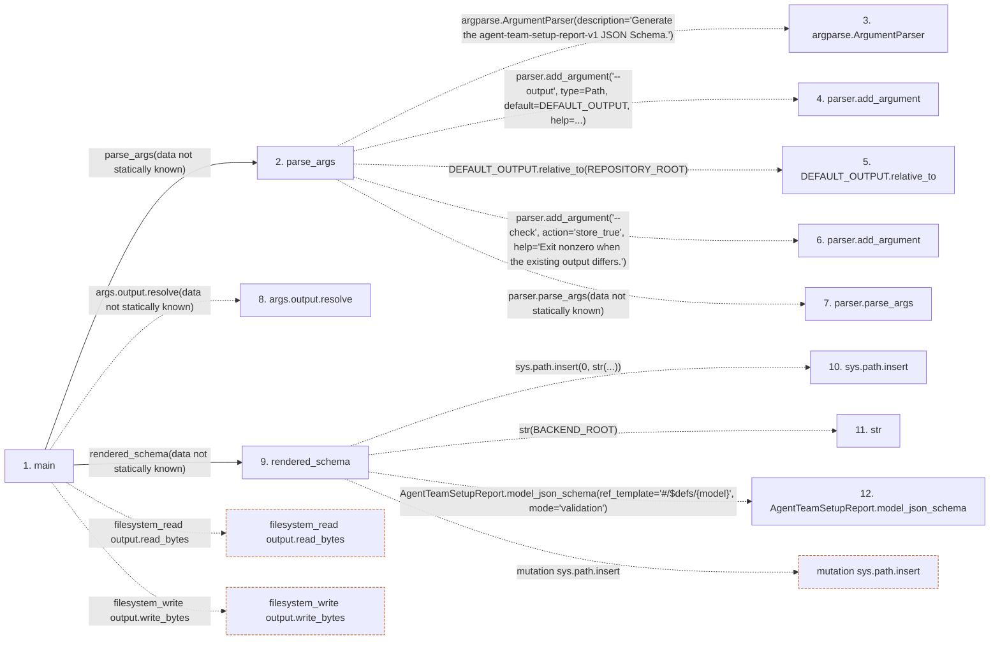

# generate_agent_team_report_contract

**Entry point:** `main` (`process`)
**Source:** [generate_agent_team_report_contract](../modules/generate_agent_team_report_contract.md)
**Modules touched:** [generate_agent_team_report_contract](../modules/generate_agent_team_report_contract.md)

**Related modules:** [agent_team_setup](../modules/agent_team_setup.md)

## Call sequence

<!-- Auto-generated from static call edges. Dashed arrows are external or unresolved calls. Reviewed runtime conditions and side effects belong in Behavior. -->

## Data flow

<!-- Auto-generated static analysis. Treat values and boundaries as best-effort hints, not runtime proof. -->

### Step data

| Step | Inputs | Reads | Writes | Returns |
|---|---|---|---|---|
| `main` | - | - | - | `1`, `...`, `0` |
| `parse_args` | - | `Path`, `DEFAULT_OUTPUT`, `REPOSITORY_ROOT` | - | `parser.parse_args(...)` |
| `argparse.ArgumentParser` | - | - | - | - |
| `parser.add_argument` | - | - | - | - |
| `DEFAULT_OUTPUT.relative_to` | - | - | - | - |
| `parser.add_argument` | - | - | - | - |
| `parser.parse_args` | - | - | - | - |
| `args.output.resolve` | - | - | - | - |
| `rendered_schema` | - | `BACKEND_ROOT` | `schema[...]`, `schema[...]` | `...` |
| `sys.path.insert` | - | - | - | - |
| `str` | - | - | - | - |
| `AgentTeamSetupReport.model_json_schema` | - | - | - | - |

### Call data

| From | To | Line | Call |
|---|---|---:|---|
| main | parse_args | 63 | `parse_args(data not statically known)` |
| parse_args | argparse.ArgumentParser | 23 | `argparse.ArgumentParser(description='Generate the agent-team-setup-report-v1 JSON Schema.')` |
| parse_args | parser.add_argument | 26 | `parser.add_argument('--output', type=Path, default=DEFAULT_OUTPUT, help=...)` |
| parse_args | DEFAULT_OUTPUT.relative_to | 32 | `DEFAULT_OUTPUT.relative_to(REPOSITORY_ROOT)` |
| parse_args | parser.add_argument | 35 | `parser.add_argument('--check', action='store_true', help='Exit nonzero when the existing output differs.')` |
| parse_args | parser.parse_args | 40 | `parser.parse_args(data not statically known)` |
| main | args.output.resolve | 64 | `args.output.resolve(data not statically known)` |
| main | rendered_schema | 65 | `rendered_schema(data not statically known)` |
| rendered_schema | sys.path.insert | 44 | `sys.path.insert(0, str(...))` |
| rendered_schema | str | 44 | `str(BACKEND_ROOT)` |
| rendered_schema | AgentTeamSetupReport.model_json_schema | 47 | `AgentTeamSetupReport.model_json_schema(ref_template='#/$defs/{model}', mode='validation')` |

### Boundary effects

| Kind | Target | Step | Line |
|---|---|---|---:|
| filesystem_read | `output.read_bytes` | `main` | 68 |
| filesystem_write | `output.write_bytes` | `main` | 73 |
| mutation | `sys.path.insert` | `rendered_schema` | 44 |

### Static analysis gaps

| Kind | Step | Target | Line |
|---|---|---|---:|
| external_call | `parse_args` | `argparse.ArgumentParser` | 23 |
| unresolved_call | `parse_args` | `parser.add_argument` | 26 |
| unresolved_call | `parse_args` | `DEFAULT_OUTPUT.relative_to` | 32 |
| unresolved_call | `parse_args` | `parser.add_argument` | 35 |
| unresolved_call | `parse_args` | `parser.parse_args` | 40 |
| unresolved_call | `main` | `args.output.resolve` | 64 |
| unresolved_call | `rendered_schema` | `AgentTeamSetupReport.model_json_schema` | 47 |
| step_limit | `main` | `first 12 steps` | 0 |

## Behavior

This flow starts at `main` and is classified as `process`. The generated call and data-flow sections are bounded static projections; runtime conditions and side effects require source-level confirmation.
