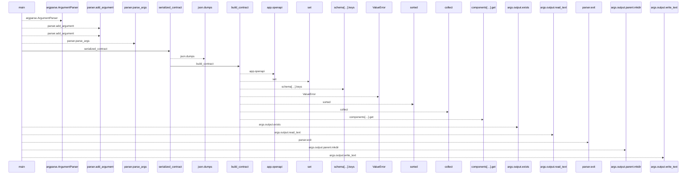
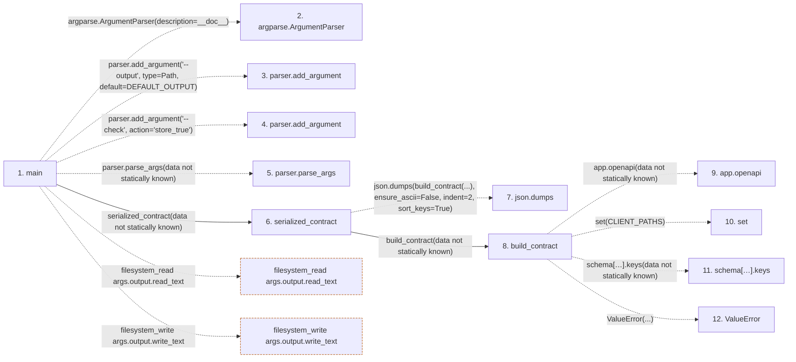

# generate_client_contract

**Entry point:** `main` (`process`)
**Source:** [generate_client_contract](../modules/generate_client_contract.md)
**Modules touched:** [generate_client_contract](../modules/generate_client_contract.md)

**Related modules:** [app_main](../modules/app_main.md)

## Call sequence

<!-- Auto-generated from static call edges. Dashed arrows are external or unresolved calls. Reviewed runtime conditions and side effects belong in Behavior. -->

## Data flow

<!-- Auto-generated static analysis. Treat values and boundaries as best-effort hints, not runtime proof. -->

### Step data

| Step | Inputs | Reads | Writes | Returns |
|---|---|---|---|---|
| `main` | - | `Path`, `DEFAULT_OUTPUT` | - | - |
| `argparse.ArgumentParser` | - | - | - | - |
| `parser.add_argument` | - | - | - | - |
| `parser.add_argument` | - | - | - | - |
| `parser.parse_args` | - | - | - | - |
| `serialized_contract` | - | - | - | `...` |
| `json.dumps` | - | - | - | - |
| `build_contract` | - | `CLIENT_PATHS`, `CLIENT_PATHS`, `app` | - | `{...}` |
| `app.openapi` | - | - | - | - |
| `set` | - | - | - | - |
| `schema[…].keys` | - | - | - | - |
| `ValueError` | - | - | - | - |

### Call data

| From | To | Line | Call |
|---|---|---:|---|
| main | argparse.ArgumentParser | 69 | `argparse.ArgumentParser(description=__doc__)` |
| main | parser.add_argument | 70 | `parser.add_argument('--output', type=Path, default=DEFAULT_OUTPUT)` |
| main | parser.add_argument | 71 | `parser.add_argument('--check', action='store_true')` |
| main | parser.parse_args | 72 | `parser.parse_args(data not statically known)` |
| main | serialized_contract | 73 | `serialized_contract(data not statically known)` |
| serialized_contract | json.dumps | 65 | `json.dumps(build_contract(...), ensure_ascii=False, indent=2, sort_keys=True)` |
| serialized_contract | build_contract | 65 | `build_contract(data not statically known)` |
| build_contract | app.openapi | 24 | `app.openapi(data not statically known)` |
| build_contract | set | 25 | `set(CLIENT_PATHS)` |
| build_contract | schema[…].keys | 25 | `schema['paths'].keys(data not statically known)` |
| build_contract | ValueError | 27 | `ValueError(...)` |

### Boundary effects

| Kind | Target | Step | Line |
|---|---|---|---:|
| filesystem_read | `args.output.read_text` | `main` | 75 |
| filesystem_write | `args.output.write_text` | `main` | 79 |

### Static analysis gaps

| Kind | Step | Target | Line |
|---|---|---|---:|
| external_call | `main` | `argparse.ArgumentParser` | 69 |
| unresolved_call | `main` | `parser.add_argument` | 70 |
| unresolved_call | `main` | `parser.add_argument` | 71 |
| unresolved_call | `main` | `parser.parse_args` | 72 |
| external_call | `serialized_contract` | `json.dumps` | 65 |
| unresolved_call | `build_contract` | `app.openapi` | 24 |
| unresolved_call | `build_contract` | `schema['paths'].keys` | 25 |
| external_call | `build_contract` | `ValueError` | 27 |
| step_limit | `main` | `first 12 steps` | 0 |

## Behavior

The exporter reads registered schema metadata without starting the HTTP lifespan. It follows referenced component schemas, serializes deterministically, and either writes the requested artifact or compares exact bytes under --check. Route removal fails explicitly. It provides a shared contract baseline without introducing a public feature-capability endpoint.
