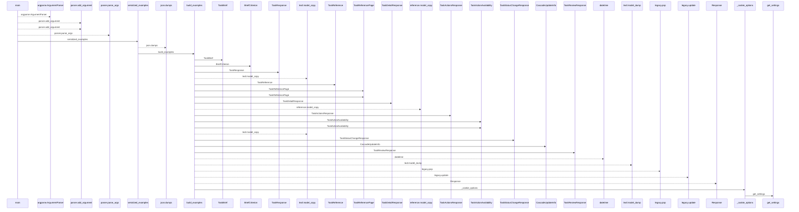
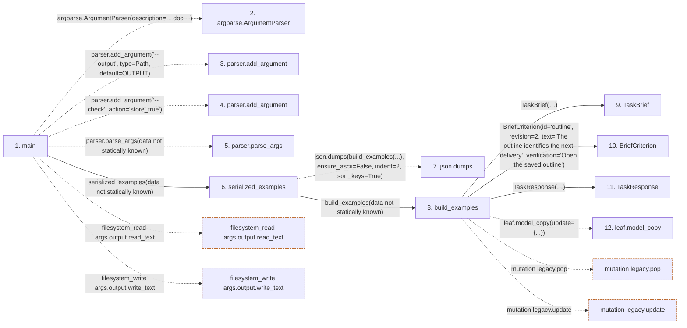

# generate_mobile_contract_fixtures

**Entry point:** `main` (`process`)
**Source:** [generate_mobile_contract_fixtures](../modules/generate_mobile_contract_fixtures.md)
**Modules touched:** [config](../modules/config.md), [generate_mobile_contract_fixtures](../modules/generate_mobile_contract_fixtures.md), [schemas_task](../modules/schemas_task.md), and 5 more

**Complete modules touched:**

- [config](../modules/config.md)
- [generate_mobile_contract_fixtures](../modules/generate_mobile_contract_fixtures.md)
- [schemas_task](../modules/schemas_task.md)
- [schemas_task_brief](../modules/schemas_task_brief.md)
- [schemas_task_domain](../modules/schemas_task_domain.md)
- [session_service](../modules/session_service.md)
- [task_detail](../modules/task_detail.md)
- [task_service](../modules/task_service.md)

**Related modules:** [schemas_task](../modules/schemas_task.md), [schemas_task_brief](../modules/schemas_task_brief.md), [schemas_task_domain](../modules/schemas_task_domain.md), [session_service](../modules/session_service.md), and 2 more

**Complete related modules:**

- [schemas_task](../modules/schemas_task.md)
- [schemas_task_brief](../modules/schemas_task_brief.md)
- [schemas_task_domain](../modules/schemas_task_domain.md)
- [session_service](../modules/session_service.md)
- [task_detail](../modules/task_detail.md)
- [task_service](../modules/task_service.md)

## Call sequence

<!-- Auto-generated from static call edges. Dashed arrows are external or unresolved calls. Reviewed runtime conditions and side effects belong in Behavior. -->

> Call sequence diagram shows 30 of 47 interactions; 17 omitted to keep the visualization within the 30-interaction and generated-diagram limits.

## Data flow

<!-- Auto-generated static analysis. Treat values and boundaries as best-effort hints, not runtime proof. -->

### Step data

| Step | Inputs | Reads | Writes | Returns |
|---|---|---|---|---|
| `main` | - | `Path`, `OUTPUT` | - | - |
| `argparse.ArgumentParser` | - | - | - | - |
| `parser.add_argument` | - | - | - | - |
| `parser.add_argument` | - | - | - | - |
| `parser.parse_args` | - | - | - | - |
| `serialized_examples` | - | - | - | `...` |
| `json.dumps` | - | - | - | - |
| `build_examples` | - | `UTC` | - | `{...}` |
| `TaskBrief` | - | - | - | - |
| `BriefCriterion` | - | - | - | - |
| `TaskResponse` | - | - | - | - |
| `leaf.model_copy` | - | - | - | - |

### Call data

| From | To | Line | Call |
|---|---|---:|---|
| main | argparse.ArgumentParser | 72 | `argparse.ArgumentParser(description=__doc__)` |
| main | parser.add_argument | 73 | `parser.add_argument('--output', type=Path, default=OUTPUT)` |
| main | parser.add_argument | 74 | `parser.add_argument('--check', action='store_true')` |
| main | parser.parse_args | 75 | `parser.parse_args(data not statically known)` |
| main | serialized_examples | 76 | `serialized_examples(data not statically known)` |
| serialized_examples | json.dumps | 68 | `json.dumps(build_examples(...), ensure_ascii=False, indent=2, sort_keys=True)` |
| serialized_examples | build_examples | 68 | `build_examples(data not statically known)` |
| build_examples | TaskBrief | 24 | `TaskBrief(goal='Deliver a reviewed outline', context='Coordinate with the team', scope='Write the outline', exclusions='Publishing', verification='Read the saved artifact', artifact_expectations='A versioned outline', acceptance_criteria=[...])` |
| build_examples | BriefCriterion | 26 | `BriefCriterion(id='outline', revision=2, text='The outline identifies the next delivery', verification='Open the saved outline')` |
| build_examples | TaskResponse | 27 | `TaskResponse(id=72, title='Review the outline', iteration_id=None, project_id=9, parent_id=71, description='Legacy text is retained independently', priority=3, effort_days=None, effort_hours=None, start_date=None, end_date=None, status='active', version=7, owner_profile_id=4, blocked_reason='Waiting for feedback', execution_mode='manual', brief=brief, brief_revision=3, artifact_revision=2, progress={...})` |
| build_examples | leaf.model_copy | 33 | `leaf.model_copy(update={...})` |

### Boundary effects

| Kind | Target | Step | Line |
|---|---|---|---:|
| filesystem_read | `args.output.read_text` | `main` | 78 |
| filesystem_write | `args.output.write_text` | `main` | 82 |
| mutation | `legacy.pop` | `build_examples` | 53 |
| mutation | `legacy.update` | `build_examples` | 54 |

### Static analysis gaps

| Kind | Step | Target | Line |
|---|---|---|---:|
| external_call | `main` | `argparse.ArgumentParser` | 72 |
| unresolved_call | `main` | `parser.add_argument` | 73 |
| unresolved_call | `main` | `parser.add_argument` | 74 |
| unresolved_call | `main` | `parser.parse_args` | 75 |
| external_call | `serialized_examples` | `json.dumps` | 68 |
| unresolved_call | `build_examples` | `leaf.model_copy` | 33 |
| step_limit | `main` | `first 12 steps` | 0 |

## Behavior

Builds deterministic sample payloads through the current backend models and includes the selected OpenAPI components. Check mode compares the complete serialized output to the committed mobile resource and fails on drift. Normal mode writes only the requested output. The caller supplies backend imports and controls the execution environment; no provider credential or live account is required.
