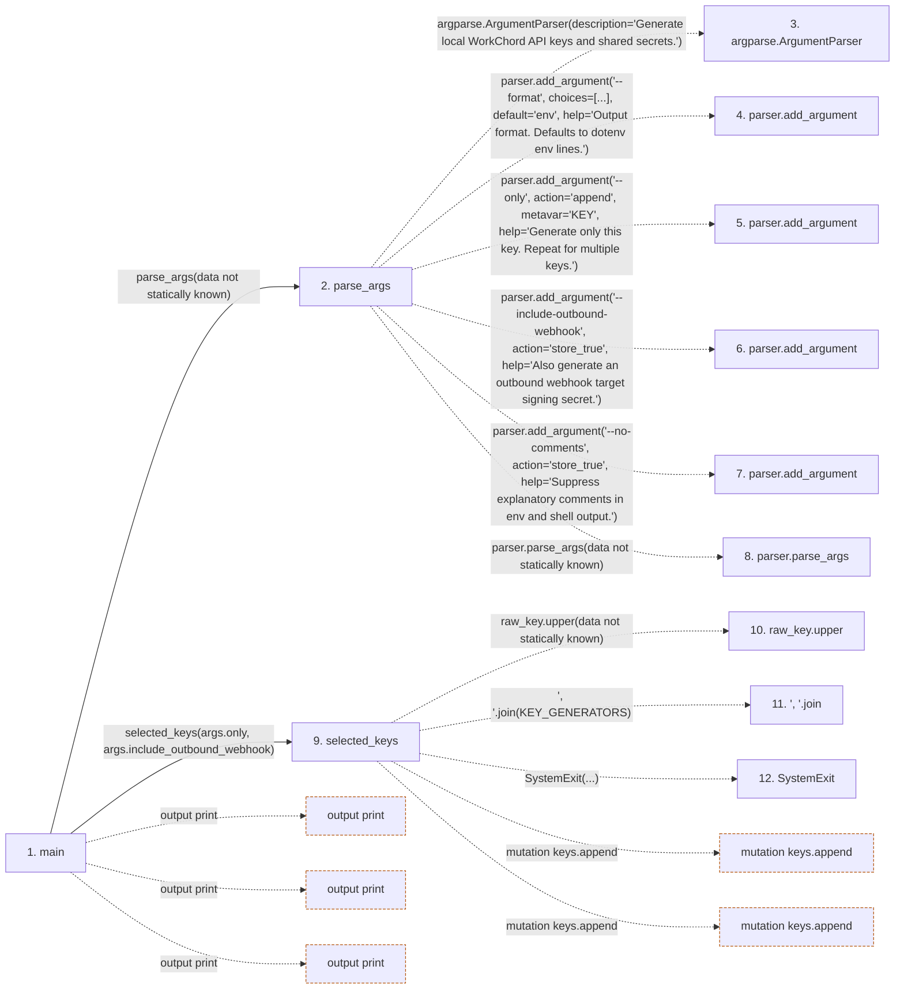

# generate_workchord_keys

**Entry point:** `main` (`process`)
**Source:** [generate_workchord_keys](../modules/generate_workchord_keys.md)
**Modules touched:** [generate_workchord_keys](../modules/generate_workchord_keys.md)

## Call sequence

```mermaid
sequenceDiagram
    participant p0 as main
    participant p1 as parse_args
    participant p2 as argparse.ArgumentParser
    participant p3 as parser.add_argument
    participant p4 as parser.parse_args
    participant p5 as selected_keys
    participant p6 as raw_key.upper
    participant p7 as ', '.join
    participant p8 as SystemExit
    participant p9 as keys.append
    participant p10 as build_payload
    participant p11 as datetime.now(…).isoformat
    participant p12 as datetime.now
    participant p13 as print
    participant p14 as json.dumps
    participant p15 as render_shell
    participant p16 as isinstance (scripts/api_keys/generate…chord_keys.py:render_shell)
    participant p17 as lines.append (scripts/api_keys/generate…chord_keys.py:render_shell)
    participant p18 as values.items (scripts/api_keys/generate…chord_keys.py:render_shell)
    participant p19 as shlex.quote
    participant p20 as str
    participant p21 as '\n'.join (scripts/api_keys/generate…chord_keys.py:render_shell)
    participant p22 as render_env
    participant p23 as isinstance (scripts/api_keys/generate…rkchord_keys.py:render_env)
    p0->>p1: parse_args
    p1-->>p2: argparse.ArgumentParser
    p1-->>p3: parser.add_argument
    p1-->>p3: parser.add_argument
    p1-->>p3: parser.add_argument
    p1-->>p3: parser.add_argument
    p1-->>p4: parser.parse_args
    p0->>p5: selected_keys
    p5-->>p6: raw_key.upper
    p5-->>p7: ', '.join
    p5-->>p8: SystemExit
    p5-->>p9: keys.append
    p5-->>p9: keys.append
    p0->>p10: build_payload
    p10-->>p11: datetime.now(…).isoformat
    p10-->>p12: datetime.now
    p0-->>p13: print
    p0-->>p14: json.dumps
    p0-->>p13: print
    p0->>p15: render_shell
    p15-->>p16: isinstance (scripts/api_keys/generate…chord_keys.py:render_shell)
    p15-->>p17: lines.append (scripts/api_keys/generate…chord_keys.py:render_shell)
    p15-->>p18: values.items (scripts/api_keys/generate…chord_keys.py:render_shell)
    p15-->>p17: lines.append (scripts/api_keys/generate…chord_keys.py:render_shell)
    p15-->>p19: shlex.quote
    p15-->>p20: str
    p15-->>p21: '\n'.join (scripts/api_keys/generate…chord_keys.py:render_shell)
    p0-->>p13: print
    p0->>p22: render_env
    p22-->>p23: isinstance (scripts/api_keys/generate…rkchord_keys.py:render_env)
```

<!-- Auto-generated from static call edges. Dashed arrows are external or unresolved calls. Reviewed runtime conditions and side effects belong in Behavior. -->

> Call sequence diagram shows 30 of 37 interactions; 7 omitted to keep the visualization within the 30-interaction and generated-diagram limits.

## Data flow

<!-- Auto-generated static analysis. Treat values and boundaries as best-effort hints, not runtime proof. -->

### Step data

| Step | Inputs | Reads | Writes | Returns |
|---|---|---|---|---|
| `main` | - | - | - | - |
| `parse_args` | - | - | - | `parser.parse_args(...)` |
| `argparse.ArgumentParser` | - | - | - | - |
| `parser.add_argument` | - | - | - | - |
| `parser.add_argument` | - | - | - | - |
| `parser.add_argument` | - | - | - | - |
| `parser.add_argument` | - | - | - | - |
| `parser.parse_args` | - | - | - | - |
| `selected_keys` | `raw_keys: list[str] \| None`, `include_outbound: bool` | `KEY_GENERATORS`, `KEY_GENERATORS` | - | `keys`, `keys` |
| `raw_key.upper` | - | - | - | - |
| `', '.join` | - | - | - | - |
| `SystemExit` | - | - | - | - |

### Call data

| From | To | Line | Call |
|---|---|---:|---|
| main | parse_args | 169 | `parse_args(data not statically known)` |
| parse_args | argparse.ArgumentParser | 140 | `argparse.ArgumentParser(description='Generate local WorkChord API keys and shared secrets.')` |
| parse_args | parser.add_argument | 143 | `parser.add_argument('--format', choices=[...], default='env', help='Output format. Defaults to dotenv env lines.')` |
| parse_args | parser.add_argument | 149 | `parser.add_argument('--only', action='append', metavar='KEY', help='Generate only this key. Repeat for multiple keys.')` |
| parse_args | parser.add_argument | 155 | `parser.add_argument('--include-outbound-webhook', action='store_true', help='Also generate an outbound webhook target signing secret.')` |
| parse_args | parser.add_argument | 160 | `parser.add_argument('--no-comments', action='store_true', help='Suppress explanatory comments in env and shell output.')` |
| parse_args | parser.parse_args | 165 | `parser.parse_args(data not statically known)` |
| main | selected_keys | 170 | `selected_keys(args.only, args.include_outbound_webhook)` |
| selected_keys | raw_key.upper | 63 | `raw_key.upper(data not statically known)` |
| selected_keys | ', '.join | 65 | `', '.join(KEY_GENERATORS)` |
| selected_keys | SystemExit | 66 | `SystemExit(...)` |

### Boundary effects

| Kind | Target | Step | Line |
|---|---|---|---:|
| output | `print` | `main` | 175 |
| output | `print` | `main` | 177 |
| output | `print` | `main` | 179 |
| mutation | `keys.append` | `selected_keys` | 68 |
| mutation | `keys.append` | `selected_keys` | 79 |

### Static analysis gaps

| Kind | Step | Target | Line |
|---|---|---|---:|
| external_call | `parse_args` | `argparse.ArgumentParser` | 140 |
| unresolved_call | `parse_args` | `parser.add_argument` | 143 |
| unresolved_call | `parse_args` | `parser.add_argument` | 149 |
| unresolved_call | `parse_args` | `parser.add_argument` | 155 |
| unresolved_call | `parse_args` | `parser.add_argument` | 160 |
| unresolved_call | `parse_args` | `parser.parse_args` | 165 |
| unresolved_call | `selected_keys` | `raw_key.upper` | 63 |
| unresolved_call | `selected_keys` | `', '.join` | 65 |
| external_call | `selected_keys` | `SystemExit` | 66 |
| step_limit | `main` | `first 12 steps` | 0 |

## Behavior

This flow starts at `main` and is classified as `process`. The generated call and data-flow sections are bounded static projections; runtime conditions and side effects require source-level confirmation.
