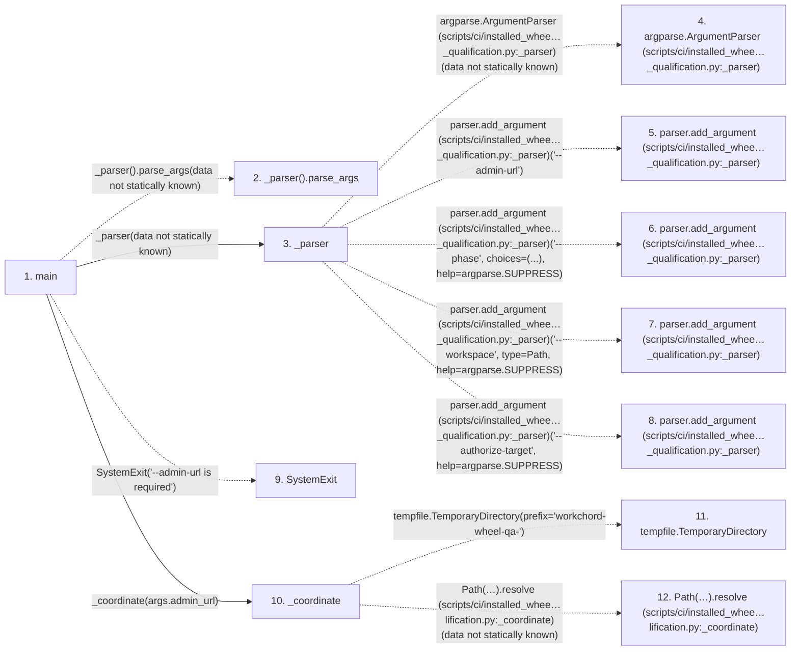

# installed_wheel_postgresql_qualification

**Entry point:** `main` (`process`)
**Source:** [installed_wheel_postgresql_qualification](../modules/installed_wheel_postgresql_qualification.md)
**Modules touched:** [calendar_service](../modules/calendar_service.md), [catalog](../modules/catalog.md), [cli_closeout](../modules/cli_closeout.md), [cli_cutover](../modules/cli_cutover.md), and 21 more

**Complete modules touched:**

- [calendar_service](../modules/calendar_service.md)
- [catalog](../modules/catalog.md)
- [cli_closeout](../modules/cli_closeout.md)
- [cli_cutover](../modules/cli_cutover.md)
- [config](../modules/config.md)
- [database_config](../modules/database_config.md)
- [database_migration_canonical](../modules/database_migration_canonical.md)
- [database_migration_manifest](../modules/database_migration_manifest.md)
- [github_status_automation_service](../modules/github_status_automation_service.md)
- [installed_wheel_postgresql_qualification](../modules/installed_wheel_postgresql_qualification.md)
- [label_service](../modules/label_service.md)
- [maintenance](../modules/maintenance.md)
- [models_agent](../modules/models_agent.md)
- [models_calendar](../modules/models_calendar.md)
- [models_iteration](../modules/models_iteration.md)
- [models_project](../modules/models_project.md)
- [models_task](../modules/models_task.md)
- [saved_view_service](../modules/saved_view_service.md)
- [source](../modules/source.md)
- [system_settings_service](../modules/system_settings_service.md)
- [template_service](../modules/template_service.md)
- [time](../modules/time.md)
- [transfer](../modules/transfer.md)
- [upgrade_service](../modules/upgrade_service.md)
- [user_session](../modules/user_session.md)

**Related modules:** [app_main](../modules/app_main.md), [cli_closeout](../modules/cli_closeout.md), [cli_cutover](../modules/cli_cutover.md), [database_migration_manifest](../modules/database_migration_manifest.md), and 9 more

**Complete related modules:**

- [app_main](../modules/app_main.md)
- [cli_closeout](../modules/cli_closeout.md)
- [cli_cutover](../modules/cli_cutover.md)
- [database_migration_manifest](../modules/database_migration_manifest.md)
- [models_agent](../modules/models_agent.md)
- [models_calendar](../modules/models_calendar.md)
- [models_iteration](../modules/models_iteration.md)
- [models_project](../modules/models_project.md)
- [models_task](../modules/models_task.md)
- [source](../modules/source.md)
- [transfer](../modules/transfer.md)
- [upgrade_service](../modules/upgrade_service.md)
- [user_session](../modules/user_session.md)

## Call sequence

```mermaid
sequenceDiagram
    participant p0 as main
    participant p1 as _parser().parse_args
    participant p2 as _parser
    participant p3 as argparse.ArgumentParser (scripts/ci/installed_whee…_qualification.py:_parser)
    participant p4 as parser.add_argument (scripts/ci/installed_whee…_qualification.py:_parser)
    participant p5 as SystemExit
    participant p6 as _coordinate
    participant p7 as tempfile.TemporaryDirectory
    participant p8 as Path(…).resolve (scripts/ci/installed_whee…lification.py:_coordinate)
    participant p9 as Path (scripts/ci/installed_whee…lification.py:_coordinate)
    participant p10 as os.urandom(…).hex
    participant p11 as os.urandom
    participant p12 as (…).write_text
    participant p13 as _database_url
    participant p14 as urlsplit (scripts/ci/installed_whee…fication.py:_database_url)
    participant p15 as urlunsplit
    participant p16 as _target_identifier
    participant p17 as urlsplit (scripts/ci/installed_whee…ion.py:_target_identifier)
    participant p18 as _create_database
    participant p19 as psycopg.connect (scripts/ci/installed_whee…ation.py:_create_database)
    participant p20 as _psycopg_url
    participant p21 as sqlalchemy_url.replace
    participant p22 as connection.execute (scripts/ci/installed_whee…ation.py:_create_database)
    participant p23 as sql.SQL(…).format (scripts/ci/installed_whee…on.py:_create_database, 8)
    participant p24 as sql.SQL (scripts/ci/installed_whee…ation.py:_create_database)
    participant p25 as sql.Identifier (scripts/ci/installed_whee…ation.py:_create_database)
    p0-->>p1: _parser().parse_args
    p0->>p2: _parser
    p2-->>p3: argparse.ArgumentParser (scripts/ci/installed_whee…_qualification.py:_parser)
    p2-->>p4: parser.add_argument (scripts/ci/installed_whee…_qualification.py:_parser)
    p2-->>p4: parser.add_argument (scripts/ci/installed_whee…_qualification.py:_parser)
    p2-->>p4: parser.add_argument (scripts/ci/installed_whee…_qualification.py:_parser)
    p2-->>p4: parser.add_argument (scripts/ci/installed_whee…_qualification.py:_parser)
    p0-->>p5: SystemExit
    p0->>p6: _coordinate
    p6-->>p7: tempfile.TemporaryDirectory
    p6-->>p8: Path(…).resolve (scripts/ci/installed_whee…lification.py:_coordinate)
    p6-->>p9: Path (scripts/ci/installed_whee…lification.py:_coordinate)
    p6-->>p10: os.urandom(…).hex
    p6-->>p11: os.urandom
    p6-->>p10: os.urandom(…).hex
    p6-->>p11: os.urandom
    p6-->>p12: (…).write_text
    p6->>p13: _database_url
    p13-->>p14: urlsplit (scripts/ci/installed_whee…fication.py:_database_url)
    p13-->>p15: urlunsplit
    p6->>p16: _target_identifier
    p16-->>p17: urlsplit (scripts/ci/installed_whee…ion.py:_target_identifier)
    p6->>p18: _create_database
    p18-->>p19: psycopg.connect (scripts/ci/installed_whee…ation.py:_create_database)
    p18->>p20: _psycopg_url
    p20-->>p21: sqlalchemy_url.replace
    p18-->>p22: connection.execute (scripts/ci/installed_whee…ation.py:_create_database)
    p18-->>p23: sql.SQL(…).format (scripts/ci/installed_whee…on.py:_create_database, 8)
    p18-->>p24: sql.SQL (scripts/ci/installed_whee…ation.py:_create_database)
    p18-->>p25: sql.Identifier (scripts/ci/installed_whee…ation.py:_create_database)
```

<!-- Auto-generated from static call edges. Dashed arrows are external or unresolved calls. Reviewed runtime conditions and side effects belong in Behavior. -->

> Call sequence diagram shows 30 of 1361 interactions; 1331 omitted to keep the visualization within the 30-interaction and generated-diagram limits.

> Trace truncated at the depth limit; deeper calls are omitted.

## Data flow

<!-- Auto-generated static analysis. Treat values and boundaries as best-effort hints, not runtime proof. -->

### Step data

| Step | Inputs | Reads | Writes | Returns |
|---|---|---|---|---|
| `main` | - | - | - | `0`, `0` |
| `_parser().parse_args` | - | - | - | - |
| `_parser` | - | `argparse`, `Path`, `argparse`, `argparse` | - | `parser` |
| `argparse.ArgumentParser (scripts/ci/installed_whee…_qualification.py:_parser)` | - | - | - | - |
| `parser.add_argument (scripts/ci/installed_whee…_qualification.py:_parser)` | - | - | - | - |
| `parser.add_argument (scripts/ci/installed_whee…_qualification.py:_parser)` | - | - | - | - |
| `parser.add_argument (scripts/ci/installed_whee…_qualification.py:_parser)` | - | - | - | - |
| `parser.add_argument (scripts/ci/installed_whee…_qualification.py:_parser)` | - | - | - | - |
| `SystemExit` | - | - | - | - |
| `_coordinate` | `admin_url: str` | - | - | - |
| `tempfile.TemporaryDirectory` | - | - | - | - |
| `Path(…).resolve (scripts/ci/installed_whee…lification.py:_coordinate)` | - | - | - | - |

### Call data

| From | To | Line | Call |
|---|---|---:|---|
| main | _parser().parse_args | 615 | `_parser().parse_args(data not statically known)` |
| main | _parser | 615 | `_parser(data not statically known)` |
| _parser | argparse.ArgumentParser (scripts/ci/installed_whee…_qualification.py:_parser) | 602 | `argparse.ArgumentParser(data not statically known)` |
| _parser | parser.add_argument (scripts/ci/installed_whee…_qualification.py:_parser) | 603 | `parser.add_argument('--admin-url')` |
| _parser | parser.add_argument (scripts/ci/installed_whee…_qualification.py:_parser) | 604 | `parser.add_argument('--phase', choices=(...), help=argparse.SUPPRESS)` |
| _parser | parser.add_argument (scripts/ci/installed_whee…_qualification.py:_parser) | 609 | `parser.add_argument('--workspace', type=Path, help=argparse.SUPPRESS)` |
| _parser | parser.add_argument (scripts/ci/installed_whee…_qualification.py:_parser) | 610 | `parser.add_argument('--authorize-target', help=argparse.SUPPRESS)` |
| main | SystemExit | 618 | `SystemExit('--admin-url is required')` |
| main | _coordinate | 619 | `_coordinate(args.admin_url)` |
| _coordinate | tempfile.TemporaryDirectory | 562 | `tempfile.TemporaryDirectory(prefix='workchord-wheel-qa-')` |
| _coordinate | Path(…).resolve (scripts/ci/installed_whee…lification.py:_coordinate) | 563 | `Path(temporary).resolve(data not statically known)` |

### Boundary effects

*No boundary effects detected.*

### Static analysis gaps

| Kind | Step | Target | Line |
|---|---|---|---:|
| unresolved_call | `main` | `_parser().parse_args` | 615 |
| external_call | `_parser` | `argparse.ArgumentParser` | 602 |
| unresolved_call | `_parser` | `parser.add_argument` | 603 |
| unresolved_call | `_parser` | `parser.add_argument` | 604 |
| unresolved_call | `_parser` | `parser.add_argument` | 609 |
| unresolved_call | `_parser` | `parser.add_argument` | 610 |
| external_call | `main` | `SystemExit` | 618 |
| external_call | `_coordinate` | `tempfile.TemporaryDirectory` | 562 |
| unresolved_call | `_coordinate` | `Path(temporary).resolve` | 563 |
| step_limit | `main` | `first 12 steps` | 0 |
| truncated_flow | `main` | `depth limit` | 0 |

## Behavior

This flow starts at `main` and is classified as `process`. The generated call and data-flow sections are bounded static projections; runtime conditions and side effects require source-level confirmation.
