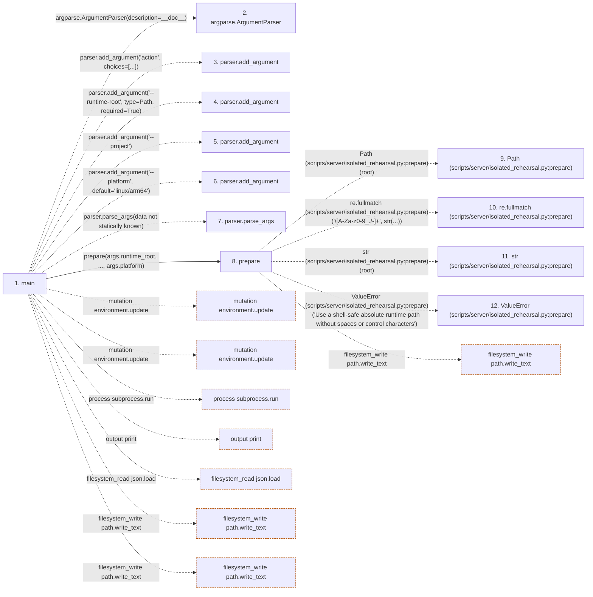

# isolated_rehearsal

**Entry point:** `main` (`process`)
**Source:** [isolated_rehearsal](../modules/isolated_rehearsal.md)
**Modules touched:** [isolated_rehearsal](../modules/isolated_rehearsal.md)

## Call sequence

```mermaid
sequenceDiagram
    participant p0 as main
    participant p1 as argparse.ArgumentParser
    participant p2 as parser.add_argument
    participant p3 as parser.parse_args
    participant p4 as prepare
    participant p5 as Path (scripts/server/isolated_rehearsal.py:prepare)
    participant p6 as re.fullmatch (scripts/server/isolated_rehearsal.py:prepare)
    participant p7 as str (scripts/server/isolated_rehearsal.py:prepare)
    participant p8 as ValueError (scripts/server/isolated_rehearsal.py:prepare)
    participant p9 as root.is_absolute
    participant p10 as (…).resolve
    participant p11 as root.resolve (scripts/server/isolated_rehearsal.py:prepare)
    participant p12 as root.exists
    participant p13 as any (scripts/server/isolated_rehearsal.py:prepare)
    participant p14 as resources(…).values
    participant p15 as resources
    participant p16 as docker(…).splitlines
    participant p17 as docker
    participant p18 as subprocess.check_output(…).strip (scripts/server/isolated_rehearsal.py:docker)
    participant p19 as subprocess.check_output (scripts/server/isolated_rehearsal.py:docker)
    participant p20 as json.loads (scripts/server/isolated_rehearsal.py:resources)
    participant p21 as item.get(…).get
    participant p22 as item.get
    p0-->>p1: argparse.ArgumentParser
    p0-->>p2: parser.add_argument
    p0-->>p2: parser.add_argument
    p0-->>p2: parser.add_argument
    p0-->>p2: parser.add_argument
    p0-->>p3: parser.parse_args
    p0->>p4: prepare
    p4-->>p5: Path (scripts/server/isolated_rehearsal.py:prepare)
    p4-->>p6: re.fullmatch (scripts/server/isolated_rehearsal.py:prepare)
    p4-->>p7: str (scripts/server/isolated_rehearsal.py:prepare)
    p4-->>p8: ValueError (scripts/server/isolated_rehearsal.py:prepare)
    p4-->>p9: root.is_absolute
    p4-->>p6: re.fullmatch (scripts/server/isolated_rehearsal.py:prepare)
    p4-->>p8: ValueError (scripts/server/isolated_rehearsal.py:prepare)
    p4-->>p10: (…).resolve
    p4-->>p11: root.resolve (scripts/server/isolated_rehearsal.py:prepare)
    p4-->>p8: ValueError (scripts/server/isolated_rehearsal.py:prepare)
    p4-->>p12: root.exists
    p4-->>p13: any (scripts/server/isolated_rehearsal.py:prepare)
    p4-->>p14: resources(…).values
    p4->>p15: resources
    p15-->>p16: docker(…).splitlines
    p15->>p17: docker
    p17-->>p18: subprocess.check_output(…).strip (scripts/server/isolated_rehearsal.py:docker)
    p17-->>p19: subprocess.check_output (scripts/server/isolated_rehearsal.py:docker)
    p15-->>p20: json.loads (scripts/server/isolated_rehearsal.py:resources)
    p15->>p17: docker
    p15-->>p21: item.get(…).get
    p15-->>p22: item.get
    p15-->>p22: item.get
```

<!-- Auto-generated from static call edges. Dashed arrows are external or unresolved calls. Reviewed runtime conditions and side effects belong in Behavior. -->

> Call sequence diagram shows 30 of 122 interactions; 92 omitted to keep the visualization within the 30-interaction and generated-diagram limits.

## Data flow

<!-- Auto-generated static analysis. Treat values and boundaries as best-effort hints, not runtime proof. -->

### Step data

| Step | Inputs | Reads | Writes | Returns |
|---|---|---|---|---|
| `main` | - | `Path`, `ROOT` | - | - |
| `argparse.ArgumentParser` | - | - | - | - |
| `parser.add_argument` | - | - | - | - |
| `parser.add_argument` | - | - | - | - |
| `parser.add_argument` | - | - | - | - |
| `parser.add_argument` | - | - | - | - |
| `parser.parse_args` | - | - | - | - |
| `prepare` | `root`, `project`, `platform` | `MARKER` | - | `marker` |
| `Path (scripts/server/isolated_rehearsal.py:prepare)` | - | - | - | - |
| `re.fullmatch (scripts/server/isolated_rehearsal.py:prepare)` | - | - | - | - |
| `str (scripts/server/isolated_rehearsal.py:prepare)` | - | - | - | - |
| `ValueError (scripts/server/isolated_rehearsal.py:prepare)` | - | - | - | - |

### Call data

| From | To | Line | Call |
|---|---|---:|---|
| main | argparse.ArgumentParser | 127 | `argparse.ArgumentParser(description=__doc__)` |
| main | parser.add_argument | 128 | `parser.add_argument('action', choices=[...])` |
| main | parser.add_argument | 129 | `parser.add_argument('--runtime-root', type=Path, required=True)` |
| main | parser.add_argument | 130 | `parser.add_argument('--project')` |
| main | parser.add_argument | 131 | `parser.add_argument('--platform', default='linux/arm64')` |
| main | parser.parse_args | 132 | `parser.parse_args(data not statically known)` |
| main | prepare | 134 | `prepare(args.runtime_root, ..., args.platform)` |
| prepare | Path (scripts/server/isolated_rehearsal.py:prepare) | 57 | `Path(root)` |
| prepare | re.fullmatch (scripts/server/isolated_rehearsal.py:prepare) | 58 | `re.fullmatch('/[A-Za-z0-9_./-]+', str(...))` |
| prepare | str (scripts/server/isolated_rehearsal.py:prepare) | 58 | `str(root)` |
| prepare | ValueError (scripts/server/isolated_rehearsal.py:prepare) | 59 | `ValueError('Use a shell-safe absolute runtime path without spaces or control characters')` |

### Boundary effects

| Kind | Target | Step | Line |
|---|---|---|---:|
| mutation | `environment.update` | `main` | 139 |
| mutation | `environment.update` | `main` | 140 |
| process | `subprocess.run` | `main` | 143 |
| output | `print` | `main` | 149 |
| filesystem_read | `json.load` | `main` | 156 |
| filesystem_write | `path.write_text` | `main` | 157 |
| filesystem_write | `path.write_text` | `main` | 160 |
| filesystem_write | `path.write_text` | `prepare` | 76 |

### Static analysis gaps

| Kind | Step | Target | Line |
|---|---|---|---:|
| external_call | `main` | `argparse.ArgumentParser` | 127 |
| unresolved_call | `main` | `parser.add_argument` | 128 |
| unresolved_call | `main` | `parser.add_argument` | 129 |
| unresolved_call | `main` | `parser.add_argument` | 130 |
| unresolved_call | `main` | `parser.add_argument` | 131 |
| unresolved_call | `main` | `parser.parse_args` | 132 |
| external_call | `prepare` | `re.fullmatch` | 58 |
| external_call | `prepare` | `ValueError` | 59 |
| step_limit | `main` | `first 12 steps` | 0 |

## Behavior

This flow starts at `main` and is classified as `process`. The generated call and data-flow sections are bounded static projections; runtime conditions and side effects require source-level confirmation.
