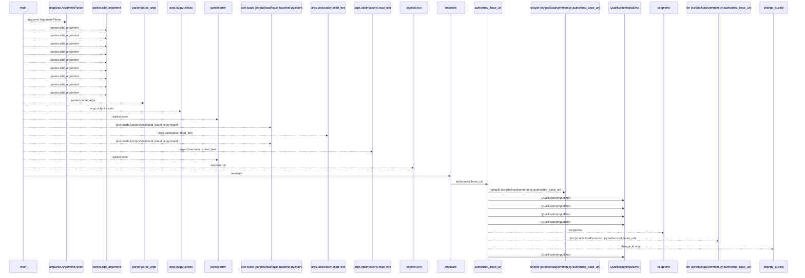
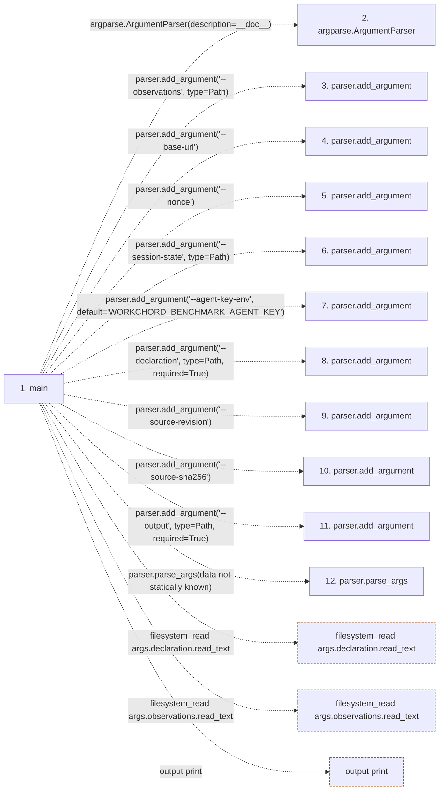

# local_baseline

**Entry point:** `main` (`process`)
**Source:** [local_baseline](../modules/local_baseline.md)
**Modules touched:** [load_common](../modules/load_common.md), [local_baseline](../modules/local_baseline.md), [result](../modules/result.md), [run](../modules/run.md)

**Related modules:** [load_common](../modules/load_common.md), [result](../modules/result.md), [run](../modules/run.md)

## Call sequence

<!-- Auto-generated from static call edges. Dashed arrows are external or unresolved calls. Reviewed runtime conditions and side effects belong in Behavior. -->

> Call sequence diagram shows 30 of 173 interactions; 143 omitted to keep the visualization within the 30-interaction and generated-diagram limits.

## Data flow

<!-- Auto-generated static analysis. Treat values and boundaries as best-effort hints, not runtime proof. -->

### Step data

| Step | Inputs | Reads | Writes | Returns |
|---|---|---|---|---|
| `main` | - | `Path`, `Path`, `Path`, `Path`, `QualificationInputError` | `result[...]`, `result[...]`, `result[...]`, `result[...]`, `result[...]` | `...` |
| `argparse.ArgumentParser` | - | - | - | - |
| `parser.add_argument` | - | - | - | - |
| `parser.add_argument` | - | - | - | - |
| `parser.add_argument` | - | - | - | - |
| `parser.add_argument` | - | - | - | - |
| `parser.add_argument` | - | - | - | - |
| `parser.add_argument` | - | - | - | - |
| `parser.add_argument` | - | - | - | - |
| `parser.add_argument` | - | - | - | - |
| `parser.add_argument` | - | - | - | - |
| `parser.parse_args` | - | - | - | - |

### Call data

| From | To | Line | Call |
|---|---|---:|---|
| main | argparse.ArgumentParser | 121 | `argparse.ArgumentParser(description=__doc__)` |
| main | parser.add_argument | 122 | `parser.add_argument('--observations', type=Path)` |
| main | parser.add_argument | 123 | `parser.add_argument('--base-url')` |
| main | parser.add_argument | 124 | `parser.add_argument('--nonce')` |
| main | parser.add_argument | 125 | `parser.add_argument('--session-state', type=Path)` |
| main | parser.add_argument | 126 | `parser.add_argument('--agent-key-env', default='WORKCHORD_BENCHMARK_AGENT_KEY')` |
| main | parser.add_argument | 127 | `parser.add_argument('--declaration', type=Path, required=True)` |
| main | parser.add_argument | 128 | `parser.add_argument('--source-revision')` |
| main | parser.add_argument | 129 | `parser.add_argument('--source-sha256')` |
| main | parser.add_argument | 130 | `parser.add_argument('--output', type=Path, required=True)` |
| main | parser.parse_args | 131 | `parser.parse_args(data not statically known)` |

### Boundary effects

| Kind | Target | Step | Line |
|---|---|---|---:|
| filesystem_read | `args.declaration.read_text` | `main` | 134 |
| filesystem_read | `args.observations.read_text` | `main` | 136 |
| output | `print` | `main` | 148 |

### Static analysis gaps

| Kind | Step | Target | Line |
|---|---|---|---:|
| external_call | `main` | `argparse.ArgumentParser` | 121 |
| unresolved_call | `main` | `parser.add_argument` | 122 |
| unresolved_call | `main` | `parser.add_argument` | 123 |
| unresolved_call | `main` | `parser.add_argument` | 124 |
| unresolved_call | `main` | `parser.add_argument` | 125 |
| unresolved_call | `main` | `parser.add_argument` | 126 |
| unresolved_call | `main` | `parser.add_argument` | 127 |
| unresolved_call | `main` | `parser.add_argument` | 128 |
| unresolved_call | `main` | `parser.add_argument` | 129 |
| unresolved_call | `main` | `parser.add_argument` | 130 |
| unresolved_call | `main` | `parser.parse_args` | 131 |
| step_limit | `main` | `first 12 steps` | 0 |

## Behavior

This flow starts at `main` and is classified as `process`. The generated call and data-flow sections are bounded static projections; runtime conditions and side effects require source-level confirmation.
