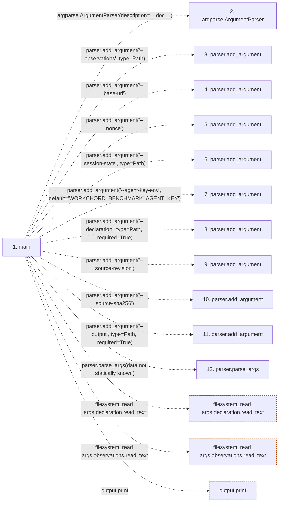

# local_baseline

**Entry point:** `main` (`process`)
**Source:** [local_baseline](../modules/local_baseline.md)
**Modules touched:** [load_common](../modules/load_common.md), [local_baseline](../modules/local_baseline.md), [result](../modules/result.md), [run](../modules/run.md), [source_binding](../modules/source_binding.md)

**Related modules:** [load_common](../modules/load_common.md), [result](../modules/result.md), [run](../modules/run.md), [source_binding](../modules/source_binding.md)

## Call sequence

```mermaid
sequenceDiagram
    participant p0 as main
    participant p1 as argparse.ArgumentParser
    participant p2 as parser.add_argument
    participant p3 as parser.parse_args
    participant p4 as args.output.exists
    participant p5 as parser.error
    participant p6 as source_binding
    participant p7 as Path(…).resolve
    participant p8 as Path
    participant p9 as sorted (scripts/load/source_binding.py:source_binding)
    participant p10 as root.glob
    participant p11 as str (scripts/load/source_binding.py:source_binding)
    participant p12 as path.relative_to
    participant p13 as hashlib.sha256(…).hexdigest (scripts/load/source_binding.py:source_binding, 1)
    participant p14 as hashlib.sha256 (scripts/load/source_binding.py:source_binding)
    participant p15 as path.read_bytes
    participant p16 as hashlib.sha256(…).hexdigest (scripts/load/source_binding.py:source_binding)
    participant p17 as json.dumps(…).encode (scripts/load/source_binding.py:source_binding)
    participant p18 as json.dumps (scripts/load/source_binding.py:source_binding)
    participant p19 as platform.platform (scripts/load/source_binding.py:source_binding)
    p0-->>p1: argparse.ArgumentParser
    p0-->>p2: parser.add_argument
    p0-->>p2: parser.add_argument
    p0-->>p2: parser.add_argument
    p0-->>p2: parser.add_argument
    p0-->>p2: parser.add_argument
    p0-->>p2: parser.add_argument
    p0-->>p2: parser.add_argument
    p0-->>p2: parser.add_argument
    p0-->>p2: parser.add_argument
    p0-->>p3: parser.parse_args
    p0-->>p4: args.output.exists
    p0-->>p5: parser.error
    p0->>p6: source_binding
    p6-->>p7: Path(…).resolve
    p6-->>p8: Path
    p6-->>p9: sorted (scripts/load/source_binding.py:source_binding)
    p6-->>p10: root.glob
    p6-->>p10: root.glob
    p6-->>p10: root.glob
    p6-->>p11: str (scripts/load/source_binding.py:source_binding)
    p6-->>p12: path.relative_to
    p6-->>p13: hashlib.sha256(…).hexdigest (scripts/load/source_binding.py:source_binding, 1)
    p6-->>p14: hashlib.sha256 (scripts/load/source_binding.py:source_binding)
    p6-->>p15: path.read_bytes
    p6-->>p16: hashlib.sha256(…).hexdigest (scripts/load/source_binding.py:source_binding)
    p6-->>p14: hashlib.sha256 (scripts/load/source_binding.py:source_binding)
    p6-->>p17: json.dumps(…).encode (scripts/load/source_binding.py:source_binding)
    p6-->>p18: json.dumps (scripts/load/source_binding.py:source_binding)
    p6-->>p19: platform.platform (scripts/load/source_binding.py:source_binding)
```

<!-- Auto-generated from static call edges. Dashed arrows are external or unresolved calls. Reviewed runtime conditions and side effects belong in Behavior. -->

> Call sequence diagram shows 30 of 197 interactions; 167 omitted to keep the visualization within the 30-interaction and generated-diagram limits.

## Data flow

<!-- Auto-generated static analysis. Treat values and boundaries as best-effort hints, not runtime proof. -->

### Step data

| Step | Inputs | Reads | Writes | Returns |
|---|---|---|---|---|
| `main` | - | `Path`, `Path`, `Path`, `Path`, `QualificationInputError` | `result[...]`, `result[...]`, `result[...]`, `result[...]`, `result[...]`, `result[...]`, `result[...]` | `...` |
| `argparse.ArgumentParser` | - | - | - | - |
| `parser.add_argument` | - | - | - | - |
| `parser.add_argument` | - | - | - | - |
| `parser.add_argument` | - | - | - | - |
| `parser.add_argument` | - | - | - | - |
| `parser.add_argument` | - | - | - | - |
| `parser.add_argument` | - | - | - | - |
| `parser.add_argument` | - | - | - | - |
| `parser.add_argument` | - | - | - | - |
| `parser.add_argument` | - | - | - | - |
| `parser.parse_args` | - | - | - | - |

### Call data

| From | To | Line | Call |
|---|---|---:|---|
| main | argparse.ArgumentParser | 128 | `argparse.ArgumentParser(description=__doc__)` |
| main | parser.add_argument | 129 | `parser.add_argument('--observations', type=Path)` |
| main | parser.add_argument | 130 | `parser.add_argument('--base-url')` |
| main | parser.add_argument | 131 | `parser.add_argument('--nonce')` |
| main | parser.add_argument | 132 | `parser.add_argument('--session-state', type=Path)` |
| main | parser.add_argument | 133 | `parser.add_argument('--agent-key-env', default='WORKCHORD_BENCHMARK_AGENT_KEY')` |
| main | parser.add_argument | 134 | `parser.add_argument('--declaration', type=Path, required=True)` |
| main | parser.add_argument | 135 | `parser.add_argument('--source-revision')` |
| main | parser.add_argument | 136 | `parser.add_argument('--source-sha256')` |
| main | parser.add_argument | 137 | `parser.add_argument('--output', type=Path, required=True)` |
| main | parser.parse_args | 138 | `parser.parse_args(data not statically known)` |

### Boundary effects

| Kind | Target | Step | Line |
|---|---|---|---:|
| filesystem_read | `args.declaration.read_text` | `main` | 142 |
| filesystem_read | `args.observations.read_text` | `main` | 144 |
| output | `print` | `main` | 158 |

### Static analysis gaps

| Kind | Step | Target | Line |
|---|---|---|---:|
| external_call | `main` | `argparse.ArgumentParser` | 128 |
| unresolved_call | `main` | `parser.add_argument` | 129 |
| unresolved_call | `main` | `parser.add_argument` | 130 |
| unresolved_call | `main` | `parser.add_argument` | 131 |
| unresolved_call | `main` | `parser.add_argument` | 132 |
| unresolved_call | `main` | `parser.add_argument` | 133 |
| unresolved_call | `main` | `parser.add_argument` | 134 |
| unresolved_call | `main` | `parser.add_argument` | 135 |
| unresolved_call | `main` | `parser.add_argument` | 136 |
| unresolved_call | `main` | `parser.add_argument` | 137 |
| unresolved_call | `main` | `parser.parse_args` | 138 |
| step_limit | `main` | `first 12 steps` | 0 |

## Behavior

This flow starts at `main` and is classified as `process`. The generated call and data-flow sections are bounded static projections; runtime conditions and side effects require source-level confirmation.
