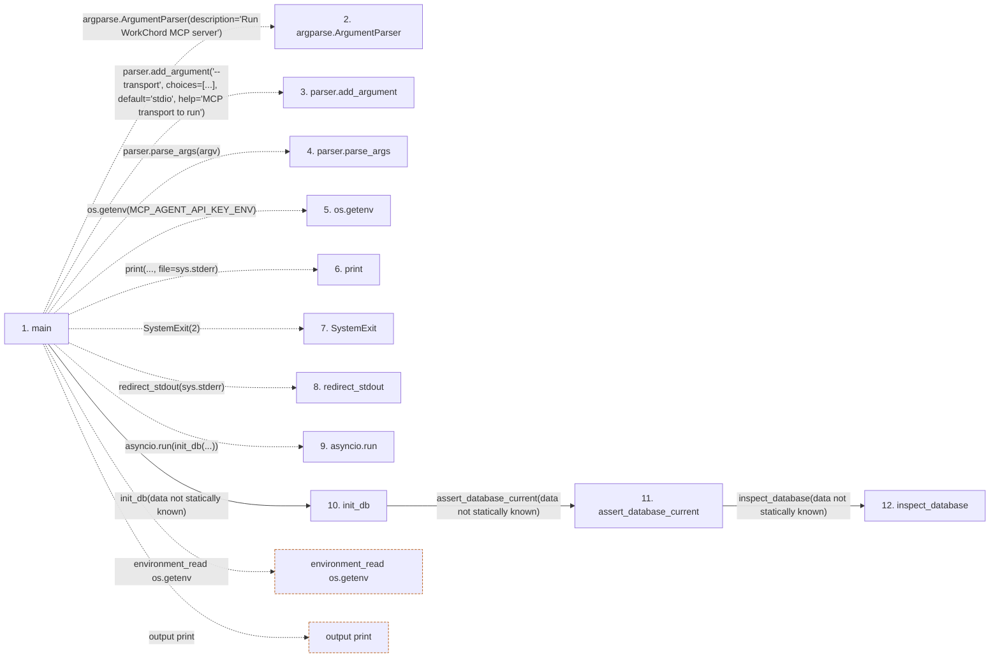

# mcp_server

**Entry point:** `main` (`process`)
**Source:** [mcp_server](../modules/mcp_server.md)
**Modules touched:** [app_database](../modules/app_database.md), [config](../modules/config.md), [database_config](../modules/database_config.md), [mcp_server](../modules/mcp_server.md), [upgrade_service](../modules/upgrade_service.md)

**Related modules:** [agent_model_catalog_service](../modules/agent_model_catalog_service.md), [agent_routing_service](../modules/agent_routing_service.md), [agent_service](../modules/agent_service.md), and 11 more

**Complete related modules:**

- [agent_model_catalog_service](../modules/agent_model_catalog_service.md)
- [agent_routing_service](../modules/agent_routing_service.md)
- [agent_service](../modules/agent_service.md)
- [agent_team_setup_service](../modules/agent_team_setup_service.md)
- [app_database](../modules/app_database.md)
- [authority](../modules/authority.md)
- [commands](../modules/commands.md)
- [config](../modules/config.md)
- [identity_service](../modules/identity_service.md)
- [maintenance](../modules/maintenance.md)
- [models_agent](../modules/models_agent.md)
- [mutation_versions](../modules/mutation_versions.md)
- [task_service](../modules/task_service.md)
- [triage_service](../modules/triage_service.md)

## Call sequence

```mermaid
sequenceDiagram
    participant p0 as main
    participant p1 as argparse.ArgumentParser
    participant p2 as parser.add_argument
    participant p3 as parser.parse_args
    participant p4 as os.getenv
    participant p5 as print
    participant p6 as SystemExit
    participant p7 as redirect_stdout
    participant p8 as asyncio.run
    participant p9 as init_db
    participant p10 as assert_database_current
    participant p11 as inspect_database
    participant p12 as _inspect_database_connection
    participant p13 as inspect (backend/app/services/upgr…nspect_database_connection)
    participant p14 as sorted (backend/app/services/upgr…nspect_database_connection)
    participant p15 as inspector.get_table_names (backend/app/services/upgr…nspect_database_connection)
    participant p16 as _current_revision
    participant p17 as inspect (backend/app/services/upgr…rvice.py:_current_revision)
    participant p18 as inspector.get_table_names (backend/app/services/upgr…rvice.py:_current_revision)
    participant p19 as connection.execute
    participant p20 as text
    participant p21 as result.fetchall
    participant p22 as len (backend/app/services/upgr…rvice.py:_current_revision)
    participant p23 as ','.join
    participant p24 as sorted (backend/app/services/upgr…rvice.py:_current_revision)
    participant p25 as set
    participant p26 as head_revision
    participant p27 as ScriptDirectory.from_config
    participant p28 as alembic_config
    participant p29 as script.get_heads
    participant p30 as len (backend/app/services/upgr…e_service.py:head_revision)
    p0-->>p1: argparse.ArgumentParser
    p0-->>p2: parser.add_argument
    p0-->>p3: parser.parse_args
    p0-->>p4: os.getenv
    p0-->>p5: print
    p0-->>p6: SystemExit
    p0-->>p7: redirect_stdout
    p0-->>p8: asyncio.run
    p0->>p9: init_db
    p9->>p10: assert_database_current
    p10->>p11: inspect_database
    p11->>p12: _inspect_database_connection
    p12-->>p13: inspect (backend/app/services/upgr…nspect_database_connection)
    p12-->>p14: sorted (backend/app/services/upgr…nspect_database_connection)
    p12-->>p15: inspector.get_table_names (backend/app/services/upgr…nspect_database_connection)
    p12->>p16: _current_revision
    p16-->>p17: inspect (backend/app/services/upgr…rvice.py:_current_revision)
    p16-->>p18: inspector.get_table_names (backend/app/services/upgr…rvice.py:_current_revision)
    p16-->>p19: connection.execute
    p16-->>p20: text
    p16-->>p21: result.fetchall
    p16-->>p22: len (backend/app/services/upgr…rvice.py:_current_revision)
    p16-->>p23: ','.join
    p16-->>p24: sorted (backend/app/services/upgr…rvice.py:_current_revision)
    p12-->>p25: set
    p12->>p26: head_revision
    p26-->>p27: ScriptDirectory.from_config
    p26->>p28: alembic_config
    p26-->>p29: script.get_heads
    p26-->>p30: len (backend/app/services/upgr…e_service.py:head_revision)
```

<!-- Auto-generated from static call edges. Dashed arrows are external or unresolved calls. Reviewed runtime conditions and side effects belong in Behavior. -->

> Call sequence diagram shows 30 of 52 interactions; 22 omitted to keep the visualization within the 30-interaction and generated-diagram limits.

> Trace truncated at the depth limit; deeper calls are omitted.

## Data flow

<!-- Auto-generated static analysis. Treat values and boundaries as best-effort hints, not runtime proof. -->

### Step data

| Step | Inputs | Reads | Writes | Returns |
|---|---|---|---|---|
| `main` | `argv: Optional[list[str]]` | `MCP_AGENT_API_KEY_ENV`, `MCP_AGENT_API_KEY_ENV`, `sys`, `sys` | - | - |
| `argparse.ArgumentParser` | - | - | - | - |
| `parser.add_argument` | - | - | - | - |
| `parser.parse_args` | - | - | - | - |
| `os.getenv` | - | - | - | - |
| `print` | - | - | - | - |
| `SystemExit` | - | - | - | - |
| `redirect_stdout` | - | - | - | - |
| `asyncio.run` | - | - | - | - |
| `init_db` | - | - | - | - |
| `assert_database_current` | - | - | - | `none` |
| `inspect_database` | `connection: Connection \| None` | - | - | `_inspect_database_connection(...)`, `_inspect_database_connection(...)` |

### Call data

| From | To | Line | Call |
|---|---|---:|---|
| main | argparse.ArgumentParser | 2405 | `argparse.ArgumentParser(description='Run WorkChord MCP server')` |
| main | parser.add_argument | 2406 | `parser.add_argument('--transport', choices=[...], default='stdio', help='MCP transport to run')` |
| main | parser.parse_args | 2412 | `parser.parse_args(argv)` |
| main | os.getenv | 2414 | `os.getenv(MCP_AGENT_API_KEY_ENV)` |
| main | print | 2415 | `print(..., file=sys.stderr)` |
| main | SystemExit | 2416 | `SystemExit(2)` |
| main | redirect_stdout | 2420 | `redirect_stdout(sys.stderr)` |
| main | asyncio.run | 2421 | `asyncio.run(init_db(...))` |
| main | init_db | 2421 | `init_db(data not statically known)` |
| init_db | assert_database_current | 71 | `assert_database_current(data not statically known)` |
| assert_database_current | inspect_database | 377 | `inspect_database(data not statically known)` |

### Boundary effects

| Kind | Target | Step | Line |
|---|---|---|---:|
| environment_read | `os.getenv` | `main` | 2414 |
| output | `print` | `main` | 2415 |

### Static analysis gaps

| Kind | Step | Target | Line |
|---|---|---|---:|
| external_call | `main` | `argparse.ArgumentParser` | 2405 |
| unresolved_call | `main` | `parser.add_argument` | 2406 |
| unresolved_call | `main` | `parser.parse_args` | 2412 |
| external_call | `main` | `SystemExit` | 2416 |
| external_call | `main` | `redirect_stdout` | 2420 |
| external_call | `main` | `asyncio.run` | 2421 |
| step_limit | `main` | `first 12 steps` | 0 |
| truncated_flow | `main` | `depth limit` | 0 |

## Behavior

This flow starts at `main` and is classified as `process`. The generated call and data-flow sections are bounded static projections; runtime conditions and side effects require source-level confirmation.
