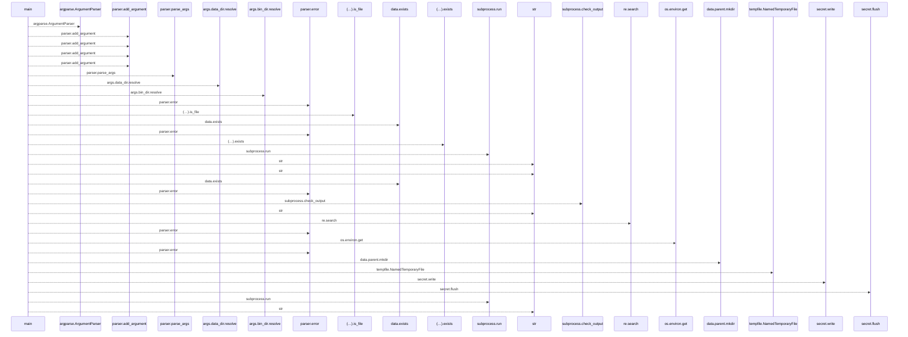
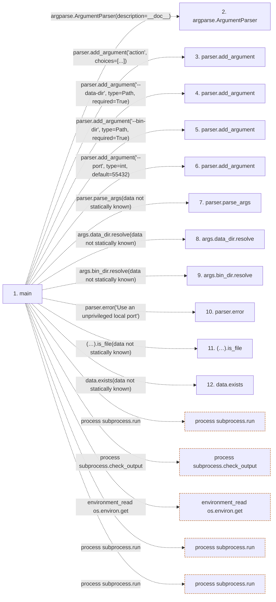

# postgres_runtime

**Entry point:** `main` (`process`)
**Source:** [postgres_runtime](../modules/postgres_runtime.md)
**Modules touched:** [postgres_runtime](../modules/postgres_runtime.md)

## Call sequence

<!-- Auto-generated from static call edges. Dashed arrows are external or unresolved calls. Reviewed runtime conditions and side effects belong in Behavior. -->

> Call sequence diagram shows 30 of 38 interactions; 8 omitted to keep the visualization within the 30-interaction and generated-diagram limits.

## Data flow

<!-- Auto-generated static analysis. Treat values and boundaries as best-effort hints, not runtime proof. -->

### Step data

| Step | Inputs | Reads | Writes | Returns |
|---|---|---|---|---|
| `main` | - | `Path`, `Path` | - | `0`, `0`, `0` |
| `argparse.ArgumentParser` | - | - | - | - |
| `parser.add_argument` | - | - | - | - |
| `parser.add_argument` | - | - | - | - |
| `parser.add_argument` | - | - | - | - |
| `parser.add_argument` | - | - | - | - |
| `parser.parse_args` | - | - | - | - |
| `args.data_dir.resolve` | - | - | - | - |
| `args.bin_dir.resolve` | - | - | - | - |
| `parser.error` | - | - | - | - |
| `(…).is_file` | - | - | - | - |
| `data.exists` | - | - | - | - |

### Call data

| From | To | Line | Call |
|---|---|---:|---|
| main | argparse.ArgumentParser | 17 | `argparse.ArgumentParser(description=__doc__)` |
| main | parser.add_argument | 18 | `parser.add_argument('action', choices=[...])` |
| main | parser.add_argument | 19 | `parser.add_argument('--data-dir', type=Path, required=True)` |
| main | parser.add_argument | 20 | `parser.add_argument('--bin-dir', type=Path, required=True)` |
| main | parser.add_argument | 21 | `parser.add_argument('--port', type=int, default=55432)` |
| main | parser.parse_args | 22 | `parser.parse_args(data not statically known)` |
| main | args.data_dir.resolve | 23 | `args.data_dir.resolve(data not statically known)` |
| main | args.bin_dir.resolve | 24 | `args.bin_dir.resolve(data not statically known)` |
| main | parser.error | 26 | `parser.error('Use an unprivileged local port')` |
| main | (…).is_file | 28 | `(data / MARKER).is_file(data not statically known)` |
| main | data.exists | 29 | `data.exists(data not statically known)` |

### Boundary effects

| Kind | Target | Step | Line |
|---|---|---|---:|
| process | `subprocess.run` | `main` | 33 |
| process | `subprocess.check_output` | `main` | 37 |
| environment_read | `os.environ.get` | `main` | 40 |
| process | `subprocess.run` | `main` | 47 |
| process | `subprocess.run` | `main` | 51 |

### Static analysis gaps

| Kind | Step | Target | Line |
|---|---|---|---:|
| external_call | `main` | `argparse.ArgumentParser` | 17 |
| unresolved_call | `main` | `parser.add_argument` | 18 |
| unresolved_call | `main` | `parser.add_argument` | 19 |
| unresolved_call | `main` | `parser.add_argument` | 20 |
| unresolved_call | `main` | `parser.add_argument` | 21 |
| unresolved_call | `main` | `parser.parse_args` | 22 |
| unresolved_call | `main` | `args.data_dir.resolve` | 23 |
| unresolved_call | `main` | `args.bin_dir.resolve` | 24 |
| unresolved_call | `main` | `parser.error` | 26 |
| unresolved_call | `main` | `(data / MARKER).is_file` | 28 |
| unresolved_call | `main` | `data.exists` | 29 |
| step_limit | `main` | `first 12 steps` | 0 |

## Behavior

The caller installs PostgreSQL 18 and provides a new data directory, local port and password. Initialization uses the builtin locale and a private temporary password file. Start records ownership before waiting for readiness. Stop operates only on a marked directory and leaves unrelated clusters alone.
