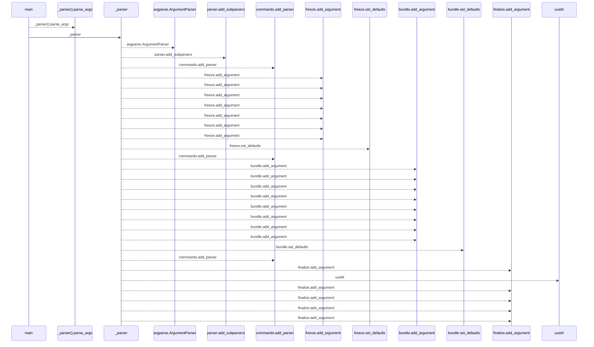
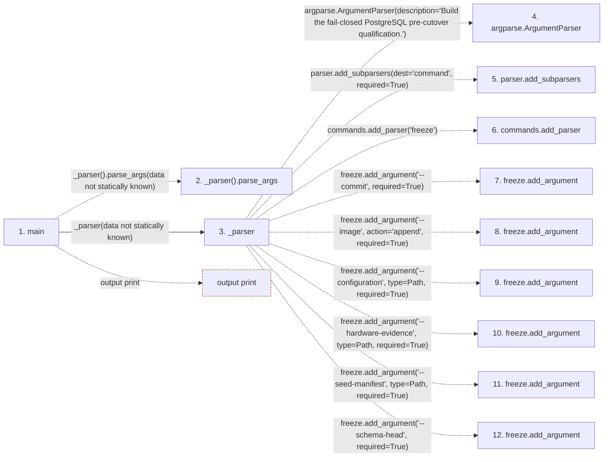

# qualify

**Entry point:** `main` (`process`)
**Source:** [qualify](../modules/qualify.md)
**Modules touched:** [load_common](../modules/load_common.md), [qualify](../modules/qualify.md)

**Related modules:** [load_common](../modules/load_common.md), [result](../modules/result.md)

## Call sequence

<!-- Auto-generated from static call edges. Dashed arrows are external or unresolved calls. Reviewed runtime conditions and side effects belong in Behavior. -->

> Call sequence diagram shows 30 of 40 interactions; 10 omitted to keep the visualization within the 30-interaction and generated-diagram limits.

## Data flow

<!-- Auto-generated static analysis. Treat values and boundaries as best-effort hints, not runtime proof. -->

### Step data

| Step | Inputs | Reads | Writes | Returns |
|---|---|---|---|---|
| `main` | - | `QualificationInputError`, `sys` | - | `int(...)`, `2` |
| `_parser().parse_args` | - | - | - | - |
| `_parser` | - | `Path`, `Path`, `Path`, `Path`, `_freeze`, `Path`, `Path`, `Path` | - | `parser` |
| `argparse.ArgumentParser` | - | - | - | - |
| `parser.add_subparsers` | - | - | - | - |
| `commands.add_parser` | - | - | - | - |
| `freeze.add_argument` | - | - | - | - |
| `freeze.add_argument` | - | - | - | - |
| `freeze.add_argument` | - | - | - | - |
| `freeze.add_argument` | - | - | - | - |
| `freeze.add_argument` | - | - | - | - |
| `freeze.add_argument` | - | - | - | - |

### Call data

| From | To | Line | Call |
|---|---|---:|---|
| main | _parser().parse_args | 791 | `_parser().parse_args(data not statically known)` |
| main | _parser | 791 | `_parser(data not statically known)` |
| _parser | argparse.ArgumentParser | 749 | `argparse.ArgumentParser(description='Build the fail-closed PostgreSQL pre-cutover qualification.')` |
| _parser | parser.add_subparsers | 752 | `parser.add_subparsers(dest='command', required=True)` |
| _parser | commands.add_parser | 754 | `commands.add_parser('freeze')` |
| _parser | freeze.add_argument | 755 | `freeze.add_argument('--commit', required=True)` |
| _parser | freeze.add_argument | 756 | `freeze.add_argument('--image', action='append', required=True)` |
| _parser | freeze.add_argument | 757 | `freeze.add_argument('--configuration', type=Path, required=True)` |
| _parser | freeze.add_argument | 758 | `freeze.add_argument('--hardware-evidence', type=Path, required=True)` |
| _parser | freeze.add_argument | 759 | `freeze.add_argument('--seed-manifest', type=Path, required=True)` |
| _parser | freeze.add_argument | 760 | `freeze.add_argument('--schema-head', required=True)` |

### Boundary effects

| Kind | Target | Step | Line |
|---|---|---|---:|
| output | `print` | `main` | 797 |

### Static analysis gaps

| Kind | Step | Target | Line |
|---|---|---|---:|
| unresolved_call | `main` | `_parser().parse_args` | 791 |
| external_call | `_parser` | `argparse.ArgumentParser` | 749 |
| unresolved_call | `_parser` | `parser.add_subparsers` | 752 |
| unresolved_call | `_parser` | `commands.add_parser` | 754 |
| unresolved_call | `_parser` | `freeze.add_argument` | 755 |
| unresolved_call | `_parser` | `freeze.add_argument` | 756 |
| unresolved_call | `_parser` | `freeze.add_argument` | 757 |
| unresolved_call | `_parser` | `freeze.add_argument` | 758 |
| unresolved_call | `_parser` | `freeze.add_argument` | 759 |
| unresolved_call | `_parser` | `freeze.add_argument` | 760 |
| step_limit | `main` | `first 12 steps` | 0 |

## Behavior

This flow starts at `main` and is classified as `process`. The generated call and data-flow sections are bounded static projections; runtime conditions and side effects require source-level confirmation.
