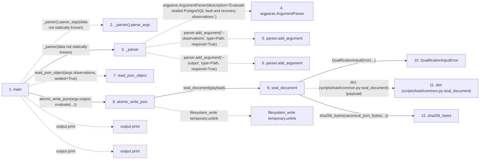

# resilience

**Entry point:** `main` (`process`)
**Source:** [resilience](../modules/resilience.md)
**Modules touched:** [autonomy_canonical](../modules/autonomy_canonical.md), [load_common](../modules/load_common.md), [loader](../modules/loader.md), [resilience](../modules/resilience.md), [result](../modules/result.md)

**Related modules:** [load_common](../modules/load_common.md), [result](../modules/result.md)

## Call sequence

```mermaid
sequenceDiagram
    participant p0 as main
    participant p1 as _parser().parse_args
    participant p2 as _parser
    participant p3 as argparse.ArgumentParser
    participant p4 as parser.add_argument
    participant p5 as read_json_object
    participant p6 as atomic_write_json
    participant p7 as seal_document
    participant p8 as QualificationInputError
    participant p9 as dict (scripts/load/common.py:seal_document)
    participant p10 as sha256_bytes
    participant p11 as hashlib.sha256(…).hexdigest
    participant p12 as hashlib.sha256
    participant p13 as canonical_json_bytes (scripts/load/common.py)
    participant p14 as json.dumps(…).encode (scripts/load/common.py:canonical_json_bytes)
    participant p15 as json.dumps (scripts/load/common.py:canonical_json_bytes)
    participant p16 as dict (scripts/load/common.py:atomic_write_json)
    participant p17 as path.parent.mkdir
    participant p18 as path.with_name
    participant p19 as os.getpid
    participant p20 as json.dumps(…).encode (scripts/load/common.py:atomic_write_json)
    participant p21 as json.dumps (scripts/load/common.py:atomic_write_json)
    participant p22 as temporary.open
    participant p23 as os.chmod
    participant p24 as handle.write
    participant p25 as handle.flush
    participant p26 as os.fsync
    participant p27 as handle.fileno
    participant p28 as os.replace
    participant p29 as os.open
    p0-->>p1: _parser().parse_args
    p0->>p2: _parser
    p2-->>p3: argparse.ArgumentParser
    p2-->>p4: parser.add_argument
    p2-->>p4: parser.add_argument
    p0-->>p5: read_json_object
    p0->>p6: atomic_write_json
    p6->>p7: seal_document
    p7->>p8: QualificationInputError
    p7-->>p9: dict (scripts/load/common.py:seal_document)
    p7->>p10: sha256_bytes
    p10-->>p11: hashlib.sha256(…).hexdigest
    p10-->>p12: hashlib.sha256
    p7->>p13: canonical_json_bytes (scripts/load/common.py)
    p13-->>p14: json.dumps(…).encode (scripts/load/common.py:canonical_json_bytes)
    p13-->>p15: json.dumps (scripts/load/common.py:canonical_json_bytes)
    p6-->>p16: dict (scripts/load/common.py:atomic_write_json)
    p6-->>p17: path.parent.mkdir
    p6-->>p18: path.with_name
    p6-->>p19: os.getpid
    p6-->>p20: json.dumps(…).encode (scripts/load/common.py:atomic_write_json)
    p6-->>p21: json.dumps (scripts/load/common.py:atomic_write_json)
    p6-->>p22: temporary.open
    p6-->>p23: os.chmod
    p6-->>p24: handle.write
    p6-->>p25: handle.flush
    p6-->>p26: os.fsync
    p6-->>p27: handle.fileno
    p6-->>p28: os.replace
    p6-->>p29: os.open
```

<!-- Auto-generated from static call edges. Dashed arrows are external or unresolved calls. Reviewed runtime conditions and side effects belong in Behavior. -->

> Call sequence diagram shows 30 of 217 interactions; 187 omitted to keep the visualization within the 30-interaction and generated-diagram limits.

> Trace truncated at the depth limit; deeper calls are omitted.

## Data flow

<!-- Auto-generated static analysis. Treat values and boundaries as best-effort hints, not runtime proof. -->

### Step data

| Step | Inputs | Reads | Writes | Returns |
|---|---|---|---|---|
| `main` | - | `QualificationInputError`, `sys` | - | `...`, `2` |
| `_parser().parse_args` | - | - | - | - |
| `_parser` | - | `Path`, `Path` | - | `parser` |
| `argparse.ArgumentParser` | - | - | - | - |
| `parser.add_argument` | - | - | - | - |
| `parser.add_argument` | - | - | - | - |
| `read_json_object` | - | - | - | - |
| `atomic_write_json` | `path: Path`, `payload: Mapping[str, Any]`, `sealed: bool`, `mode: int` | `os` | - | `document` |
| `seal_document` | `payload: Mapping[str, Any]` | `DOCUMENT_CHECKSUM_FIELD`, `DOCUMENT_CHECKSUM_FIELD` | `document[...]` | `document` |
| `QualificationInputError` | - | - | - | - |
| `dict (scripts/load/common.py:seal_document)` | - | - | - | - |
| `sha256_bytes` | `value: bytes` | - | - | `...` |

### Call data

| From | To | Line | Call |
|---|---|---:|---|
| main | _parser().parse_args | 209 | `_parser().parse_args(data not statically known)` |
| main | _parser | 209 | `_parser(data not statically known)` |
| _parser | argparse.ArgumentParser | 200 | `argparse.ArgumentParser(description='Evaluate sealed PostgreSQL fault and recovery observations.')` |
| _parser | parser.add_argument | 203 | `parser.add_argument('--observations', type=Path, required=True)` |
| _parser | parser.add_argument | 204 | `parser.add_argument('--output', type=Path, required=True)` |
| main | read_json_object | 211 | `read_json_object(args.observations, sealed=True)` |
| main | atomic_write_json | 212 | `atomic_write_json(args.output, evaluate(...))` |
| atomic_write_json | seal_document | 141 | `seal_document(payload)` |
| seal_document | QualificationInputError | 62 | `QualificationInputError(...)` |
| seal_document | dict (scripts/load/common.py:seal_document) | 65 | `dict(payload)` |
| seal_document | sha256_bytes | 66 | `sha256_bytes(canonical_json_bytes(...))` |

### Boundary effects

| Kind | Target | Step | Line |
|---|---|---|---:|
| output | `print` | `main` | 213 |
| output | `print` | `main` | 219 |
| filesystem_write | `temporary.unlink` | `atomic_write_json` | 165 |

### Static analysis gaps

| Kind | Step | Target | Line |
|---|---|---|---:|
| unresolved_call | `main` | `_parser().parse_args` | 209 |
| external_call | `_parser` | `argparse.ArgumentParser` | 200 |
| unresolved_call | `_parser` | `parser.add_argument` | 203 |
| unresolved_call | `_parser` | `parser.add_argument` | 204 |
| unresolved_call | `main` | `read_json_object` | 211 |
| step_limit | `main` | `first 12 steps` | 0 |
| truncated_flow | `main` | `depth limit` | 0 |

## Behavior

This flow starts at `main` and is classified as `process`. The generated call and data-flow sections are bounded static projections; runtime conditions and side effects require source-level confirmation.
