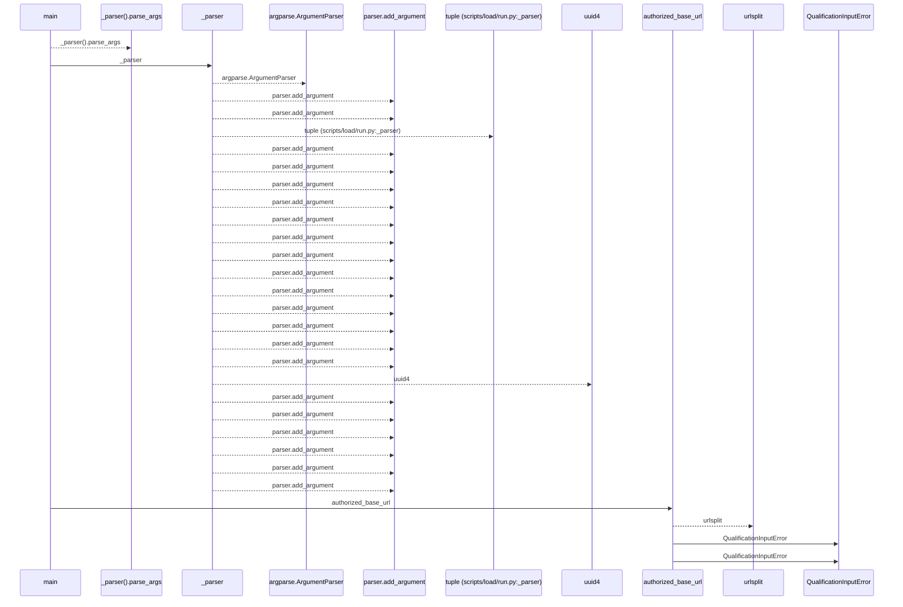
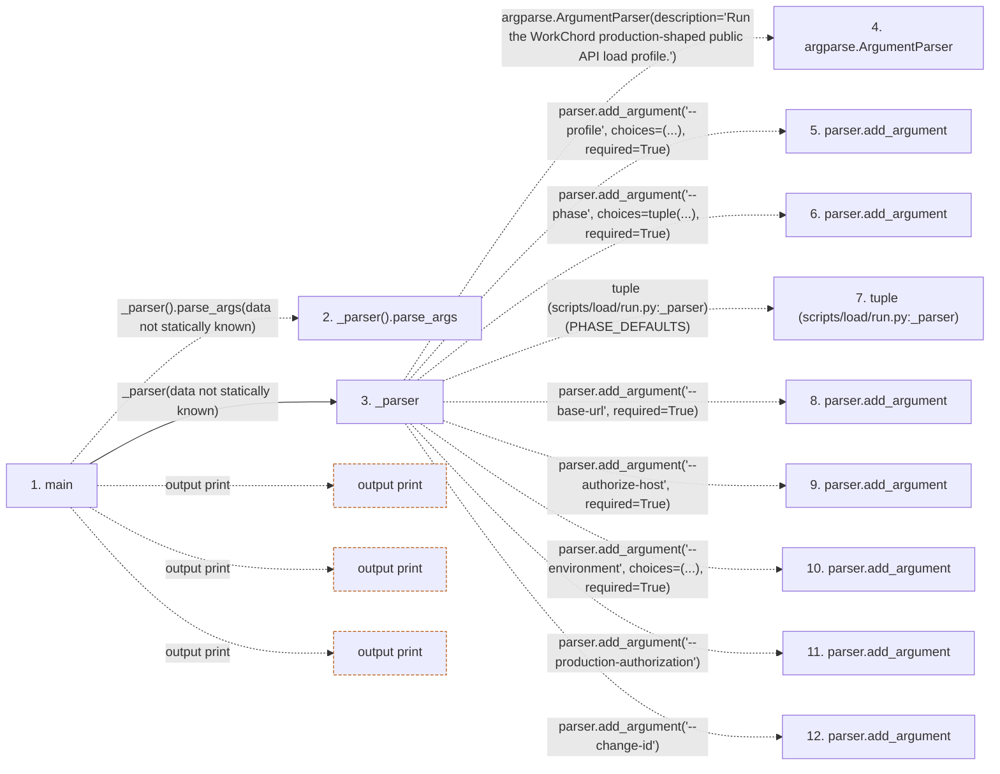

# run

**Entry point:** `main` (`process`)
**Source:** [run](../modules/run.md)
**Modules touched:** [autonomy_canonical](../modules/autonomy_canonical.md), [load_common](../modules/load_common.md), [loader](../modules/loader.md), [result](../modules/result.md), [run](../modules/run.md)

**Related modules:** [load_common](../modules/load_common.md), [result](../modules/result.md)

## Call sequence

<!-- Auto-generated from static call edges. Dashed arrows are external or unresolved calls. Reviewed runtime conditions and side effects belong in Behavior. -->

> Call sequence diagram shows 30 of 914 interactions; 884 omitted to keep the visualization within the 30-interaction and generated-diagram limits.

> Trace truncated at the depth limit; deeper calls are omitted.

## Data flow

<!-- Auto-generated static analysis. Treat values and boundaries as best-effort hints, not runtime proof. -->

### Step data

| Step | Inputs | Reads | Writes | Returns |
|---|---|---|---|---|
| `main` | - | `QualificationInputError`, `httpx`, `sys` | `args.base_url`, `credentials[...]` | `0`, `...`, `2` |
| `_parser().parse_args` | - | - | - | - |
| `_parser` | - | `PHASE_DEFAULTS`, `Path`, `Path`, `Path`, `Path`, `Path`, `Path` | - | `parser` |
| `argparse.ArgumentParser` | - | - | - | - |
| `parser.add_argument` | - | - | - | - |
| `parser.add_argument` | - | - | - | - |
| `tuple (scripts/load/run.py:_parser)` | - | - | - | - |
| `parser.add_argument` | - | - | - | - |
| `parser.add_argument` | - | - | - | - |
| `parser.add_argument` | - | - | - | - |
| `parser.add_argument` | - | - | - | - |
| `parser.add_argument` | - | - | - | - |

### Call data

| From | To | Line | Call |
|---|---|---:|---|
| main | _parser().parse_args | 1541 | `_parser().parse_args(data not statically known)` |
| main | _parser | 1541 | `_parser(data not statically known)` |
| _parser | argparse.ArgumentParser | 1495 | `argparse.ArgumentParser(description='Run the WorkChord production-shaped public API load profile.')` |
| _parser | parser.add_argument | 1498 | `parser.add_argument('--profile', choices=(...), required=True)` |
| _parser | parser.add_argument | 1508 | `parser.add_argument('--phase', choices=tuple(...), required=True)` |
| _parser | tuple (scripts/load/run.py:_parser) | 1508 | `tuple(PHASE_DEFAULTS)` |
| _parser | parser.add_argument | 1509 | `parser.add_argument('--base-url', required=True)` |
| _parser | parser.add_argument | 1510 | `parser.add_argument('--authorize-host', required=True)` |
| _parser | parser.add_argument | 1511 | `parser.add_argument('--environment', choices=(...), required=True)` |
| _parser | parser.add_argument | 1514 | `parser.add_argument('--production-authorization')` |
| _parser | parser.add_argument | 1515 | `parser.add_argument('--change-id')` |

### Boundary effects

| Kind | Target | Step | Line |
|---|---|---|---:|
| output | `print` | `main` | 1670 |
| output | `print` | `main` | 1682 |
| output | `print` | `main` | 1689 |

### Static analysis gaps

| Kind | Step | Target | Line |
|---|---|---|---:|
| unresolved_call | `main` | `_parser().parse_args` | 1541 |
| external_call | `_parser` | `argparse.ArgumentParser` | 1495 |
| unresolved_call | `_parser` | `parser.add_argument` | 1498 |
| unresolved_call | `_parser` | `parser.add_argument` | 1508 |
| unresolved_call | `_parser` | `parser.add_argument` | 1509 |
| unresolved_call | `_parser` | `parser.add_argument` | 1510 |
| unresolved_call | `_parser` | `parser.add_argument` | 1511 |
| unresolved_call | `_parser` | `parser.add_argument` | 1514 |
| unresolved_call | `_parser` | `parser.add_argument` | 1515 |
| step_limit | `main` | `first 12 steps` | 0 |
| truncated_flow | `main` | `depth limit` | 0 |

## Behavior

This flow starts at `main` and is classified as `process`. The generated call and data-flow sections are bounded static projections; runtime conditions and side effects require source-level confirmation.
