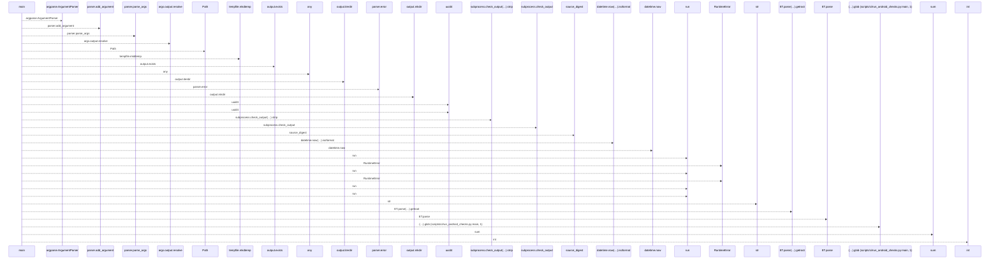
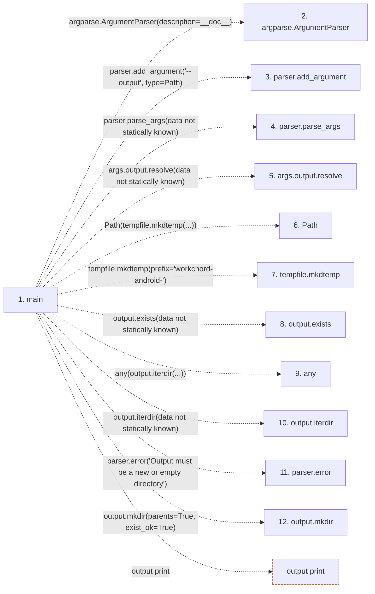

# run_android_checks

**Entry point:** `main` (`process`)
**Source:** [run_android_checks](../modules/run_android_checks.md)
**Modules touched:** [run_android_checks](../modules/run_android_checks.md)

## Call sequence

<!-- Auto-generated from static call edges. Dashed arrows are external or unresolved calls. Reviewed runtime conditions and side effects belong in Behavior. -->

> Call sequence diagram shows 30 of 52 interactions; 22 omitted to keep the visualization within the 30-interaction and generated-diagram limits.

## Data flow

<!-- Auto-generated static analysis. Treat values and boundaries as best-effort hints, not runtime proof. -->

### Step data

| Step | Inputs | Reads | Writes | Returns |
|---|---|---|---|---|
| `main` | - | `Path` | `receipt[...]`, `receipt[...]`, `receipt[...]`, `receipt[...]`, `receipt[...]`, `receipt[...]`, `receipt[...]`, `receipt[...]` | `...` |
| `argparse.ArgumentParser` | - | - | - | - |
| `parser.add_argument` | - | - | - | - |
| `parser.parse_args` | - | - | - | - |
| `args.output.resolve` | - | - | - | - |
| `Path` | - | - | - | - |
| `tempfile.mkdtemp` | - | - | - | - |
| `output.exists` | - | - | - | - |
| `any` | - | - | - | - |
| `output.iterdir` | - | - | - | - |
| `parser.error` | - | - | - | - |
| `output.mkdir` | - | - | - | - |

### Call data

| From | To | Line | Call |
|---|---|---:|---|
| main | argparse.ArgumentParser | 18 | `argparse.ArgumentParser(description=__doc__)` |
| main | parser.add_argument | 19 | `parser.add_argument('--output', type=Path)` |
| main | parser.parse_args | 20 | `parser.parse_args(data not statically known)` |
| main | args.output.resolve | 21 | `args.output.resolve(data not statically known)` |
| main | Path | 21 | `Path(tempfile.mkdtemp(...))` |
| main | tempfile.mkdtemp | 21 | `tempfile.mkdtemp(prefix='workchord-android-')` |
| main | output.exists | 22 | `output.exists(data not statically known)` |
| main | any | 22 | `any(output.iterdir(...))` |
| main | output.iterdir | 22 | `output.iterdir(data not statically known)` |
| main | parser.error | 23 | `parser.error('Output must be a new or empty directory')` |
| main | output.mkdir | 24 | `output.mkdir(parents=True, exist_ok=True)` |

### Boundary effects

| Kind | Target | Step | Line |
|---|---|---|---:|
| output | `print` | `main` | 78 |

### Static analysis gaps

| Kind | Step | Target | Line |
|---|---|---|---:|
| external_call | `main` | `argparse.ArgumentParser` | 18 |
| unresolved_call | `main` | `parser.add_argument` | 19 |
| unresolved_call | `main` | `parser.parse_args` | 20 |
| unresolved_call | `main` | `args.output.resolve` | 21 |
| external_call | `main` | `tempfile.mkdtemp` | 21 |
| unresolved_call | `main` | `output.exists` | 22 |
| external_call | `main` | `any` | 22 |
| unresolved_call | `main` | `output.iterdir` | 22 |
| unresolved_call | `main` | `parser.error` | 23 |
| unresolved_call | `main` | `output.mkdir` | 24 |
| step_limit | `main` | `first 12 steps` | 0 |

## Behavior

The command creates a unique image tag and container, runs the Gradle wrapper, and copies execution reports and the debug APK to a new output directory. Nonempty executed results and an APK are required before reporting success. Source stability and cleanup are checked. SDK configuration and debug signing material stay inside the disposable image/container; production signing is outside this workflow.
