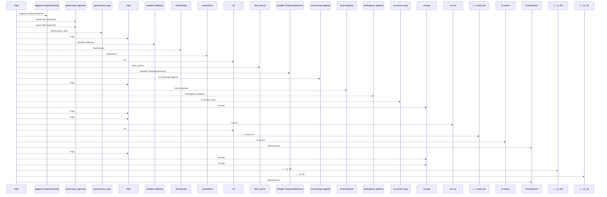
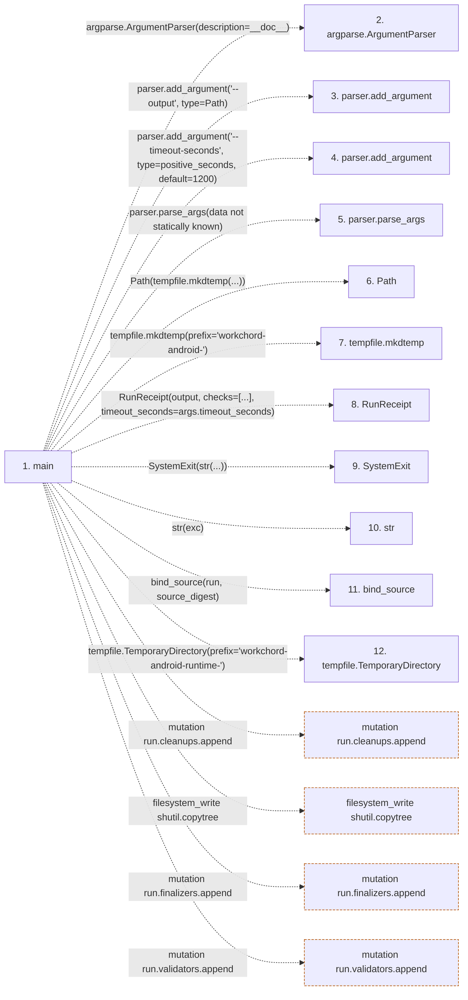

# run_android_checks

**Entry point:** `main` (`process`)
**Source:** [run_android_checks](../modules/run_android_checks.md)
**Modules touched:** [run_android_checks](../modules/run_android_checks.md)

## Call sequence

<!-- Auto-generated from static call edges. Dashed arrows are external or unresolved calls. Reviewed runtime conditions and side effects belong in Behavior. -->

> Call sequence diagram shows 30 of 41 interactions; 11 omitted to keep the visualization within the 30-interaction and generated-diagram limits.

## Data flow

<!-- Auto-generated static analysis. Treat values and boundaries as best-effort hints, not runtime proof. -->

### Step data

| Step | Inputs | Reads | Writes | Returns |
|---|---|---|---|---|
| `main` | - | `Path`, `positive_seconds`, `source_digest`, `ROOT` | `run.data[...]`, `run.data[...]` | `run.exit_code` |
| `argparse.ArgumentParser` | - | - | - | - |
| `parser.add_argument` | - | - | - | - |
| `parser.add_argument` | - | - | - | - |
| `parser.parse_args` | - | - | - | - |
| `Path` | - | - | - | - |
| `tempfile.mkdtemp` | - | - | - | - |
| `RunReceipt` | - | - | - | - |
| `SystemExit` | - | - | - | - |
| `str` | - | - | - | - |
| `bind_source` | - | - | - | - |
| `tempfile.TemporaryDirectory` | - | - | - | - |

### Call data

| From | To | Line | Call |
|---|---|---:|---|
| main | argparse.ArgumentParser | 18 | `argparse.ArgumentParser(description=__doc__)` |
| main | parser.add_argument | 19 | `parser.add_argument('--output', type=Path)` |
| main | parser.add_argument | 20 | `parser.add_argument('--timeout-seconds', type=positive_seconds, default=1200)` |
| main | parser.parse_args | 21 | `parser.parse_args(data not statically known)` |
| main | Path | 22 | `Path(tempfile.mkdtemp(...))` |
| main | tempfile.mkdtemp | 22 | `tempfile.mkdtemp(prefix='workchord-android-')` |
| main | RunReceipt | 24 | `RunReceipt(output, checks=[...], timeout_seconds=args.timeout_seconds)` |
| main | SystemExit | 26 | `SystemExit(str(...))` |
| main | str | 26 | `str(exc)` |
| main | bind_source | 28 | `bind_source(run, source_digest)` |
| main | tempfile.TemporaryDirectory | 30 | `tempfile.TemporaryDirectory(prefix='workchord-android-runtime-')` |

### Boundary effects

| Kind | Target | Step | Line |
|---|---|---|---:|
| mutation | `run.cleanups.append` | `main` | 31 |
| filesystem_write | `shutil.copytree` | `main` | 33 |
| mutation | `run.finalizers.append` | `main` | 55 |
| mutation | `run.validators.append` | `main` | 78 |

### Static analysis gaps

| Kind | Step | Target | Line |
|---|---|---|---:|
| external_call | `main` | `argparse.ArgumentParser` | 18 |
| unresolved_call | `main` | `parser.add_argument` | 19 |
| unresolved_call | `main` | `parser.add_argument` | 20 |
| unresolved_call | `main` | `parser.parse_args` | 21 |
| external_call | `main` | `tempfile.mkdtemp` | 22 |
| external_call | `main` | `RunReceipt` | 24 |
| external_call | `main` | `SystemExit` | 26 |
| external_call | `main` | `bind_source` | 28 |
| external_call | `main` | `tempfile.TemporaryDirectory` | 30 |
| step_limit | `main` | `first 12 steps` | 0 |

## Behavior

The command verifies its native JDK/SDK and Gradle wrapper, copies source without local SDK configuration or build caches, and runs both build variants before validating the debug APK. The shared runner records progress, streams logs and limits execution time. Available outputs are collected before temporary-project cleanup, including on interruption. Both variants need successful executed results and the APK must be nonempty; failed or interrupted commands cannot be upgraded to success by partial artifacts. Production signing and real-device behavior remain outside this command.
