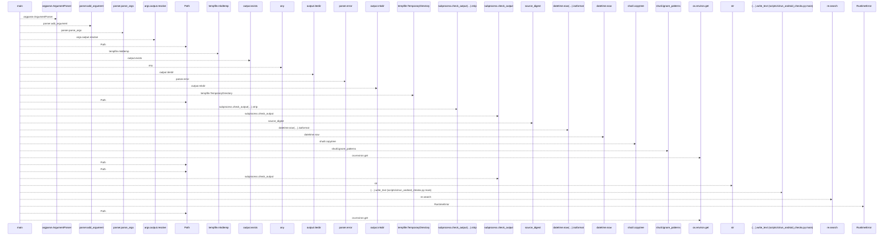
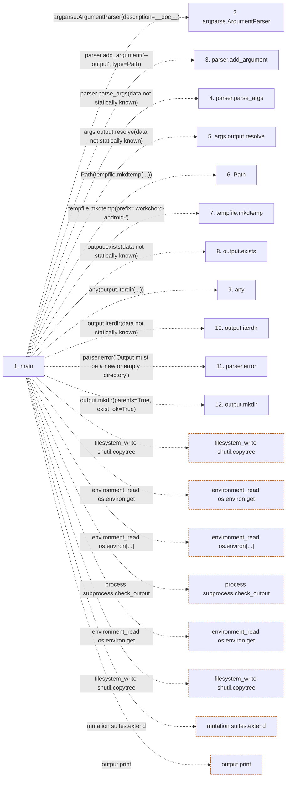

# run_android_checks

**Entry point:** `main` (`process`)
**Source:** [run_android_checks](../modules/run_android_checks.md)
**Modules touched:** [run_android_checks](../modules/run_android_checks.md)

## Call sequence

<!-- Auto-generated from static call edges. Dashed arrows are external or unresolved calls. Reviewed runtime conditions and side effects belong in Behavior. -->

> Call sequence diagram shows 30 of 79 interactions; 49 omitted to keep the visualization within the 30-interaction and generated-diagram limits.

## Data flow

<!-- Auto-generated static analysis. Treat values and boundaries as best-effort hints, not runtime proof. -->

### Step data

| Step | Inputs | Reads | Writes | Returns |
|---|---|---|---|---|
| `main` | - | `Path`, `ROOT`, `os`, `subprocess` | `receipt[...]`, `receipt[...]`, `receipt[...]`, `receipt[...]`, `receipt[...]`, `receipt[...]`, `receipt[...]`, `receipt[...]` | `...` |
| `argparse.ArgumentParser` | - | - | - | - |
| `parser.add_argument` | - | - | - | - |
| `parser.parse_args` | - | - | - | - |
| `args.output.resolve` | - | - | - | - |
| `Path` | - | - | - | - |
| `tempfile.mkdtemp` | - | - | - | - |
| `output.exists` | - | - | - | - |
| `any` | - | - | - | - |
| `output.iterdir` | - | - | - | - |
| `parser.error` | - | - | - | - |
| `output.mkdir` | - | - | - | - |

### Call data

| From | To | Line | Call |
|---|---|---:|---|
| main | argparse.ArgumentParser | 20 | `argparse.ArgumentParser(description=__doc__)` |
| main | parser.add_argument | 21 | `parser.add_argument('--output', type=Path)` |
| main | parser.parse_args | 22 | `parser.parse_args(data not statically known)` |
| main | args.output.resolve | 23 | `args.output.resolve(data not statically known)` |
| main | Path | 23 | `Path(tempfile.mkdtemp(...))` |
| main | tempfile.mkdtemp | 23 | `tempfile.mkdtemp(prefix='workchord-android-')` |
| main | output.exists | 24 | `output.exists(data not statically known)` |
| main | any | 24 | `any(output.iterdir(...))` |
| main | output.iterdir | 24 | `output.iterdir(data not statically known)` |
| main | parser.error | 25 | `parser.error('Output must be a new or empty directory')` |
| main | output.mkdir | 26 | `output.mkdir(parents=True, exist_ok=True)` |

### Boundary effects

| Kind | Target | Step | Line |
|---|---|---|---:|
| filesystem_write | `shutil.copytree` | `main` | 43 |
| environment_read | `os.environ.get` | `main` | 45 |
| environment_read | `os.environ[...]` | `main` | 45 |
| process | `subprocess.check_output` | `main` | 46 |
| environment_read | `os.environ.get` | `main` | 50 |
| filesystem_write | `shutil.copytree` | `main` | 64 |
| mutation | `suites.extend` | `main` | 77 |
| output | `print` | `main` | 99 |

### Static analysis gaps

| Kind | Step | Target | Line |
|---|---|---|---:|
| external_call | `main` | `argparse.ArgumentParser` | 20 |
| unresolved_call | `main` | `parser.add_argument` | 21 |
| unresolved_call | `main` | `parser.parse_args` | 22 |
| unresolved_call | `main` | `args.output.resolve` | 23 |
| external_call | `main` | `tempfile.mkdtemp` | 23 |
| unresolved_call | `main` | `output.exists` | 24 |
| external_call | `main` | `any` | 24 |
| unresolved_call | `main` | `output.iterdir` | 24 |
| unresolved_call | `main` | `parser.error` | 25 |
| unresolved_call | `main` | `output.mkdir` | 26 |
| step_limit | `main` | `first 12 steps` | 0 |

## Behavior

The command verifies the configured JDK/SDK and Gradle wrapper, copies source without local SDK configuration or build caches, and runs both build variants before collecting a debug APK. Each variant needs successful executed results. Logs, source hashes and artifact digests remain in the requested output directory after temporary project cleanup. Production signing and real-device behavior are outside this command.
