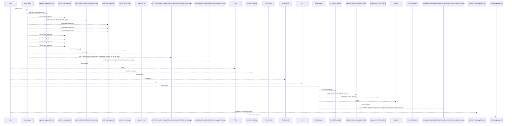
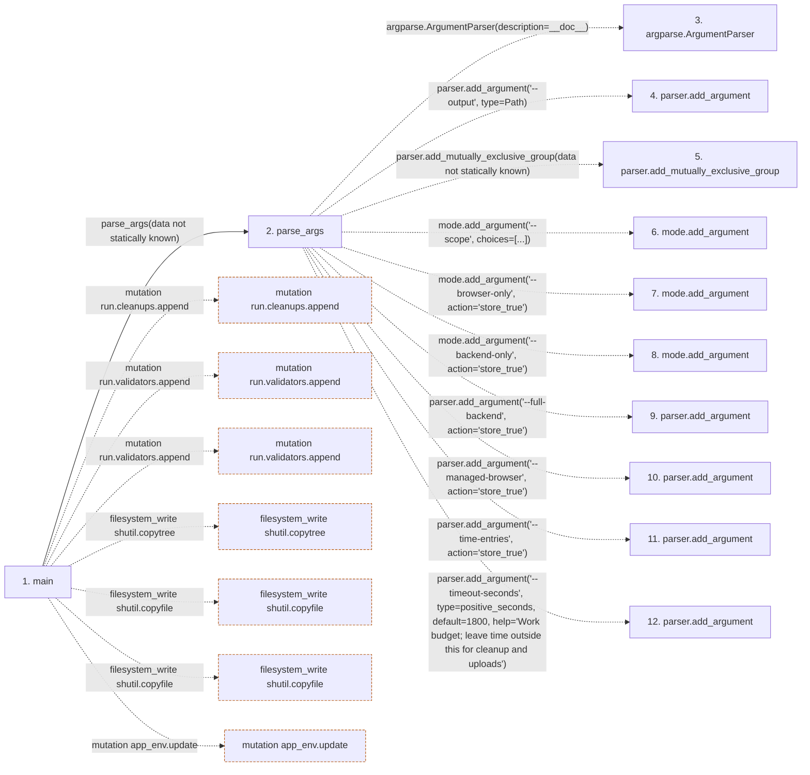

# run_disposable_checks

**Entry point:** `main` (`process`)
**Source:** [run_disposable_checks](../modules/run_disposable_checks.md)
**Modules touched:** [run_disposable_checks](../modules/run_disposable_checks.md)

## Call sequence

<!-- Auto-generated from static call edges. Dashed arrows are external or unresolved calls. Reviewed runtime conditions and side effects belong in Behavior. -->

> Call sequence diagram shows 30 of 95 interactions; 65 omitted to keep the visualization within the 30-interaction and generated-diagram limits.

## Data flow

<!-- Auto-generated static analysis. Treat values and boundaries as best-effort hints, not runtime proof. -->

### Step data

| Step | Inputs | Reads | Writes | Returns |
|---|---|---|---|---|
| `main` | - | `source_digest`, `PLAYWRIGHT_VERSION`, `ROOT`, `sys`, `sys`, `ROOT`, `ROOT`, `sys` | `run.data[...]`, `run.data[...]`, `env[...]`, `app_env[...]` | `run.exit_code` |
| `parse_args` | - | `Path`, `positive_seconds` | - | `(...)` |
| `argparse.ArgumentParser` | - | - | - | - |
| `parser.add_argument` | - | - | - | - |
| `parser.add_mutually_exclusive_group` | - | - | - | - |
| `mode.add_argument` | - | - | - | - |
| `mode.add_argument` | - | - | - | - |
| `mode.add_argument` | - | - | - | - |
| `parser.add_argument` | - | - | - | - |
| `parser.add_argument` | - | - | - | - |
| `parser.add_argument` | - | - | - | - |
| `parser.add_argument` | - | - | - | - |

### Call data

| From | To | Line | Call |
|---|---|---:|---|
| main | parse_args | 140 | `parse_args(data not statically known)` |
| parse_args | argparse.ArgumentParser | 114 | `argparse.ArgumentParser(description=__doc__)` |
| parse_args | parser.add_argument | 115 | `parser.add_argument('--output', type=Path)` |
| parse_args | parser.add_mutually_exclusive_group | 116 | `parser.add_mutually_exclusive_group(data not statically known)` |
| parse_args | mode.add_argument | 117 | `mode.add_argument('--scope', choices=[...])` |
| parse_args | mode.add_argument | 118 | `mode.add_argument('--browser-only', action='store_true')` |
| parse_args | mode.add_argument | 119 | `mode.add_argument('--backend-only', action='store_true')` |
| parse_args | parser.add_argument | 120 | `parser.add_argument('--full-backend', action='store_true')` |
| parse_args | parser.add_argument | 121 | `parser.add_argument('--managed-browser', action='store_true')` |
| parse_args | parser.add_argument | 122 | `parser.add_argument('--time-entries', action='store_true')` |
| parse_args | parser.add_argument | 123 | `parser.add_argument('--timeout-seconds', type=positive_seconds, default=1800, help='Work budget; leave time outside this for cleanup and uploads')` |

### Boundary effects

| Kind | Target | Step | Line |
|---|---|---|---:|
| mutation | `run.cleanups.append` | `main` | 151 |
| mutation | `run.validators.append` | `main` | 152 |
| mutation | `run.validators.append` | `main` | 179 |
| filesystem_write | `shutil.copytree` | `main` | 182 |
| filesystem_write | `shutil.copyfile` | `main` | 198 |
| filesystem_write | `shutil.copyfile` | `main` | 200 |
| mutation | `app_env.update` | `main` | 207 |

### Static analysis gaps

| Kind | Step | Target | Line |
|---|---|---|---:|
| external_call | `parse_args` | `argparse.ArgumentParser` | 114 |
| unresolved_call | `parse_args` | `parser.add_argument` | 115 |
| unresolved_call | `parse_args` | `parser.add_mutually_exclusive_group` | 116 |
| unresolved_call | `parse_args` | `mode.add_argument` | 117 |
| unresolved_call | `parse_args` | `mode.add_argument` | 118 |
| unresolved_call | `parse_args` | `mode.add_argument` | 119 |
| unresolved_call | `parse_args` | `parser.add_argument` | 120 |
| unresolved_call | `parse_args` | `parser.add_argument` | 121 |
| unresolved_call | `parse_args` | `parser.add_argument` | 122 |
| unresolved_call | `parse_args` | `parser.add_argument` | 123 |
| step_limit | `main` | `first 12 steps` | 0 |

## Behavior

The runner supplies its exact Python executable to the managed browser and copies the inbox dispatch helper beside the scenario. Node launches the worker through that absolute executable, retaining the backend dependency environment even when a different Python is on `PATH`. The helper requires the owned disposable database and invocation nonce before starting delivery.

The selected scope determines prerequisites, commands and required artifacts. SQLite runs without a PostgreSQL admin endpoint; PostgreSQL uses a validated loopback cluster; frontend owns its JUnit, lint and build outcomes; browser-only mode provisions the isolated application and Playwright scenario without repeating those suites. Existing combined command-line modes remain available.

The runner writes an initial receipt before commands, streams command logs with periodic heartbeats, records stage durations, and enforces command/run deadlines. Workflow setup time reduces the remaining budget so cleanup and uploads have reserved headroom. Missing evidence, nonzero commands, source changes and unsuccessful cleanup fail the run. Graceful cancellation is recorded; a hard-killed run remains incomplete. The browser invocation nonce and active-port ownership checks remain enforced.
