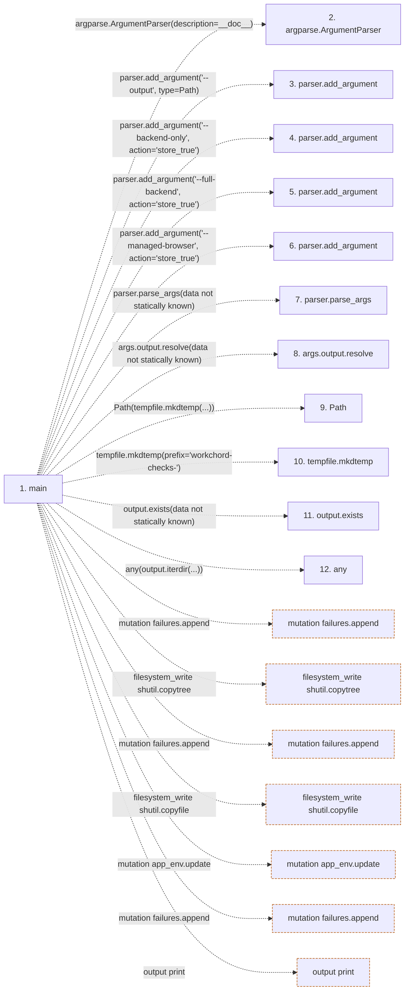

# run_disposable_checks

**Entry point:** `main` (`process`)
**Source:** [run_disposable_checks](../modules/run_disposable_checks.md)
**Modules touched:** [run_disposable_checks](../modules/run_disposable_checks.md)

## Call sequence

```mermaid
sequenceDiagram
    participant p0 as main
    participant p1 as argparse.ArgumentParser
    participant p2 as parser.add_argument
    participant p3 as parser.parse_args
    participant p4 as args.output.resolve
    participant p5 as Path
    participant p6 as tempfile.mkdtemp
    participant p7 as output.exists
    participant p8 as any
    participant p9 as output.iterdir
    participant p10 as parser.error
    participant p11 as output.mkdir
    participant p12 as subprocess.check_output(…).strip
    participant p13 as subprocess.check_output (scripts/ci/run_disposable_checks.py:main)
    participant p14 as source_digest
    participant p15 as subprocess.check_output(…).split
    participant p16 as subprocess.check_output (scripts/ci/run_disposable_checks.py:source_digest)
    participant p17 as hashlib.sha256 (scripts/ci/run_disposable_checks.py:source_digest)
    participant p18 as sorted (scripts/ci/run_disposable_checks.py:source_digest)
    participant p19 as set
    participant p20 as raw.decode
    participant p21 as path.is_file (scripts/ci/run_disposable_checks.py:source_digest)
    participant p22 as name.startswith
    participant p23 as digest.update
    participant p24 as path.read_bytes (scripts/ci/run_disposable_checks.py:source_digest)
    participant p25 as digest.hexdigest
    participant p26 as datetime.now(…).isoformat
    participant p27 as datetime.now
    p0-->>p1: argparse.ArgumentParser
    p0-->>p2: parser.add_argument
    p0-->>p2: parser.add_argument
    p0-->>p2: parser.add_argument
    p0-->>p2: parser.add_argument
    p0-->>p3: parser.parse_args
    p0-->>p4: args.output.resolve
    p0-->>p5: Path
    p0-->>p6: tempfile.mkdtemp
    p0-->>p7: output.exists
    p0-->>p8: any
    p0-->>p9: output.iterdir
    p0-->>p10: parser.error
    p0-->>p11: output.mkdir
    p0-->>p12: subprocess.check_output(…).strip
    p0-->>p13: subprocess.check_output (scripts/ci/run_disposable_checks.py:main)
    p0->>p14: source_digest
    p14-->>p15: subprocess.check_output(…).split
    p14-->>p16: subprocess.check_output (scripts/ci/run_disposable_checks.py:source_digest)
    p14-->>p17: hashlib.sha256 (scripts/ci/run_disposable_checks.py:source_digest)
    p14-->>p18: sorted (scripts/ci/run_disposable_checks.py:source_digest)
    p14-->>p19: set
    p14-->>p20: raw.decode
    p14-->>p21: path.is_file (scripts/ci/run_disposable_checks.py:source_digest)
    p14-->>p22: name.startswith
    p14-->>p23: digest.update
    p14-->>p24: path.read_bytes (scripts/ci/run_disposable_checks.py:source_digest)
    p14-->>p25: digest.hexdigest
    p0-->>p26: datetime.now(…).isoformat
    p0-->>p27: datetime.now
```

<!-- Auto-generated from static call edges. Dashed arrows are external or unresolved calls. Reviewed runtime conditions and side effects belong in Behavior. -->

> Call sequence diagram shows 30 of 109 interactions; 79 omitted to keep the visualization within the 30-interaction and generated-diagram limits.

## Data flow

<!-- Auto-generated static analysis. Treat values and boundaries as best-effort hints, not runtime proof. -->

### Step data

| Step | Inputs | Reads | Writes | Returns |
|---|---|---|---|---|
| `main` | - | `Path`, `PLAYWRIGHT_VERSION`, `ROOT`, `sys`, `sys`, `ROOT`, `ROOT`, `sys` | `receipt[...]`, `receipt[...]`, `receipt[...]`, `receipt[...]`, `receipt[...]`, `counts[...]`, `receipt[...]`, `receipt[...]` | `...` |
| `argparse.ArgumentParser` | - | - | - | - |
| `parser.add_argument` | - | - | - | - |
| `parser.add_argument` | - | - | - | - |
| `parser.add_argument` | - | - | - | - |
| `parser.add_argument` | - | - | - | - |
| `parser.parse_args` | - | - | - | - |
| `args.output.resolve` | - | - | - | - |
| `Path` | - | - | - | - |
| `tempfile.mkdtemp` | - | - | - | - |
| `output.exists` | - | - | - | - |
| `any` | - | - | - | - |

### Call data

| From | To | Line | Call |
|---|---|---:|---|
| main | argparse.ArgumentParser | 87 | `argparse.ArgumentParser(description=__doc__)` |
| main | parser.add_argument | 88 | `parser.add_argument('--output', type=Path)` |
| main | parser.add_argument | 89 | `parser.add_argument('--backend-only', action='store_true')` |
| main | parser.add_argument | 90 | `parser.add_argument('--full-backend', action='store_true')` |
| main | parser.add_argument | 91 | `parser.add_argument('--managed-browser', action='store_true')` |
| main | parser.parse_args | 92 | `parser.parse_args(data not statically known)` |
| main | args.output.resolve | 93 | `args.output.resolve(data not statically known)` |
| main | Path | 93 | `Path(tempfile.mkdtemp(...))` |
| main | tempfile.mkdtemp | 93 | `tempfile.mkdtemp(prefix='workchord-checks-')` |
| main | output.exists | 94 | `output.exists(data not statically known)` |
| main | any | 94 | `any(output.iterdir(...))` |

### Boundary effects

| Kind | Target | Step | Line |
|---|---|---|---:|
| mutation | `failures.append` | `main` | 142 |
| filesystem_write | `shutil.copytree` | `main` | 146 |
| mutation | `failures.append` | `main` | 153 |
| filesystem_write | `shutil.copyfile` | `main` | 159 |
| mutation | `app_env.update` | `main` | 165 |
| mutation | `failures.append` | `main` | 172 |
| output | `print` | `main` | 213 |

### Static analysis gaps

| Kind | Step | Target | Line |
|---|---|---|---:|
| external_call | `main` | `argparse.ArgumentParser` | 87 |
| unresolved_call | `main` | `parser.add_argument` | 88 |
| unresolved_call | `main` | `parser.add_argument` | 89 |
| unresolved_call | `main` | `parser.add_argument` | 90 |
| unresolved_call | `main` | `parser.add_argument` | 91 |
| unresolved_call | `main` | `parser.parse_args` | 92 |
| unresolved_call | `main` | `args.output.resolve` | 93 |
| external_call | `main` | `tempfile.mkdtemp` | 93 |
| unresolved_call | `main` | `output.exists` | 94 |
| external_call | `main` | `any` | 94 |
| step_limit | `main` | `first 12 steps` | 0 |

## Behavior

Provision native tools and a loopback PostgreSQL admin endpoint before invoking the runner. It runs database and client contracts, copies the frontend into a temporary workspace, and starts owned API/frontend processes for bounded browser interactions. The browser verifies an invocation nonce before mutation. Source drift, missing executed results, failed commands or cleanup failures prevent a successful receipt. Automatic workflows do not pull or build container images.
