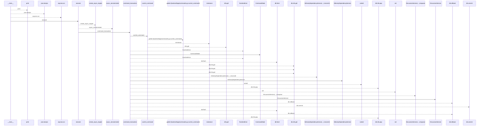
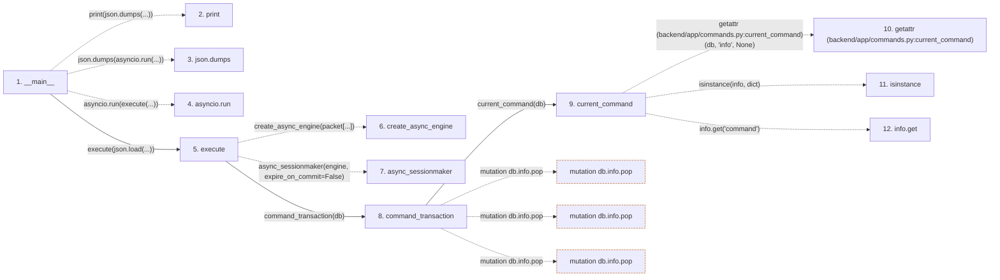

# runtime_peer

**Entry point:** `__main__` (`process`)
**Source:** [runtime_peer](../modules/runtime_peer.md)
**Modules touched:** [agent_service](../modules/agent_service.md), [agent_work_service](../modules/agent_work_service.md), [commands](../modules/commands.md), and 3 more

**Complete modules touched:**

- [agent_service](../modules/agent_service.md)
- [agent_work_service](../modules/agent_work_service.md)
- [commands](../modules/commands.md)
- [delivery_dependency_service](../modules/delivery_dependency_service.md)
- [discussion_service](../modules/discussion_service.md)
- [runtime_peer](../modules/runtime_peer.md)

**Related modules:** [agent_service](../modules/agent_service.md), [agent_work_service](../modules/agent_work_service.md), [commands](../modules/commands.md), [schemas_agent](../modules/schemas_agent.md)

## Call sequence

<!-- Auto-generated from static call edges. Dashed arrows are external or unresolved calls. Reviewed runtime conditions and side effects belong in Behavior. -->

> Call sequence diagram shows 30 of 56 interactions; 26 omitted to keep the visualization within the 30-interaction and generated-diagram limits.

## Data flow

<!-- Auto-generated static analysis. Treat values and boundaries as best-effort hints, not runtime proof. -->

### Step data

| Step | Inputs | Reads | Writes | Returns |
|---|---|---|---|---|
| `__main__` | - | - | - | - |
| `print` | - | - | - | - |
| `json.dumps` | - | - | - | - |
| `asyncio.run` | - | - | - | - |
| `execute` | `packet` | `AgentWorkBegin`, `AgentWorkRenew`, `AgentWorkSubmit`, `AgentWorkTerminal` | - | `{...}`, `{...}` |
| `create_async_engine` | - | - | - | - |
| `async_sessionmaker` | - | - | - | - |
| `command_transaction` | `db: AsyncSession`, `mode`, `commit` | - | `previous.failed`, `db.info[...]` | `none` |
| `current_command` | `db` | - | - | `...` |
| `getattr (backend/app/commands.py:current_command)` | - | - | - | - |
| `isinstance` | - | - | - | - |
| `info.get` | - | - | - | - |

### Call data

| From | To | Line | Call |
|---|---|---:|---|
| __main__ | print | 63 | `print(json.dumps(...))` |
| __main__ | json.dumps | 63 | `json.dumps(asyncio.run(...))` |
| __main__ | asyncio.run | 63 | `asyncio.run(execute(...))` |
| __main__ | execute | 63 | `execute(json.load(...))` |
| execute | create_async_engine | 22 | `create_async_engine(packet[...])` |
| execute | async_sessionmaker | 28 | `async_sessionmaker(engine, expire_on_commit=False)` |
| execute | command_transaction | 29 | `command_transaction(db)` |
| command_transaction | current_command | 85 | `current_command(db)` |
| current_command | getattr (backend/app/commands.py:current_command) | 71 | `getattr(db, 'info', None)` |
| current_command | isinstance | 72 | `isinstance(info, dict)` |
| current_command | info.get | 72 | `info.get('command')` |

### Boundary effects

| Kind | Target | Step | Line |
|---|---|---|---:|
| mutation | `db.info.pop` | `command_transaction` | 105 |
| mutation | `db.info.pop` | `command_transaction` | 118 |
| mutation | `db.info.pop` | `command_transaction` | 120 |

### Static analysis gaps

| Kind | Step | Target | Line |
|---|---|---|---:|
| external_call | `__main__` | `print` | 63 |
| external_call | `__main__` | `json.dumps` | 63 |
| external_call | `__main__` | `asyncio.run` | 63 |
| external_call | `execute` | `create_async_engine` | 22 |
| external_call | `execute` | `async_sessionmaker` | 28 |
| external_call | `current_command` | `getattr` | 71 |
| external_call | `current_command` | `isinstance` | 72 |
| unresolved_call | `current_command` | `info.get` | 72 |
| step_limit | `__main__` | `first 12 steps` | 0 |

## Behavior

This flow starts at `__main__` and is classified as `process`. The generated call and data-flow sections are bounded static projections; runtime conditions and side effects require source-level confirmation.
