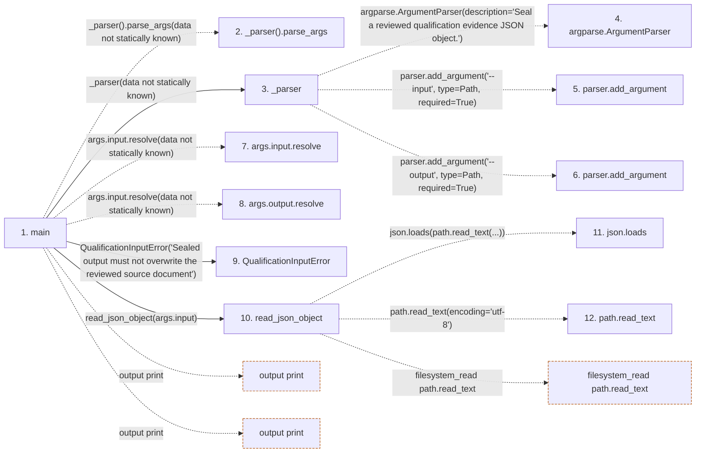

# seal

**Entry point:** `main` (`process`)
**Source:** [seal](../modules/seal.md)
**Modules touched:** [load_common](../modules/load_common.md), [seal](../modules/seal.md)

**Related modules:** [load_common](../modules/load_common.md)

## Call sequence

```mermaid
sequenceDiagram
    participant p0 as main
    participant p1 as _parser().parse_args
    participant p2 as _parser
    participant p3 as argparse.ArgumentParser
    participant p4 as parser.add_argument
    participant p5 as args.input.resolve
    participant p6 as args.output.resolve
    participant p7 as QualificationInputError
    participant p8 as read_json_object
    participant p9 as json.loads
    participant p10 as path.read_text
    participant p11 as isinstance (scripts/load/common.py:read_json_object)
    participant p12 as verify_document
    participant p13 as document.get (scripts/load/common.py:verify_document)
    participant p14 as isinstance (scripts/load/common.py:verify_document)
    participant p15 as len
    participant p16 as dict (scripts/load/common.py:verify_document)
    participant p17 as payload.pop
    participant p18 as sha256_bytes
    participant p19 as hashlib.sha256(…).hexdigest
    participant p20 as hashlib.sha256
    participant p21 as canonical_json_bytes
    participant p22 as json.dumps(…).encode (scripts/load/common.py:canonical_json_bytes)
    participant p23 as json.dumps (scripts/load/common.py:canonical_json_bytes)
    participant p24 as atomic_write_json
    p0-->>p1: _parser().parse_args
    p0->>p2: _parser
    p2-->>p3: argparse.ArgumentParser
    p2-->>p4: parser.add_argument
    p2-->>p4: parser.add_argument
    p0-->>p5: args.input.resolve
    p0-->>p6: args.output.resolve
    p0->>p7: QualificationInputError
    p0->>p8: read_json_object
    p8-->>p9: json.loads
    p8-->>p10: path.read_text
    p8->>p7: QualificationInputError
    p8-->>p11: isinstance (scripts/load/common.py:read_json_object)
    p8->>p7: QualificationInputError
    p8->>p12: verify_document
    p12-->>p13: document.get (scripts/load/common.py:verify_document)
    p12-->>p14: isinstance (scripts/load/common.py:verify_document)
    p12-->>p15: len
    p12->>p7: QualificationInputError
    p12-->>p16: dict (scripts/load/common.py:verify_document)
    p12-->>p17: payload.pop
    p12->>p18: sha256_bytes
    p18-->>p19: hashlib.sha256(…).hexdigest
    p18-->>p20: hashlib.sha256
    p12->>p21: canonical_json_bytes
    p21-->>p22: json.dumps(…).encode (scripts/load/common.py:canonical_json_bytes)
    p21-->>p23: json.dumps (scripts/load/common.py:canonical_json_bytes)
    p12->>p7: QualificationInputError
    p0->>p7: QualificationInputError
    p0->>p24: atomic_write_json
```

<!-- Auto-generated from static call edges. Dashed arrows are external or unresolved calls. Reviewed runtime conditions and side effects belong in Behavior. -->

> Call sequence diagram shows 30 of 56 interactions; 26 omitted to keep the visualization within the 30-interaction and generated-diagram limits.

## Data flow

<!-- Auto-generated static analysis. Treat values and boundaries as best-effort hints, not runtime proof. -->

### Step data

| Step | Inputs | Reads | Writes | Returns |
|---|---|---|---|---|
| `main` | - | `DOCUMENT_CHECKSUM_FIELD`, `DOCUMENT_CHECKSUM_FIELD`, `QualificationInputError`, `sys` | - | `0`, `2` |
| `_parser().parse_args` | - | - | - | - |
| `_parser` | - | `Path`, `Path` | - | `parser` |
| `argparse.ArgumentParser` | - | - | - | - |
| `parser.add_argument` | - | - | - | - |
| `parser.add_argument` | - | - | - | - |
| `args.input.resolve` | - | - | - | - |
| `args.output.resolve` | - | - | - | - |
| `QualificationInputError` | - | - | - | - |
| `read_json_object` | `path: Path`, `sealed: bool` | `json` | - | `value` |
| `json.loads` | - | - | - | - |
| `path.read_text` | - | - | - | - |

### Call data

| From | To | Line | Call |
|---|---|---:|---|
| main | _parser().parse_args | 31 | `_parser().parse_args(data not statically known)` |
| main | _parser | 31 | `_parser(data not statically known)` |
| _parser | argparse.ArgumentParser | 22 | `argparse.ArgumentParser(description='Seal a reviewed qualification evidence JSON object.')` |
| _parser | parser.add_argument | 25 | `parser.add_argument('--input', type=Path, required=True)` |
| _parser | parser.add_argument | 26 | `parser.add_argument('--output', type=Path, required=True)` |
| main | args.input.resolve | 33 | `args.input.resolve(data not statically known)` |
| main | args.output.resolve | 33 | `args.input.resolve(data not statically known)` |
| main | QualificationInputError | 34 | `QualificationInputError('Sealed output must not overwrite the reviewed source document')` |
| main | read_json_object | 37 | `read_json_object(args.input)` |
| read_json_object | json.loads | 90 | `json.loads(path.read_text(...))` |
| read_json_object | path.read_text | 90 | `path.read_text(encoding='utf-8')` |

### Boundary effects

| Kind | Target | Step | Line |
|---|---|---|---:|
| output | `print` | `main` | 43 |
| output | `print` | `main` | 49 |
| filesystem_read | `path.read_text` | `read_json_object` | 90 |

### Static analysis gaps

| Kind | Step | Target | Line |
|---|---|---|---:|
| unresolved_call | `main` | `_parser().parse_args` | 31 |
| external_call | `_parser` | `argparse.ArgumentParser` | 22 |
| unresolved_call | `_parser` | `parser.add_argument` | 25 |
| unresolved_call | `_parser` | `parser.add_argument` | 26 |
| unresolved_call | `main` | `args.input.resolve` | 33 |
| unresolved_call | `main` | `args.output.resolve` | 33 |
| step_limit | `main` | `first 12 steps` | 0 |

## Behavior

This flow starts at `main` and is classified as `process`. The generated call and data-flow sections are bounded static projections; runtime conditions and side effects require source-level confirmation.
