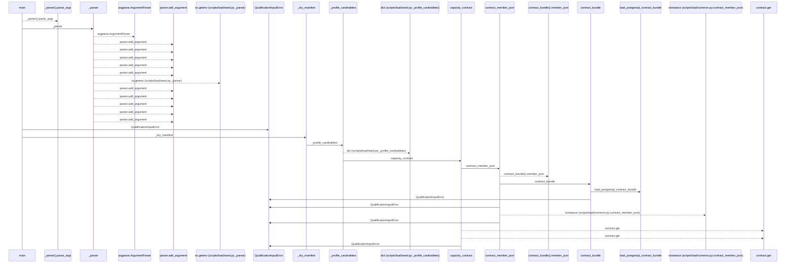
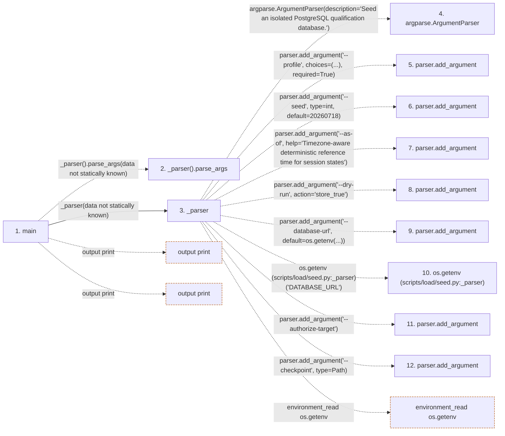

# seed

**Entry point:** `main` (`process`)
**Source:** [seed](../modules/seed.md)
**Modules touched:** [config](../modules/config.md), [database_config](../modules/database_config.md), [load_common](../modules/load_common.md), [loader](../modules/loader.md), and 2 more

**Complete modules touched:**

- [config](../modules/config.md)
- [database_config](../modules/database_config.md)
- [load_common](../modules/load_common.md)
- [loader](../modules/loader.md)
- [seed](../modules/seed.md)
- [upgrade_service](../modules/upgrade_service.md)

**Related modules:** [load_common](../modules/load_common.md), [upgrade_service](../modules/upgrade_service.md)

## Call sequence

<!-- Auto-generated from static call edges. Dashed arrows are external or unresolved calls. Reviewed runtime conditions and side effects belong in Behavior. -->

> Call sequence diagram shows 30 of 360 interactions; 330 omitted to keep the visualization within the 30-interaction and generated-diagram limits.

> Trace truncated at the depth limit; deeper calls are omitted.

## Data flow

<!-- Auto-generated static analysis. Treat values and boundaries as best-effort hints, not runtime proof. -->

### Step data

| Step | Inputs | Reads | Writes | Returns |
|---|---|---|---|---|
| `main` | - | `QualificationInputError`, `sys` | - | `0`, `2` |
| `_parser().parse_args` | - | - | - | - |
| `_parser` | - | `Path`, `Path`, `Path` | - | `parser` |
| `argparse.ArgumentParser` | - | - | - | - |
| `parser.add_argument` | - | - | - | - |
| `parser.add_argument` | - | - | - | - |
| `parser.add_argument` | - | - | - | - |
| `parser.add_argument` | - | - | - | - |
| `parser.add_argument` | - | - | - | - |
| `os.getenv (scripts/load/seed.py:_parser)` | - | - | - | - |
| `parser.add_argument` | - | - | - | - |
| `parser.add_argument` | - | - | - | - |

### Call data

| From | To | Line | Call |
|---|---|---:|---|
| main | _parser().parse_args | 1087 | `_parser().parse_args(data not statically known)` |
| main | _parser | 1087 | `_parser(data not statically known)` |
| _parser | argparse.ArgumentParser | 1067 | `argparse.ArgumentParser(description='Seed an isolated PostgreSQL qualification database.')` |
| _parser | parser.add_argument | 1070 | `parser.add_argument('--profile', choices=(...), required=True)` |
| _parser | parser.add_argument | 1071 | `parser.add_argument('--seed', type=int, default=20260718)` |
| _parser | parser.add_argument | 1072 | `parser.add_argument('--as-of', help='Timezone-aware deterministic reference time for session states')` |
| _parser | parser.add_argument | 1076 | `parser.add_argument('--dry-run', action='store_true')` |
| _parser | parser.add_argument | 1077 | `parser.add_argument('--database-url', default=os.getenv(...))` |
| _parser | os.getenv (scripts/load/seed.py:_parser) | 1077 | `os.getenv('DATABASE_URL')` |
| _parser | parser.add_argument | 1078 | `parser.add_argument('--authorize-target')` |
| _parser | parser.add_argument | 1079 | `parser.add_argument('--checkpoint', type=Path)` |

### Boundary effects

| Kind | Target | Step | Line |
|---|---|---|---:|
| output | `print` | `main` | 1110 |
| output | `print` | `main` | 1116 |
| environment_read | `os.getenv` | `_parser` | 1077 |

### Static analysis gaps

| Kind | Step | Target | Line |
|---|---|---|---:|
| unresolved_call | `main` | `_parser().parse_args` | 1087 |
| external_call | `_parser` | `argparse.ArgumentParser` | 1067 |
| unresolved_call | `_parser` | `parser.add_argument` | 1070 |
| unresolved_call | `_parser` | `parser.add_argument` | 1071 |
| unresolved_call | `_parser` | `parser.add_argument` | 1072 |
| unresolved_call | `_parser` | `parser.add_argument` | 1076 |
| unresolved_call | `_parser` | `parser.add_argument` | 1078 |
| unresolved_call | `_parser` | `parser.add_argument` | 1079 |
| step_limit | `main` | `first 12 steps` | 0 |
| truncated_flow | `main` | `depth limit` | 0 |

## Behavior

This flow starts at `main` and is classified as `process`. The generated call and data-flow sections are bounded static projections; runtime conditions and side effects require source-level confirmation.
