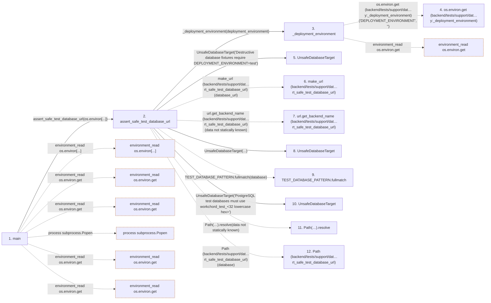

# serve_disposable_api

**Entry point:** `main` (`process`)
**Source:** [serve_disposable_api](../modules/serve_disposable_api.md)
**Modules touched:** [authority](../modules/authority.md), [calendar_service](../modules/calendar_service.md), [commands](../modules/commands.md), [config](../modules/config.md), and 13 more

**Complete modules touched:**

- [authority](../modules/authority.md)
- [calendar_service](../modules/calendar_service.md)
- [commands](../modules/commands.md)
- [config](../modules/config.md)
- [database_config](../modules/database_config.md)
- [github_status_automation_service](../modules/github_status_automation_service.md)
- [identity_service](../modules/identity_service.md)
- [label_service](../modules/label_service.md)
- [maintenance](../modules/maintenance.md)
- [models_identity](../modules/models_identity.md)
- [project_identity](../modules/project_identity.md)
- [saved_view_service](../modules/saved_view_service.md)
- [serve_disposable_api](../modules/serve_disposable_api.md)
- [support_database](../modules/support_database.md)
- [system_settings_service](../modules/system_settings_service.md)
- [template_service](../modules/template_service.md)
- [upgrade_service](../modules/upgrade_service.md)

**Related modules:** [app_database](../modules/app_database.md), [app_main](../modules/app_main.md), [delivery](../modules/delivery.md), [models_identity](../modules/models_identity.md), and 3 more

**Complete related modules:**

- [app_database](../modules/app_database.md)
- [app_main](../modules/app_main.md)
- [delivery](../modules/delivery.md)
- [models_identity](../modules/models_identity.md)
- [models_task](../modules/models_task.md)
- [support_database](../modules/support_database.md)
- [upgrade_service](../modules/upgrade_service.md)

## Call sequence

```mermaid
sequenceDiagram
    participant p0 as main
    participant p1 as assert_safe_test_database_url
    participant p2 as _deployment_environment
    participant p3 as os.environ.get (backend/tests/support/dat…y:_deployment_environment)
    participant p4 as UnsafeDatabaseTarget
    participant p5 as make_url (backend/tests/support/dat…rt_safe_test_database_url)
    participant p6 as url.get_backend_name (backend/tests/support/dat…rt_safe_test_database_url)
    participant p7 as TEST_DATABASE_PATTERN.fullmatch
    participant p8 as Path(…).resolve
    participant p9 as Path (backend/tests/support/dat…rt_safe_test_database_url)
    participant p10 as (…).resolve
    participant p11 as tempfile.gettempdir
    participant p12 as database_path.is_relative_to
    participant p13 as database_path.name.startswith
    participant p14 as url.get_backend_name (scripts/ci/serve_disposable_api.py:main)
    participant p15 as SystemExit
    participant p16 as run_alembic_upgrade
    participant p17 as migration_connection
    participant p18 as database_configuration
    participant p19 as parse_database_configuration
    participant p20 as make_url (backend/app/database_conf…se_database_configuration)
    participant p21 as str (backend/app/database_conf…se_database_configuration)
    participant p22 as _settings_value
    participant p23 as getattr (backend/app/database_config.py:_settings_value)
    participant p24 as DatabaseConfigurationError
    p0->>p1: assert_safe_test_database_url
    p1->>p2: _deployment_environment
    p2-->>p3: os.environ.get (backend/tests/support/dat…y:_deployment_environment)
    p1->>p4: UnsafeDatabaseTarget
    p1-->>p5: make_url (backend/tests/support/dat…rt_safe_test_database_url)
    p1-->>p6: url.get_backend_name (backend/tests/support/dat…rt_safe_test_database_url)
    p1->>p4: UnsafeDatabaseTarget
    p1-->>p7: TEST_DATABASE_PATTERN.fullmatch
    p1->>p4: UnsafeDatabaseTarget
    p1-->>p8: Path(…).resolve
    p1-->>p9: Path (backend/tests/support/dat…rt_safe_test_database_url)
    p1-->>p10: (…).resolve
    p1-->>p9: Path (backend/tests/support/dat…rt_safe_test_database_url)
    p1-->>p11: tempfile.gettempdir
    p1-->>p12: database_path.is_relative_to
    p1->>p4: UnsafeDatabaseTarget
    p1-->>p13: database_path.name.startswith
    p1->>p4: UnsafeDatabaseTarget
    p1->>p4: UnsafeDatabaseTarget
    p0-->>p14: url.get_backend_name (scripts/ci/serve_disposable_api.py:main)
    p0-->>p15: SystemExit
    p0->>p16: run_alembic_upgrade
    p16->>p17: migration_connection
    p17->>p18: database_configuration
    p18->>p19: parse_database_configuration
    p19-->>p20: make_url (backend/app/database_conf…se_database_configuration)
    p19-->>p21: str (backend/app/database_conf…se_database_configuration)
    p19->>p22: _settings_value
    p22-->>p23: getattr (backend/app/database_config.py:_settings_value)
    p22->>p24: DatabaseConfigurationError
```

<!-- Auto-generated from static call edges. Dashed arrows are external or unresolved calls. Reviewed runtime conditions and side effects belong in Behavior. -->

> Call sequence diagram shows 30 of 399 interactions; 369 omitted to keep the visualization within the 30-interaction and generated-diagram limits.

> Trace truncated at the depth limit; deeper calls are omitted.

## Data flow

<!-- Auto-generated static analysis. Treat values and boundaries as best-effort hints, not runtime proof. -->

### Step data

| Step | Inputs | Reads | Writes | Returns |
|---|---|---|---|---|
| `main` | - | `os` | - | - |
| `assert_safe_test_database_url` | `database_url: str \| URL`, `deployment_environment: str \| None`, `allowed_postgres_hosts: frozenset[str]`, `allowed_sqlite_root: Path \| None` | `TEST_DATABASE_PREFIX`, `TEST_DATABASE_PREFIX` | - | `url`, `url`, `url` |
| `_deployment_environment` | `explicit: str \| None` | - | - | `...` |
| `os.environ.get (backend/tests/support/dat…y:_deployment_environment)` | - | - | - | - |
| `UnsafeDatabaseTarget` | - | - | - | - |
| `make_url (backend/tests/support/dat…rt_safe_test_database_url)` | - | - | - | - |
| `url.get_backend_name (backend/tests/support/dat…rt_safe_test_database_url)` | - | - | - | - |
| `UnsafeDatabaseTarget` | - | - | - | - |
| `TEST_DATABASE_PATTERN.fullmatch` | - | - | - | - |
| `UnsafeDatabaseTarget` | - | - | - | - |
| `Path(…).resolve` | - | - | - | - |
| `Path (backend/tests/support/dat…rt_safe_test_database_url)` | - | - | - | - |

### Call data

| From | To | Line | Call |
|---|---|---:|---|
| main | assert_safe_test_database_url | 14 | `assert_safe_test_database_url(os.environ[...])` |
| assert_safe_test_database_url | _deployment_environment | 49 | `_deployment_environment(deployment_environment)` |
| _deployment_environment | os.environ.get (backend/tests/support/dat…y:_deployment_environment) | 32 | `os.environ.get('DEPLOYMENT_ENVIRONMENT', '')` |
| assert_safe_test_database_url | UnsafeDatabaseTarget | 50 | `UnsafeDatabaseTarget('Destructive database fixtures require DEPLOYMENT_ENVIRONMENT=test')` |
| assert_safe_test_database_url | make_url (backend/tests/support/dat…rt_safe_test_database_url) | 54 | `make_url(database_url)` |
| assert_safe_test_database_url | url.get_backend_name (backend/tests/support/dat…rt_safe_test_database_url) | 55 | `url.get_backend_name(data not statically known)` |
| assert_safe_test_database_url | UnsafeDatabaseTarget | 60 | `UnsafeDatabaseTarget(...)` |
| assert_safe_test_database_url | TEST_DATABASE_PATTERN.fullmatch | 63 | `TEST_DATABASE_PATTERN.fullmatch(database)` |
| assert_safe_test_database_url | UnsafeDatabaseTarget | 64 | `UnsafeDatabaseTarget('PostgreSQL test databases must use workchord_test_<32 lowercase hex>')` |
| assert_safe_test_database_url | Path(…).resolve | 72 | `Path(database).resolve(data not statically known)` |
| assert_safe_test_database_url | Path (backend/tests/support/dat…rt_safe_test_database_url) | 72 | `Path(database)` |

### Boundary effects

| Kind | Target | Step | Line |
|---|---|---|---:|
| environment_read | `os.environ[...]` | `main` | 14 |
| environment_read | `os.environ.get` | `main` | 51 |
| environment_read | `os.environ.get` | `main` | 85 |
| process | `subprocess.Popen` | `main` | 89 |
| environment_read | `os.environ.get` | `main` | 91 |
| environment_read | `os.environ.get` | `main` | 96 |
| environment_read | `os.environ.get` | `_deployment_environment` | 32 |

### Static analysis gaps

| Kind | Step | Target | Line |
|---|---|---|---:|
| external_call | `assert_safe_test_database_url` | `make_url` | 54 |
| unresolved_call | `assert_safe_test_database_url` | `url.get_backend_name` | 55 |
| unresolved_call | `assert_safe_test_database_url` | `TEST_DATABASE_PATTERN.fullmatch` | 63 |
| unresolved_call | `assert_safe_test_database_url` | `Path(database).resolve` | 72 |
| step_limit | `main` | `first 12 steps` | 0 |
| truncated_flow | `main` | `depth limit` | 0 |

## Behavior

The process validates the configured URL against the existing temporary-database safety fence before running migrations or seeding records. It permits only SQLite for this browser fixture. Managed fixture seeding adds canonical human ownership and explicit identity/profile/project links. When a nonce is configured, responses expose it and a single expiring override can simulate task-read failures. The real web lifespan then validates the schema and serves the application. Running the production app directly is a separate operation.
