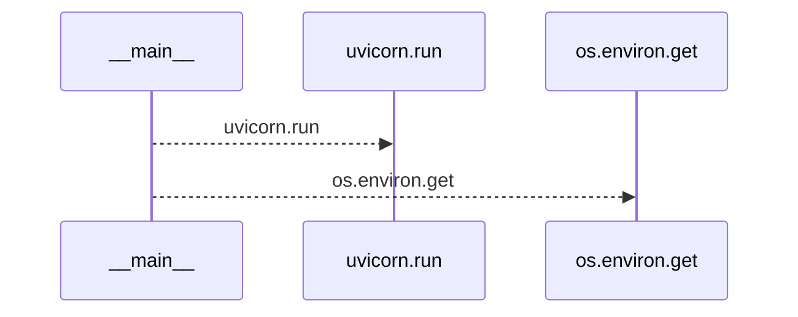
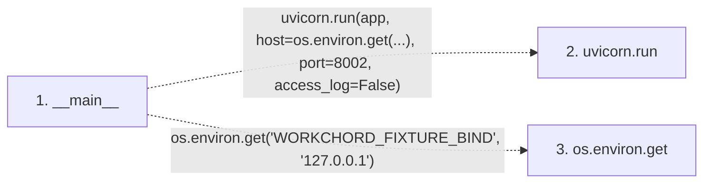

# serve_disposable_oidc

**Entry point:** `__main__` (`process`)
**Source:** [serve_disposable_oidc](../modules/serve_disposable_oidc.md)
**Modules touched:** [serve_disposable_oidc](../modules/serve_disposable_oidc.md)

**Related modules:** [support_database](../modules/support_database.md)

## Call sequence

<!-- Auto-generated from static call edges. Dashed arrows are external or unresolved calls. Reviewed runtime conditions and side effects belong in Behavior. -->

## Data flow

<!-- Auto-generated static analysis. Treat values and boundaries as best-effort hints, not runtime proof. -->

### Step data

| Step | Inputs | Reads | Writes | Returns |
|---|---|---|---|---|
| `__main__` | - | - | - | - |
| `uvicorn.run` | - | - | - | - |
| `os.environ.get` | - | - | - | - |

### Call data

| From | To | Line | Call |
|---|---|---:|---|
| __main__ | uvicorn.run | 90 | `uvicorn.run(app, host=os.environ.get(...), port=8002, access_log=False)` |
| __main__ | os.environ.get | 90 | `os.environ.get('WORKCHORD_FIXTURE_BIND', '127.0.0.1')` |

### Boundary effects

*No boundary effects detected.*

### Static analysis gaps

| Kind | Step | Target | Line |
|---|---|---|---:|
| external_call | `__main__` | `uvicorn.run` | 90 |
| external_call | `__main__` | `os.environ.get` | 90 |

## Behavior

This flow starts at `__main__` and is classified as `process`. The generated call and data-flow sections are bounded static projections; runtime conditions and side effects require source-level confirmation.
