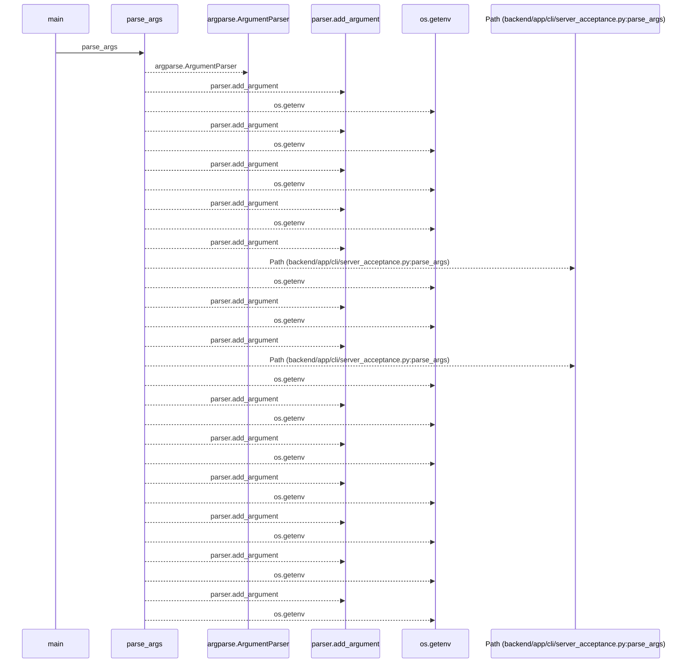
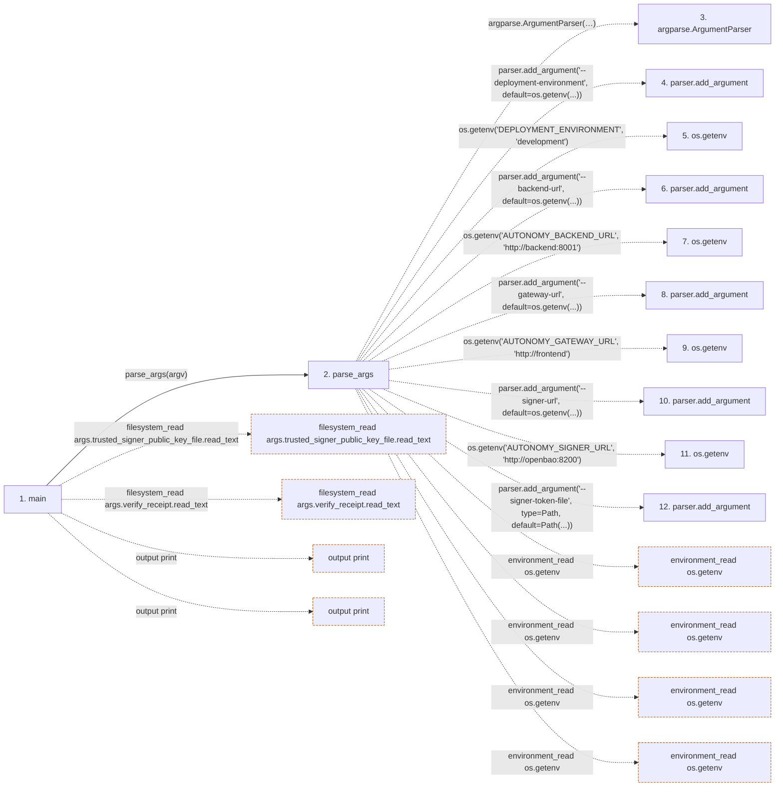

# server_acceptance

**Entry point:** `main` (`process`)
**Source:** [cli_server_acceptance](../modules/cli_server_acceptance.md)
**Modules touched:** [autonomy_canonical](../modules/autonomy_canonical.md), [autonomy_server_acceptance](../modules/autonomy_server_acceptance.md), [build_identity](../modules/build_identity.md), and 2 more

**Complete modules touched:**

- [autonomy_canonical](../modules/autonomy_canonical.md)
- [autonomy_server_acceptance](../modules/autonomy_server_acceptance.md)
- [build_identity](../modules/build_identity.md)
- [cli_server_acceptance](../modules/cli_server_acceptance.md)
- [loader](../modules/loader.md)

**Related modules:** [autonomy_server_acceptance](../modules/autonomy_server_acceptance.md), [build_identity](../modules/build_identity.md)

## Call sequence

<!-- Auto-generated from static call edges. Dashed arrows are external or unresolved calls. Reviewed runtime conditions and side effects belong in Behavior. -->

> Call sequence diagram shows 30 of 343 interactions; 313 omitted to keep the visualization within the 30-interaction and generated-diagram limits.

## Data flow

<!-- Auto-generated static analysis. Treat values and boundaries as best-effort hints, not runtime proof. -->

### Step data

| Step | Inputs | Reads | Writes | Returns |
|---|---|---|---|---|
| `main` | `argv: list[str] \| None` | `ServerAcceptanceError` | - | `2`, `0`, `2`, `2`, `2`, `0` |
| `parse_args` | `argv: list[str] \| None` | `Path`, `Path`, `Path`, `Path` | - | `parser.parse_args(...)` |
| `argparse.ArgumentParser` | - | - | - | - |
| `parser.add_argument` | - | - | - | - |
| `os.getenv` | - | - | - | - |
| `parser.add_argument` | - | - | - | - |
| `os.getenv` | - | - | - | - |
| `parser.add_argument` | - | - | - | - |
| `os.getenv` | - | - | - | - |
| `parser.add_argument` | - | - | - | - |
| `os.getenv` | - | - | - | - |
| `parser.add_argument` | - | - | - | - |

### Call data

| From | To | Line | Call |
|---|---|---:|---|
| main | parse_args | 170 | `parse_args(argv)` |
| parse_args | argparse.ArgumentParser | 24 | `argparse.ArgumentParser(description='Verify one exact self-hosted WorkChord checkout against its container-backed PostgreSQL, signer, locked evidence, and CAS services. A pass is never production autonomy evidence.')` |
| parse_args | parser.add_argument | 31 | `parser.add_argument('--deployment-environment', default=os.getenv(...))` |
| parse_args | os.getenv | 33 | `os.getenv('DEPLOYMENT_ENVIRONMENT', 'development')` |
| parse_args | parser.add_argument | 35 | `parser.add_argument('--backend-url', default=os.getenv(...))` |
| parse_args | os.getenv | 37 | `os.getenv('AUTONOMY_BACKEND_URL', 'http://backend:8001')` |
| parse_args | parser.add_argument | 39 | `parser.add_argument('--gateway-url', default=os.getenv(...))` |
| parse_args | os.getenv | 41 | `os.getenv('AUTONOMY_GATEWAY_URL', 'http://frontend')` |
| parse_args | parser.add_argument | 43 | `parser.add_argument('--signer-url', default=os.getenv(...))` |
| parse_args | os.getenv | 45 | `os.getenv('AUTONOMY_SIGNER_URL', 'http://openbao:8200')` |
| parse_args | parser.add_argument | 47 | `parser.add_argument('--signer-token-file', type=Path, default=Path(...))` |

### Boundary effects

| Kind | Target | Step | Line |
|---|---|---|---:|
| filesystem_read | `args.trusted_signer_public_key_file.read_text` | `main` | 174 |
| filesystem_read | `args.verify_receipt.read_text` | `main` | 177 |
| output | `print` | `main` | 185 |
| output | `print` | `main` | 196 |
| environment_read | `os.getenv` | `parse_args` | 33 |
| environment_read | `os.getenv` | `parse_args` | 37 |
| environment_read | `os.getenv` | `parse_args` | 41 |
| environment_read | `os.getenv` | `parse_args` | 45 |

### Static analysis gaps

| Kind | Step | Target | Line |
|---|---|---|---:|
| external_call | `parse_args` | `argparse.ArgumentParser` | 24 |
| unresolved_call | `parse_args` | `parser.add_argument` | 31 |
| unresolved_call | `parse_args` | `parser.add_argument` | 35 |
| unresolved_call | `parse_args` | `parser.add_argument` | 39 |
| unresolved_call | `parse_args` | `parser.add_argument` | 43 |
| unresolved_call | `parse_args` | `parser.add_argument` | 47 |
| step_limit | `main` | `first 12 steps` | 0 |

## Behavior

This flow starts at `main` and is classified as `process`. The generated call and data-flow sections are bounded static projections; runtime conditions and side effects require source-level confirmation.
