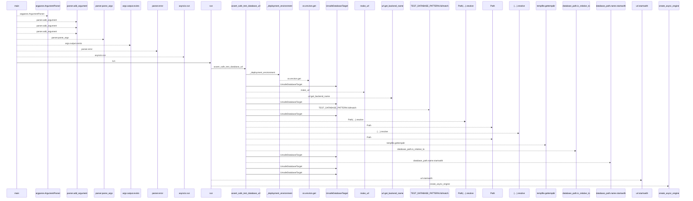
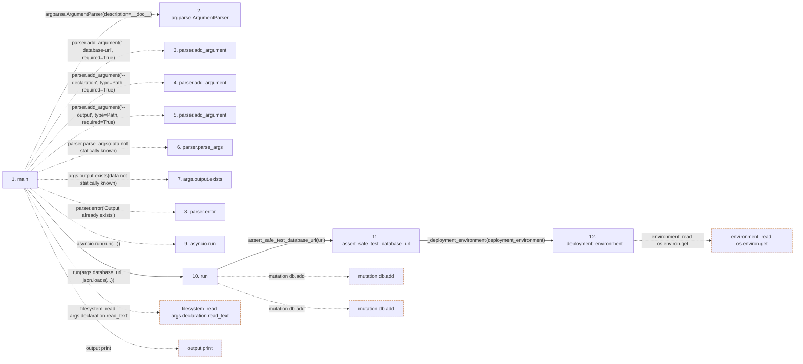

# service_worksets

**Entry point:** `main` (`process`)
**Source:** [service_worksets](../modules/service_worksets.md)
**Modules touched:** [agent_service](../modules/agent_service.md), [delivery](../modules/delivery.md), [load_common](../modules/load_common.md), [local_baseline](../modules/local_baseline.md), and 11 more

**Complete modules touched:**

- [agent_service](../modules/agent_service.md)
- [delivery](../modules/delivery.md)
- [load_common](../modules/load_common.md)
- [local_baseline](../modules/local_baseline.md)
- [models_agent](../modules/models_agent.md)
- [models_calendar](../modules/models_calendar.md)
- [models_iteration](../modules/models_iteration.md)
- [models_project](../modules/models_project.md)
- [models_task](../modules/models_task.md)
- [result](../modules/result.md)
- [run](../modules/run.md)
- [service_worksets](../modules/service_worksets.md)
- [support_database](../modules/support_database.md)
- [team_member](../modules/team_member.md)
- [user_session](../modules/user_session.md)

**Related modules:** [app_database](../modules/app_database.md), [authority](../modules/authority.md), [capacity_service](../modules/capacity_service.md), [delivery](../modules/delivery.md), and 11 more

**Complete related modules:**

- [app_database](../modules/app_database.md)
- [authority](../modules/authority.md)
- [capacity_service](../modules/capacity_service.md)
- [delivery](../modules/delivery.md)
- [delivery_metrics_service](../modules/delivery_metrics_service.md)
- [load_common](../modules/load_common.md)
- [local_baseline](../modules/local_baseline.md)
- [models_agent](../modules/models_agent.md)
- [models_iteration](../modules/models_iteration.md)
- [models_task](../modules/models_task.md)
- [project_service](../modules/project_service.md)
- [query_limits](../modules/query_limits.md)
- [support_database](../modules/support_database.md)
- [task_detail_service](../modules/task_detail_service.md)
- [task_service](../modules/task_service.md)

## Call sequence

<!-- Auto-generated from static call edges. Dashed arrows are external or unresolved calls. Reviewed runtime conditions and side effects belong in Behavior. -->

> Call sequence diagram shows 30 of 201 interactions; 171 omitted to keep the visualization within the 30-interaction and generated-diagram limits.

## Data flow

<!-- Auto-generated static analysis. Treat values and boundaries as best-effort hints, not runtime proof. -->

### Step data

| Step | Inputs | Reads | Writes | Returns |
|---|---|---|---|---|
| `main` | - | `Path`, `Path` | - | `...` |
| `argparse.ArgumentParser` | - | - | - | - |
| `parser.add_argument` | - | - | - | - |
| `parser.add_argument` | - | - | - | - |
| `parser.add_argument` | - | - | - | - |
| `parser.parse_args` | - | - | - | - |
| `args.output.exists` | - | - | - | - |
| `parser.error` | - | - | - | - |
| `asyncio.run` | - | - | - | - |
| `run` | `url`, `declaration` | `Base`, `Task`, `Task`, `Task` | `task.title`, `result[...]` | `result` |
| `assert_safe_test_database_url` | `database_url: str \| URL`, `deployment_environment: str \| None`, `allowed_postgres_hosts: frozenset[str]`, `allowed_sqlite_root: Path \| None` | `TEST_DATABASE_PREFIX`, `TEST_DATABASE_PREFIX` | - | `url`, `url`, `url` |
| `_deployment_environment` | `explicit: str \| None` | - | - | `...` |

### Call data

| From | To | Line | Call |
|---|---|---:|---|
| main | argparse.ArgumentParser | 74 | `argparse.ArgumentParser(description=__doc__)` |
| main | parser.add_argument | 75 | `parser.add_argument('--database-url', required=True)` |
| main | parser.add_argument | 75 | `parser.add_argument('--declaration', type=Path, required=True)` |
| main | parser.add_argument | 76 | `parser.add_argument('--output', type=Path, required=True)` |
| main | parser.parse_args | 76 | `parser.parse_args(data not statically known)` |
| main | args.output.exists | 77 | `args.output.exists(data not statically known)` |
| main | parser.error | 77 | `parser.error('Output already exists')` |
| main | asyncio.run | 78 | `asyncio.run(run(...))` |
| main | run | 78 | `run(args.database_url, json.loads(...))` |
| run | assert_safe_test_database_url | 25 | `assert_safe_test_database_url(url)` |
| assert_safe_test_database_url | _deployment_environment | 49 | `_deployment_environment(deployment_environment)` |

### Boundary effects

| Kind | Target | Step | Line |
|---|---|---|---:|
| filesystem_read | `args.declaration.read_text` | `main` | 78 |
| output | `print` | `main` | 79 |
| mutation | `db.add` | `run` | 32 |
| mutation | `db.add` | `run` | 36 |
| environment_read | `os.environ.get` | `_deployment_environment` | 32 |

### Static analysis gaps

| Kind | Step | Target | Line |
|---|---|---|---:|
| external_call | `main` | `argparse.ArgumentParser` | 74 |
| unresolved_call | `main` | `parser.add_argument` | 75 |
| unresolved_call | `main` | `parser.add_argument` | 76 |
| unresolved_call | `main` | `parser.parse_args` | 76 |
| unresolved_call | `main` | `args.output.exists` | 77 |
| unresolved_call | `main` | `parser.error` | 77 |
| step_limit | `main` | `first 12 steps` | 0 |

## Behavior

This flow starts at `main` and is classified as `process`. The generated call and data-flow sections are bounded static projections; runtime conditions and side effects require source-level confirmation.
