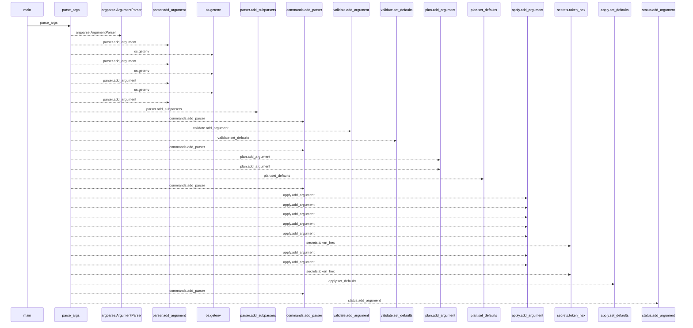
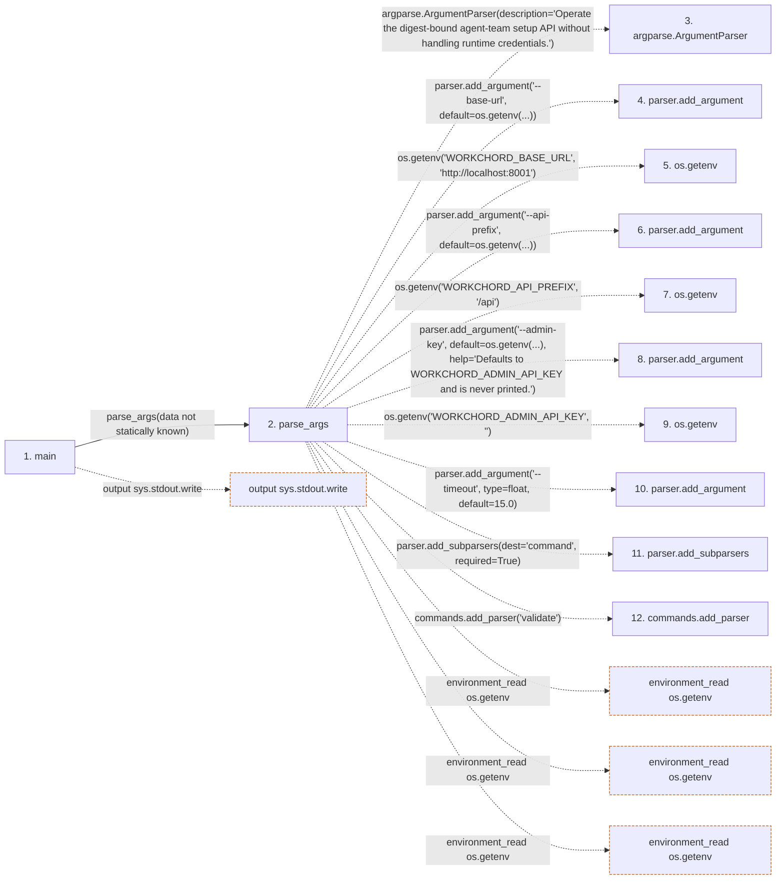

# setup_agent_team

**Entry point:** `main` (`process`)
**Source:** [setup_agent_team](../modules/setup_agent_team.md)
**Modules touched:** [setup_agent_team](../modules/setup_agent_team.md)

## Call sequence

<!-- Auto-generated from static call edges. Dashed arrows are external or unresolved calls. Reviewed runtime conditions and side effects belong in Behavior. -->

> Call sequence diagram shows 30 of 38 interactions; 8 omitted to keep the visualization within the 30-interaction and generated-diagram limits.

## Data flow

<!-- Auto-generated static analysis. Treat values and boundaries as best-effort hints, not runtime proof. -->

### Step data

| Step | Inputs | Reads | Writes | Returns |
|---|---|---|---|---|
| `main` | - | `sys` | - | `0` |
| `parse_args` | - | `Path`, `run_validate`, `Path`, `run_plan`, `Path`, `Path`, `run_apply`, `run_status` | - | `parser.parse_args(...)` |
| `argparse.ArgumentParser` | - | - | - | - |
| `parser.add_argument` | - | - | - | - |
| `os.getenv` | - | - | - | - |
| `parser.add_argument` | - | - | - | - |
| `os.getenv` | - | - | - | - |
| `parser.add_argument` | - | - | - | - |
| `os.getenv` | - | - | - | - |
| `parser.add_argument` | - | - | - | - |
| `parser.add_subparsers` | - | - | - | - |
| `commands.add_parser` | - | - | - | - |

### Call data

| From | To | Line | Call |
|---|---|---:|---|
| main | parse_args | 264 | `parse_args(data not statically known)` |
| parse_args | argparse.ArgumentParser | 200 | `argparse.ArgumentParser(description='Operate the digest-bound agent-team setup API without handling runtime credentials.')` |
| parse_args | parser.add_argument | 206 | `parser.add_argument('--base-url', default=os.getenv(...))` |
| parse_args | os.getenv | 208 | `os.getenv('WORKCHORD_BASE_URL', 'http://localhost:8001')` |
| parse_args | parser.add_argument | 210 | `parser.add_argument('--api-prefix', default=os.getenv(...))` |
| parse_args | os.getenv | 212 | `os.getenv('WORKCHORD_API_PREFIX', '/api')` |
| parse_args | parser.add_argument | 214 | `parser.add_argument('--admin-key', default=os.getenv(...), help='Defaults to WORKCHORD_ADMIN_API_KEY and is never printed.')` |
| parse_args | os.getenv | 216 | `os.getenv('WORKCHORD_ADMIN_API_KEY', '')` |
| parse_args | parser.add_argument | 219 | `parser.add_argument('--timeout', type=float, default=15.0)` |
| parse_args | parser.add_subparsers | 220 | `parser.add_subparsers(dest='command', required=True)` |
| parse_args | commands.add_parser | 222 | `commands.add_parser('validate')` |

### Boundary effects

| Kind | Target | Step | Line |
|---|---|---|---:|
| output | `sys.stdout.write` | `main` | 267 |
| environment_read | `os.getenv` | `parse_args` | 208 |
| environment_read | `os.getenv` | `parse_args` | 212 |
| environment_read | `os.getenv` | `parse_args` | 216 |

### Static analysis gaps

| Kind | Step | Target | Line |
|---|---|---|---:|
| external_call | `parse_args` | `argparse.ArgumentParser` | 200 |
| unresolved_call | `parse_args` | `parser.add_argument` | 206 |
| unresolved_call | `parse_args` | `parser.add_argument` | 210 |
| unresolved_call | `parse_args` | `parser.add_argument` | 214 |
| unresolved_call | `parse_args` | `parser.add_argument` | 219 |
| unresolved_call | `parse_args` | `parser.add_subparsers` | 220 |
| unresolved_call | `parse_args` | `commands.add_parser` | 222 |
| step_limit | `main` | `first 12 steps` | 0 |

## Behavior

This flow starts at `main` and is classified as `process`. The generated call and data-flow sections are bounded static projections; runtime conditions and side effects require source-level confirmation.
