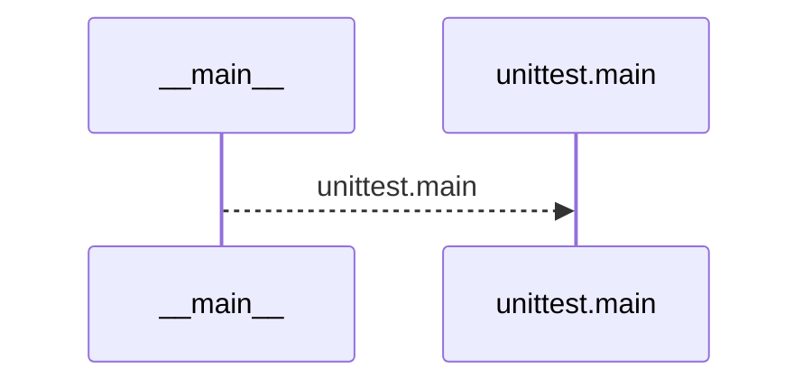
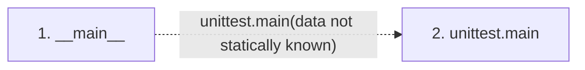

# test_native_runtimes

**Entry point:** `__main__` (`process`)
**Source:** [test_native_runtimes](../modules/test_native_runtimes.md)
**Modules touched:** [test_native_runtimes](../modules/test_native_runtimes.md)

## Call sequence

<!-- Auto-generated from static call edges. Dashed arrows are external or unresolved calls. Reviewed runtime conditions and side effects belong in Behavior. -->

## Data flow

<!-- Auto-generated static analysis. Treat values and boundaries as best-effort hints, not runtime proof. -->

### Step data

| Step | Inputs | Reads | Writes | Returns |
|---|---|---|---|---|
| `__main__` | - | - | - | - |
| `unittest.main` | - | - | - | - |

### Call data

| From | To | Line | Call |
|---|---|---:|---|
| __main__ | unittest.main | 365 | `unittest.main(data not statically known)` |

### Boundary effects

*No boundary effects detected.*

### Static analysis gaps

| Kind | Step | Target | Line |
|---|---|---|---:|
| external_call | `__main__` | `unittest.main` | 365 |

## Behavior

This flow starts at `__main__` and is classified as `process`. The generated call and data-flow sections are bounded static projections; runtime conditions and side effects require source-level confirmation.
