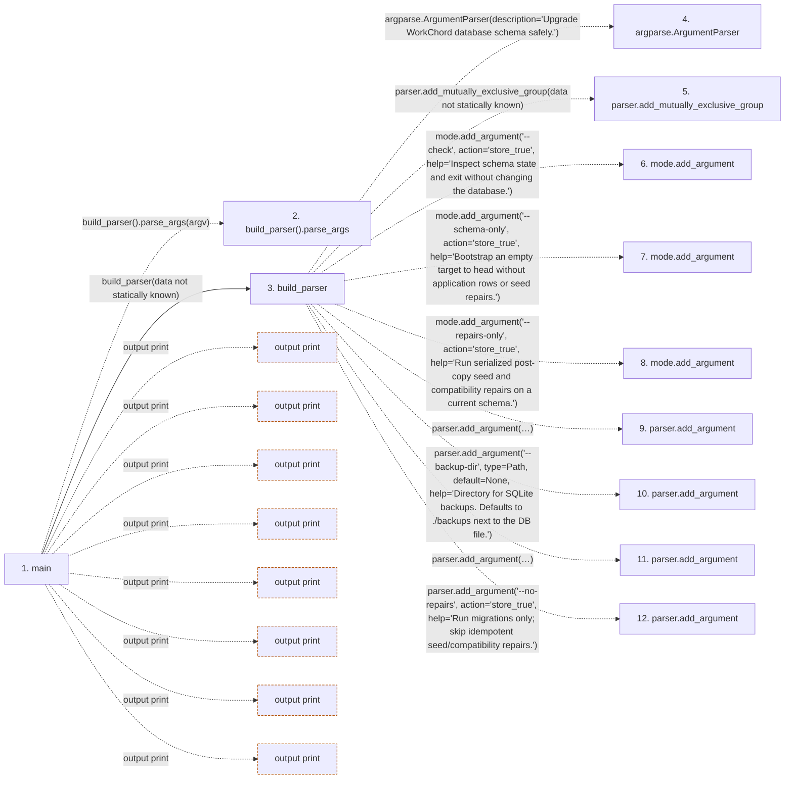

# upgrade

**Entry point:** `main` (`process`)
**Source:** [upgrade](../modules/upgrade.md)
**Modules touched:** [authority](../modules/authority.md), [calendar_service](../modules/calendar_service.md), [commands](../modules/commands.md), [config](../modules/config.md), and 12 more

**Complete modules touched:**

- [authority](../modules/authority.md)
- [calendar_service](../modules/calendar_service.md)
- [commands](../modules/commands.md)
- [config](../modules/config.md)
- [database_config](../modules/database_config.md)
- [github_status_automation_service](../modules/github_status_automation_service.md)
- [identity_service](../modules/identity_service.md)
- [label_service](../modules/label_service.md)
- [maintenance](../modules/maintenance.md)
- [models_identity](../modules/models_identity.md)
- [project_identity](../modules/project_identity.md)
- [saved_view_service](../modules/saved_view_service.md)
- [system_settings_service](../modules/system_settings_service.md)
- [template_service](../modules/template_service.md)
- [upgrade](../modules/upgrade.md)
- [upgrade_service](../modules/upgrade_service.md)

**Related modules:** [config](../modules/config.md), [upgrade_service](../modules/upgrade_service.md)

## Call sequence

```mermaid
sequenceDiagram
    participant p0 as main
    participant p1 as build_parser().parse_args
    participant p2 as build_parser
    participant p3 as argparse.ArgumentParser
    participant p4 as parser.add_mutually_exclusive_group
    participant p5 as mode.add_argument
    participant p6 as parser.add_argument
    participant p7 as _print_status
    participant p8 as inspect_database
    participant p9 as _inspect_database_connection
    participant p10 as inspect (backend/app/services/upgr…spect_database_connection)
    participant p11 as sorted (backend/app/services/upgr…spect_database_connection)
    participant p12 as inspector.get_table_names (backend/app/services/upgr…spect_database_connection)
    participant p13 as _current_revision
    participant p14 as inspect (backend/app/services/upgr…vice.py:_current_revision)
    participant p15 as inspector.get_table_names (backend/app/services/upgr…vice.py:_current_revision)
    participant p16 as connection.execute (backend/app/services/upgr…vice.py:_current_revision)
    participant p17 as text (backend/app/services/upgr…vice.py:_current_revision)
    participant p18 as result.fetchall
    participant p19 as len (backend/app/services/upgr…vice.py:_current_revision)
    participant p20 as ','.join
    participant p21 as sorted (backend/app/services/upgr…vice.py:_current_revision)
    participant p22 as set (backend/app/services/upgr…spect_database_connection)
    participant p23 as head_revision
    participant p24 as ScriptDirectory.from_config (backend/app/services/upgr…_service.py:head_revision)
    participant p25 as alembic_config
    p0-->>p1: build_parser().parse_args
    p0->>p2: build_parser
    p2-->>p3: argparse.ArgumentParser
    p2-->>p4: parser.add_mutually_exclusive_group
    p2-->>p5: mode.add_argument
    p2-->>p5: mode.add_argument
    p2-->>p5: mode.add_argument
    p2-->>p6: parser.add_argument
    p2-->>p6: parser.add_argument
    p2-->>p6: parser.add_argument
    p2-->>p6: parser.add_argument
    p0->>p7: _print_status
    p7->>p8: inspect_database
    p8->>p9: _inspect_database_connection
    p9-->>p10: inspect (backend/app/services/upgr…spect_database_connection)
    p9-->>p11: sorted (backend/app/services/upgr…spect_database_connection)
    p9-->>p12: inspector.get_table_names (backend/app/services/upgr…spect_database_connection)
    p9->>p13: _current_revision
    p13-->>p14: inspect (backend/app/services/upgr…vice.py:_current_revision)
    p13-->>p15: inspector.get_table_names (backend/app/services/upgr…vice.py:_current_revision)
    p13-->>p16: connection.execute (backend/app/services/upgr…vice.py:_current_revision)
    p13-->>p17: text (backend/app/services/upgr…vice.py:_current_revision)
    p13-->>p18: result.fetchall
    p13-->>p19: len (backend/app/services/upgr…vice.py:_current_revision)
    p13-->>p20: ','.join
    p13-->>p21: sorted (backend/app/services/upgr…vice.py:_current_revision)
    p9-->>p22: set (backend/app/services/upgr…spect_database_connection)
    p9->>p23: head_revision
    p23-->>p24: ScriptDirectory.from_config (backend/app/services/upgr…_service.py:head_revision)
    p23->>p25: alembic_config
```

<!-- Auto-generated from static call edges. Dashed arrows are external or unresolved calls. Reviewed runtime conditions and side effects belong in Behavior. -->

> Call sequence diagram shows 30 of 302 interactions; 272 omitted to keep the visualization within the 30-interaction and generated-diagram limits.

> Trace truncated at the depth limit; deeper calls are omitted.

## Data flow

<!-- Auto-generated static analysis. Treat values and boundaries as best-effort hints, not runtime proof. -->

### Step data

| Step | Inputs | Reads | Writes | Returns |
|---|---|---|---|---|
| `main` | `argv: list[str] \| None` | `UpgradeError`, `sys` | - | `0`, `0`, `0`, `2` |
| `build_parser().parse_args` | - | - | - | - |
| `build_parser` | - | `Path` | - | `parser` |
| `argparse.ArgumentParser` | - | - | - | - |
| `parser.add_mutually_exclusive_group` | - | - | - | - |
| `mode.add_argument` | - | - | - | - |
| `mode.add_argument` | - | - | - | - |
| `mode.add_argument` | - | - | - | - |
| `parser.add_argument` | - | - | - | - |
| `parser.add_argument` | - | - | - | - |
| `parser.add_argument` | - | - | - | - |
| `parser.add_argument` | - | - | - | - |

### Call data

| From | To | Line | Call |
|---|---|---:|---|
| main | build_parser().parse_args | 80 | `build_parser().parse_args(argv)` |
| main | build_parser | 80 | `build_parser(data not statically known)` |
| build_parser | argparse.ArgumentParser | 29 | `argparse.ArgumentParser(description='Upgrade WorkChord database schema safely.')` |
| build_parser | parser.add_mutually_exclusive_group | 32 | `parser.add_mutually_exclusive_group(data not statically known)` |
| build_parser | mode.add_argument | 33 | `mode.add_argument('--check', action='store_true', help='Inspect schema state and exit without changing the database.')` |
| build_parser | mode.add_argument | 38 | `mode.add_argument('--schema-only', action='store_true', help='Bootstrap an empty target to head without application rows or seed repairs.')` |
| build_parser | mode.add_argument | 43 | `mode.add_argument('--repairs-only', action='store_true', help='Run serialized post-copy seed and compatibility repairs on a current schema.')` |
| build_parser | parser.add_argument | 48 | `parser.add_argument('--skip-backup', action='store_true', help='Do not create an automatic SQLite backup. This never bypasses the PostgreSQL external backup/PITR gate.')` |
| build_parser | parser.add_argument | 56 | `parser.add_argument('--backup-dir', type=Path, default=None, help='Directory for SQLite backups. Defaults to ./backups next to the DB file.')` |
| build_parser | parser.add_argument | 62 | `parser.add_argument('--external-backup-reference', default=None, help='Operator-provided backup/PITR recovery-point reference required before upgrading a non-empty PostgreSQL database.')` |
| build_parser | parser.add_argument | 70 | `parser.add_argument('--no-repairs', action='store_true', help='Run migrations only; skip idempotent seed/compatibility repairs.')` |

### Boundary effects

| Kind | Target | Step | Line |
|---|---|---|---:|
| output | `print` | `main` | 94 |
| output | `print` | `main` | 98 |
| output | `print` | `main` | 125 |
| output | `print` | `main` | 130 |
| output | `print` | `main` | 132 |
| output | `print` | `main` | 134 |
| output | `print` | `main` | 135 |
| output | `print` | `main` | 143 |

### Static analysis gaps

| Kind | Step | Target | Line |
|---|---|---|---:|
| unresolved_call | `main` | `build_parser().parse_args` | 80 |
| external_call | `build_parser` | `argparse.ArgumentParser` | 29 |
| unresolved_call | `build_parser` | `parser.add_mutually_exclusive_group` | 32 |
| unresolved_call | `build_parser` | `mode.add_argument` | 33 |
| unresolved_call | `build_parser` | `mode.add_argument` | 38 |
| unresolved_call | `build_parser` | `mode.add_argument` | 43 |
| unresolved_call | `build_parser` | `parser.add_argument` | 48 |
| unresolved_call | `build_parser` | `parser.add_argument` | 56 |
| unresolved_call | `build_parser` | `parser.add_argument` | 62 |
| unresolved_call | `build_parser` | `parser.add_argument` | 70 |
| step_limit | `main` | `first 12 steps` | 0 |
| truncated_flow | `main` | `depth limit` | 0 |

## Behavior

The CLI inspects the configured target without changing it when `--check` is selected. A migration-role invocation applies the initial schema only to an empty destination, or advances a known managed revision. Unknown and unversioned databases fail before DDL; they are never inferred current from table names or stamped automatically.

Schema-only initialization leaves application tables empty. Explicit repair runs under the repair process role. PostgreSQL runners share an advisory lock and nonempty upgrades require an external recovery-point reference. The command reports the resulting revision and refuses an incomplete upgrade.
