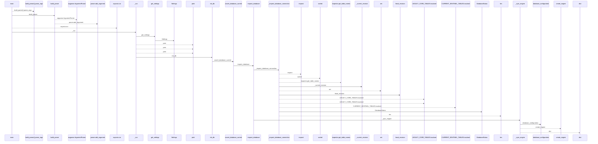
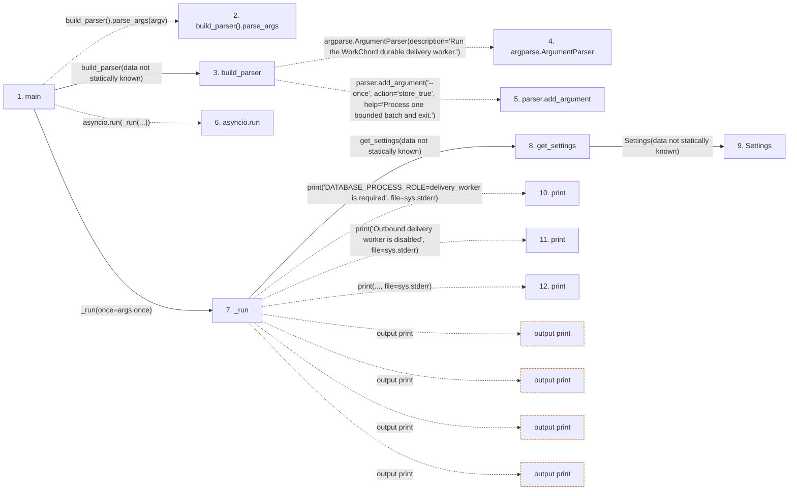

# worker

**Entry point:** `main` (`process`)
**Source:** [worker](../modules/worker.md)
**Modules touched:** [app_database](../modules/app_database.md), [config](../modules/config.md), [maintenance](../modules/maintenance.md), [outbound_webhook_service](../modules/outbound_webhook_service.md), and 2 more

**Complete modules touched:**

- [app_database](../modules/app_database.md)
- [config](../modules/config.md)
- [maintenance](../modules/maintenance.md)
- [outbound_webhook_service](../modules/outbound_webhook_service.md)
- [upgrade_service](../modules/upgrade_service.md)
- [worker](../modules/worker.md)

**Related modules:** [app_database](../modules/app_database.md), [config](../modules/config.md), [outbound_webhook_service](../modules/outbound_webhook_service.md)

## Call sequence

<!-- Auto-generated from static call edges. Dashed arrows are external or unresolved calls. Reviewed runtime conditions and side effects belong in Behavior. -->

> Call sequence diagram shows 30 of 56 interactions; 26 omitted to keep the visualization within the 30-interaction and generated-diagram limits.

> Trace truncated at the depth limit; deeper calls are omitted.

## Data flow

<!-- Auto-generated static analysis. Treat values and boundaries as best-effort hints, not runtime proof. -->

### Step data

| Step | Inputs | Reads | Writes | Returns |
|---|---|---|---|---|
| `main` | `argv: Optional[list[str]]` | - | - | `asyncio.run(...)` |
| `build_parser().parse_args` | - | - | - | - |
| `build_parser` | - | - | - | `parser` |
| `argparse.ArgumentParser` | - | - | - | - |
| `parser.add_argument` | - | - | - | - |
| `asyncio.run` | - | - | - | - |
| `_run` | `once: bool` | `sys`, `sys`, `sys`, `signal` | - | `2`, `2`, `0`, `0`, `0` |
| `get_settings` | - | - | - | `Settings(...)` |
| `Settings` | - | - | - | - |
| `print` | - | - | - | - |
| `print` | - | - | - | - |
| `print` | - | - | - | - |

### Call data

| From | To | Line | Call |
|---|---|---:|---|
| main | build_parser().parse_args | 76 | `build_parser().parse_args(argv)` |
| main | build_parser | 76 | `build_parser(data not statically known)` |
| build_parser | argparse.ArgumentParser | 20 | `argparse.ArgumentParser(description='Run the WorkChord durable delivery worker.')` |
| build_parser | parser.add_argument | 23 | `parser.add_argument('--once', action='store_true', help='Process one bounded batch and exit.')` |
| main | asyncio.run | 77 | `asyncio.run(_run(...))` |
| main | _run | 77 | `_run(once=args.once)` |
| _run | get_settings | 32 | `get_settings(data not statically known)` |
| get_settings | Settings | 469 | `Settings(data not statically known)` |
| _run | print | 34 | `print('DATABASE_PROCESS_ROLE=delivery_worker is required', file=sys.stderr)` |
| _run | print | 40 | `print('Outbound delivery worker is disabled', file=sys.stderr)` |
| _run | print | 43 | `print(..., file=sys.stderr)` |

### Boundary effects

| Kind | Target | Step | Line |
|---|---|---|---:|
| output | `print` | `_run` | 34 |
| output | `print` | `_run` | 40 |
| output | `print` | `_run` | 43 |
| output | `print` | `_run` | 55 |

### Static analysis gaps

| Kind | Step | Target | Line |
|---|---|---|---:|
| unresolved_call | `main` | `build_parser().parse_args` | 76 |
| external_call | `build_parser` | `argparse.ArgumentParser` | 20 |
| unresolved_call | `build_parser` | `parser.add_argument` | 23 |
| external_call | `main` | `asyncio.run` | 77 |
| step_limit | `main` | `first 12 steps` | 0 |
| truncated_flow | `main` | `depth limit` | 0 |

## Behavior

This flow starts at `main` and is classified as `process`. The generated call and data-flow sections are bounded static projections; runtime conditions and side effects require source-level confirmation.
