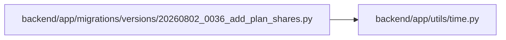

# 20260802_0036_add_plan_shares Module

**Path:** `backend/app/migrations/versions/20260802_0036_add_plan_shares.py`

## Description

Add immutable, revocable plan shares.

Revision ID: 20260802_0036
Revises: 20260728_0035
Create Date: 2026-08-02 00:00:00.000000

## Imports

| Source | Symbols |
|--------|---------|
| `alembic` | `op` |
| `app.utils.time` | `UTCDateTime` |
| `collections.abc` | `Sequence` |
| `sqlalchemy` | `sa` |

## Local dependency map

<!-- Auto-generated local dependency summary. Do not edit by hand. -->

### Internal neighbors

| Direction | Module |
|---|---|
| Outbound | [time](../modules/time.md) |

### External packages

| Language | Used packages | Undeclared packages |
|---|---:|---:|
| python | 2 | 0 |

## Functions

| Function | Signature | Decorators | Description |
|----------|-----------|------------|-------------|
| `upgrade` | `() -> None` | — | — |
| `downgrade` | `() -> None` | — | — |
