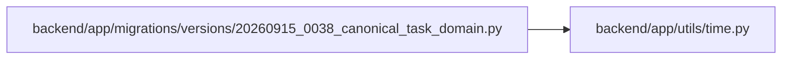

# 20260915_0038_canonical_task_domain Module

**Path:** `backend/app/migrations/versions/20260915_0038_canonical_task_domain.py`

## Description

Expand task ownership, backlog, effort and canonical brief history.

SQLite rebuilds with foreign keys disabled inside an explicit transaction, then
checks every foreign key before committing. Re-entry after schema application is
safe; each backfilled row carries its own completion marker.

## Imports

| Source | Symbols |
|--------|---------|
| `alembic` | `op` |
| `app.utils.time` | `UTCDateTime` |
| `json` | `json` |
| `sqlalchemy` | `sa` |

## Local dependency map

<!-- Auto-generated local dependency summary. Do not edit by hand. -->

### Internal neighbors

| Direction | Module |
|---|---|
| Outbound | [time](../modules/time.md) |

### External packages

| Language | Used packages | Undeclared packages |
|---|---:|---:|
| python | 2 | 0 |

## Functions

| Function | Signature | Decorators | Description |
|----------|-----------|------------|-------------|
| `backfill_tasks` | `(connection, *, after_id = 0, limit = 500, apply = True)` | — | Return bounded diagnostics; apply each legacy row at most once. |
| `_expand` | `()` | — | — |
| `upgrade` | `()` | — | — |
| `downgrade` | `()` | — | — |
