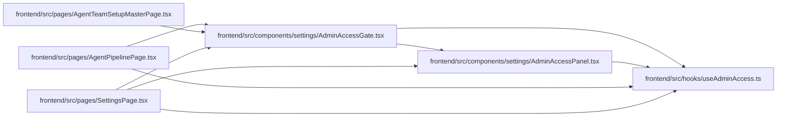

# AdminAccessGate Module

**Path:** `frontend/src/components/settings/AdminAccessGate.tsx`

## Description

_Auto-generated from `frontend/src/components/settings/AdminAccessGate.tsx`._

## Imports

| Source | Symbols |
|--------|---------|
| `../../hooks/useAdminAccess` | `useAdminAccess` |
| `./AdminAccessPanel` | `AdminAccessPanel` |
| `lucide-react` | `LockKeyhole` |
| `react` | `ReactNode` |
| `react-i18next` | `useTranslation` |

## Module Signals

| Signal | Values |
|--------|--------|
| Exports | `AdminAccessGate` |

## Local dependency map

<!-- Auto-generated local dependency summary. Do not edit by hand. -->

### Internal neighbors

| Direction | Module |
|---|---|
| Inbound | [AgentPipelinePage](../modules/AgentPipelinePage.md) |
| Inbound | [AgentTeamSetupMasterPage](../modules/AgentTeamSetupMasterPage.md) |
| Inbound | [SettingsPage](../modules/SettingsPage.md) |
| Outbound | [AdminAccessPanel](../modules/AdminAccessPanel.md) |
| Outbound | [useAdminAccess](../modules/useAdminAccess.md) |

### External packages

| Language | Used packages | Undeclared packages |
|---|---:|---:|
| typescript | 3 | 0 |

## Classes

| Class | Kind | Line | Bases / Target | Description |
|-------|------|------|----------------|-------------|
| [AdminAccessGateProps](../entities/AdminAccessGateProps.md) | Class | 7 | — | — |

## Functions

| Function | Signature | Decorators | Description |
|----------|-----------|------------|-------------|
| `AdminAccessGate` | `({     children,     showPanel = true,     recovery,     accessGranted,     headingLevel = 3, }: AdminAccessGateProps)` | — | — |
