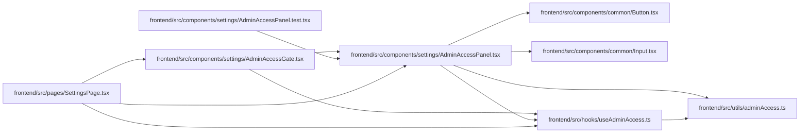

# AdminAccessPanel Module

**Path:** `frontend/src/components/settings/AdminAccessPanel.tsx`

## Description

_Auto-generated from `frontend/src/components/settings/AdminAccessPanel.tsx`._

## Imports

| Source | Symbols |
|--------|---------|
| `../../hooks/useAdminAccess` | `useAdminAccess` |
| `../../utils/adminAccess` | `clearAdminApiKey`, `setAdminApiKey` |
| `../common/Button` | `Button` |
| `../common/Input` | `Input` |
| `@tanstack/react-query` | `useQueryClient` |
| `lucide-react` | `KeyRound`, `ShieldCheck`, `Trash2` |
| `react` | `useState` |
| `react-i18next` | `useTranslation` |

## Module Signals

| Signal | Values |
|--------|--------|
| Exports | `AdminAccessPanel` |
| Constants | `protectedQueryKeys` |

## Local dependency map

<!-- Auto-generated local dependency summary. Do not edit by hand. -->

### Internal neighbors

| Direction | Module |
|---|---|
| Inbound | [AdminAccessGate](../modules/AdminAccessGate.md) |
| Inbound | [AdminAccessPanel.test](../modules/AdminAccessPanel.test.md) |
| Inbound | [SettingsPage](../modules/SettingsPage.md) |
| Outbound | [Button](../modules/Button.md) |
| Outbound | [Input](../modules/Input.md) |
| Outbound | [useAdminAccess](../modules/useAdminAccess.md) |
| Outbound | [adminAccess](../modules/adminAccess.md) |

### External packages

| Language | Used packages | Undeclared packages |
|---|---:|---:|
| typescript | 4 | 0 |

## Functions

| Function | Signature | Decorators | Description |
|----------|-----------|------------|-------------|
| `AdminAccessPanel` | `({     headingLevel = 2, }: {     headingLevel?: 2 \| 3; })` | — | — |
