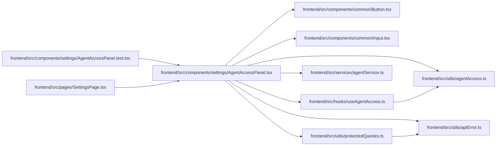

# AgentAccessPanel Module

**Path:** `frontend/src/components/settings/AgentAccessPanel.tsx`

## Description

_Auto-generated from `frontend/src/components/settings/AgentAccessPanel.tsx`._

## Imports

| Source | Symbols |
|--------|---------|
| `../../hooks/useAgentAccess` | `useAgentAccess` |
| `../../services/agentService` | `agentService` |
| `../../utils/agentAccess` | `clearAgentApiKey`, `setAgentApiKey` |
| `../../utils/apiError` | `getApiErrorMessage` |
| `../../utils/protectedQueries` | `protectedQueryRetry` |
| `../common/Button` | `Button` |
| `../common/Input` | `Input` |
| `@tanstack/react-query` | `useQuery`, `useQueryClient` |
| `lucide-react` | `AlertTriangle`, `CheckCircle2`, `KeyRound`, `ShieldCheck`, `Trash2` |
| `react` | `useState` |
| `react-i18next` | `useTranslation` |

## Module Signals

| Signal | Values |
|--------|--------|
| Exports | `AgentAccessPanel` |
| Constants | `AGENT_QUERY_KEYS` |

## Local dependency map

<!-- Auto-generated local dependency summary. Do not edit by hand. -->

### Internal neighbors

| Direction | Module |
|---|---|
| Inbound | [AgentAccessPanel.test](../modules/AgentAccessPanel.test.md) |
| Inbound | [SettingsPage](../modules/SettingsPage.md) |
| Outbound | [Button](../modules/Button.md) |
| Outbound | [Input](../modules/Input.md) |
| Outbound | [useAgentAccess](../modules/useAgentAccess.md) |
| Outbound | [agentService](../modules/agentService.md) |
| Outbound | [agentAccess](../modules/agentAccess.md) |
| Outbound | [apiError](../modules/apiError.md) |
| Outbound | [protectedQueries](../modules/protectedQueries.md) |

### External packages

| Language | Used packages | Undeclared packages |
|---|---:|---:|
| typescript | 4 | 0 |

## Functions

| Function | Signature | Decorators | Description |
|----------|-----------|------------|-------------|
| `AgentAccessPanel` | `()` | — | — |
