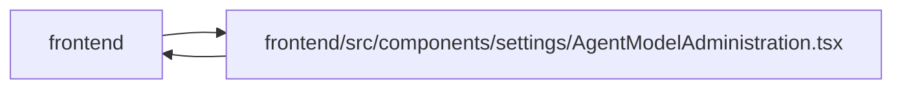

# AgentModelAdministration Module

**Path:** `frontend/src/components/settings/AgentModelAdministration.tsx`

## Description

_Auto-generated from `frontend/src/components/settings/AgentModelAdministration.tsx`._

## Imports

| Source | Symbols | Type-only | Runtime emission |
|--------|---------|-----------|------------------|
| `../../hooks/useAgentAccess` | `useAgentAccess` | — | compiler-dependent |
| `../../services/agentService` | `agentService` | — | compiler-dependent |
| `../../types/agent` | `AgentModelBinding`, `AgentModelBindingCreate`, `AgentModelCatalogCreate`, `AgentModelCatalogEntry` | Declaration | erased |
| `../../utils/apiError` | `normalizeApiError` | — | compiler-dependent |
| `../../utils/formatDate` | `formatDateTime` | — | compiler-dependent |
| `../../utils/modelRouting` | `createAgentCommandMetadata`, `formatRoutingCode`, `parseRoutingTags` | — | compiler-dependent |
| `../../utils/protectedQueries` | `protectedQueryRetry` | — | compiler-dependent |
| `../common/Button` | `Button` | — | compiler-dependent |
| `../common/Checkbox` | `Checkbox` | — | compiler-dependent |
| `../common/Input` | `Input`, `RequiredIndicator` | — | compiler-dependent |
| `../common/useConfirmDialog` | `useConfirmDialog` | — | compiler-dependent |
| `../feedback/QueryState` | `QueryEmptyState`, `QueryErrorState`, `QueryLoadingState` | — | compiler-dependent |
| `../feedback/toast` | `useToast` | — | compiler-dependent |
| `@tanstack/react-query` | `useMutation`, `useQuery`, `useQueryClient` | — | compiler-dependent |
| `lucide-react` | `AlertTriangle`, `Bot`, `Database`, `Link2`, `Pencil`, `Plus`, `RefreshCw`, `ShieldCheck`, `X` | — | compiler-dependent |
| `react` | `FormEvent` | Declaration | erased |
| `react` | `useMemo`, `useState` | — | compiler-dependent |
| `react-i18next` | `useTranslation` | — | compiler-dependent |

## Module Signals

| Signal | Values |
|--------|--------|
| Exports | `AgentModelAdministration` |
| Constants | `EMPTY_CATALOG_FORM`, `EMPTY_BINDING_FORM` |

## Local dependency map

<!-- Auto-generated local dependency summary. Do not edit by hand. -->
This graph shows full source coupling. Type dependencies can be erased; compiler-dependent cycle groups are runtime candidates, not confirmed initialization cycles.

```mermaid
flowchart LR
    n0["frontend"]
    n1["frontend/src/components/settings/AgentModelAdministration.tsx"]
    n0 --> n1
    n1 --> n0
    click n1 "../modules/AgentModelAdministration.md"
```

> Module-level dependencies exceed the generated-diagram limits, so the diagram and table below group them by top-level package. Counts report the number of module neighbors in each package.

### Internal neighbors

| Direction | Module |
|---|---|
| Inbound | `frontend` (2) |
| Outbound | `frontend` (13) |

### External packages

| Language | Used packages | Undeclared packages |
|---|---:|---:|
| typescript | 4 | 0 |

> All 15 module neighbor(s) are summarized by package because the module-level view exceeds the 12-node limit.

## Classes

| Class | Kind | Line | Bases / Target | Description |
|-------|------|------|----------------|-------------|
| [CatalogForm](../entities/CatalogForm.md) | Interface | 39 | — | — |
| [BindingForm](../entities/BindingForm.md) | Interface | 53 | — | — |
| [ConflictResolution](../entities/ConflictResolution.md) | Interface | 63 | — | — |

## Functions

| Function | Signature | Decorators | Description |
|----------|-----------|------------|-------------|
| `AgentModelAdministration` | `()` | — | — |
