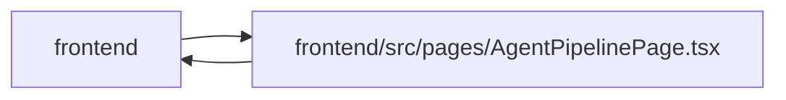

# AgentPipelinePage Module

**Path:** `frontend/src/pages/AgentPipelinePage.tsx`

## Description

_Auto-generated from `frontend/src/pages/AgentPipelinePage.tsx`._

## Imports

| Source | Symbols |
|--------|---------|
| `../components/agent/TaskRoutingPanel` | `TaskRoutingPanel` |
| `../components/feedback/QueryState` | `QueryEmptyState`, `QueryErrorState`, `QueryLoadingState`, `QueryStaleState` |
| `../components/settings/AdminAccessGate` | `AdminAccessGate` |
| `../components/ui` | `MetricGrid`, `PageHeader`, `PageLayout` |
| `../components/ui/SlideOverDrawer` | `SlideOverDrawer` |
| `../hooks/useAdminAccess` | `useAdminAccess` |
| `../hooks/useAgentAccess` | `useAgentAccess` |
| `../services/agentService` | `agentService` |
| `../types/agent` | `AgentModelTrustState`, `TaskTimelineItem` |
| `../types/task` | `Task`, `TaskStatus` |
| `../utils/apiError` | `getApiErrorStatus` |
| `../utils/formatDate` | `formatDateTime` |
| `../utils/protectedQueries` | `protectedQueryRetry` |
| `@tanstack/react-query` | `useQuery` |
| `clsx` | `clsx` |
| `framer-motion` | `motion` |
| `lucide-react` | `CheckCircle2`, `User`, `Calendar`, `Folder`, `RefreshCw`, `Terminal`, `Search`, `Clock`, `AlertTriangle` |
| `react` | `useMemo`, `useState` |
| `react-i18next` | `useTranslation` |

## Module Signals

| Signal | Values |
|--------|--------|
| Exports | `default` |
| Constants | `EMPTY_PIPELINE`, `TIMELINE_ITEM_LABELS`, `RUN_STATUSES`, `MODEL_TRUST_STATES`, `TASK_STATUSES` |
| Module calls | `RUN_STATUSES = Set`, `MODEL_TRUST_STATES = Set`, `TASK_STATUSES = Set` |

## Local dependency map

<!-- Auto-generated local dependency summary. Do not edit by hand. -->

> Module-level dependencies exceed the generated-diagram limits, so the diagram and table below group them by top-level package. Counts report the number of module neighbors in each package.

### Internal neighbors

| Direction | Module |
|---|---|
| Inbound | `frontend` (1) |
| Outbound | `frontend` (13) |

### External packages

| Language | Used packages | Undeclared packages |
|---|---:|---:|
| typescript | 6 | 0 |

> All 14 module neighbor(s) are summarized by package because the module-level view exceeds the 12-node limit.

## Functions

| Function | Signature | Decorators | Description |
|----------|-----------|------------|-------------|
| `AgentPipelinePage` | `()` | — | — |
