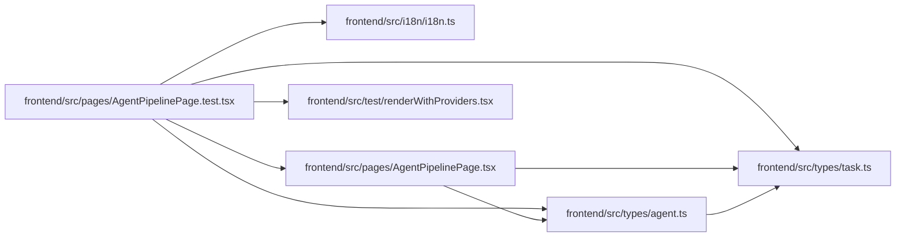

# AgentPipelinePage.test Module

**Path:** `frontend/src/pages/AgentPipelinePage.test.tsx`

## Description

_Auto-generated from `frontend/src/pages/AgentPipelinePage.test.tsx`._

## Imports

| Source | Symbols |
|--------|---------|
| `../i18n/i18n` | `i18n` |
| `../test/renderWithProviders` | `renderWithProviders` |
| `../types/agent` | `AgentPipeline`, `AgentRun`, `TaskTimelineResponse` |
| `../types/task` | `Task` |
| `./AgentPipelinePage` | `AgentPipelinePage` |
| `@testing-library/react` | `screen`, `waitFor` |
| `vitest` | `beforeEach`, `describe`, `expect`, `it`, `vi` |

## Module Signals

| Signal | Values |
|--------|--------|
| Constants | `agentServiceMock`, `useAdminAccessMock`, `useAgentAccessMock`, `sensitive`, `taskFixture`, `pipelineFixture`, `timelineFixture` |
| Module calls | `agentServiceMock = hoisted`, `useAdminAccessMock = hoisted`, `useAgentAccessMock = hoisted`, `mock`, `mock`, `mock`, `mock`, `describe` |

## Local dependency map

<!-- Auto-generated local dependency summary. Do not edit by hand. -->

### Internal neighbors

| Direction | Module |
|---|---|
| Outbound | [i18n](../modules/i18n.md) |
| Outbound | [AgentPipelinePage](../modules/AgentPipelinePage.md) |
| Outbound | [renderWithProviders](../modules/renderWithProviders.md) |
| Outbound | [types_agent](../modules/types_agent.md) |
| Outbound | [types_task](../modules/types_task.md) |

### External packages

| Language | Used packages | Undeclared packages |
|---|---:|---:|
| typescript | 2 | 0 |
