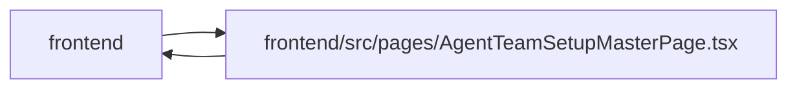

# AgentTeamSetupMasterPage Module

**Path:** `frontend/src/pages/AgentTeamSetupMasterPage.tsx`

## Description

The responsive setup workflow keeps current blockers and recovery actions reachable outside the desktop rail. Known mobile blocker codes have English and Russian recovery labels; raw codes remain secondary diagnostics. Unknown codes retain a general recovery instruction and their original diagnostic value. Configuration, package acknowledgment and observed runtime readiness remain distinct.

_Auto-generated from `frontend/src/pages/AgentTeamSetupMasterPage.tsx`._

## Imports

| Source | Symbols |
|--------|---------|
| `../components/layout/Breadcrumbs` | `Breadcrumbs` |
| `../components/settings/AdminAccessGate` | `AdminAccessGate` |
| `../components/ui/MasterProgress` | `MasterProgress` |
| `../features/agentTeamSetup/manifest` | `parseAgentTeamMasterEditor` |
| `../features/agentTeamSetup/masters` | `AGENT_TEAM_STEP_DEFINITIONS`, `stateTone`, `AgentTeamStepId` |
| `../features/agentTeamSetup/statusScopes` | `deriveAgentTeamStatusScopes`, `RuntimeReadinessState`, `SessionAuthorityState`, `TopologyConfigurationState` |
| `../features/agentTeamSetup/useAgentTeamReadiness` | `useAgentTeamReadiness` |
| `../services/agentService` | `agentService` |
| `../types/agent` | `AgentTeamApplyResponse`, `AgentTeamMaster`, `AgentTeamPlan`, `AgentTeamPlanAction`, `AgentTeamValidation` |
| `../utils/focusLifecycle` | `captureFocusOrigin`, `focusOwnedTarget` |
| `../utils/formatDate` | `formatDateTime` |
| `@tanstack/react-query` | `useMutation`, `useQueryClient` |
| `axios` | `axios` |
| `lucide-react` | `Check`, `ChevronDown`, `CircleAlert`, `FileJson`, `KeyRound`, `LoaderCircle`, `RefreshCw`, `ShieldCheck` |
| `react` | `useEffect`, `useMemo`, `useRef`, `useState` |
| `react-i18next` | `useTranslation` |

## Module Signals

| Signal | Values |
|--------|--------|
| Exports | `default` |
| Constants | `topologyTone`, `authorityTone`, `runtimeTone`, `AGENT_TEAM_STEP_SCOPES`, `AGENT_TEAM_OPERATION_KEYS`, `AGENT_TEAM_RECONCILIATION_KEYS`, `AGENT_TEAM_APPLY_STATUS_KEYS`, `AGENT_TEAM_APPLY_STATUS_TONES`, `AGENT_TEAM_ACTION_STATUS_KEYS`, `AGENT_TEAM_ACTION_STATUS_TONES` |

## Local dependency map

<!-- Auto-generated local dependency summary. Do not edit by hand. -->

> Module-level dependencies exceed the generated-diagram limits, so the diagram and table below group them by top-level package. Counts report the number of module neighbors in each package.

### Internal neighbors

| Direction | Module |
|---|---|
| Inbound | `frontend` (1) |
| Outbound | `frontend` (11) |

### External packages

| Language | Used packages | Undeclared packages |
|---|---:|---:|
| typescript | 5 | 0 |

> All 12 module neighbor(s) are summarized by package because the module-level view exceeds the 12-node limit.

## Classes

| Class | Kind | Line | Bases / Target | Description |
|-------|------|------|----------------|-------------|
| [WorkflowFocusIntent](../entities/WorkflowFocusIntent.md) | Class | 144 | — | — |
| [StatusTone](../entities/StatusTone.md) | Type alias | 61 | — | — |
| [AgentTeamStepScope](../entities/AgentTeamStepScope.md) | Type alias | 62 | — | — |
| [AgentTeamActionReceiptStatus](../entities/AgentTeamActionReceiptStatus.md) | Type alias | 141 | — | — |
| [WorkflowFocusTarget](../entities/WorkflowFocusTarget.md) | Type alias | 142 | — | — |