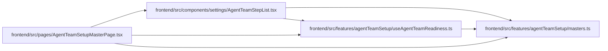

# AgentTeamStepList Module

**Path:** `frontend/src/components/settings/AgentTeamStepList.tsx`

## Description

The navigation-only collaborator renders the same authority/topology/runtime step groups and current/done states using incumbent tokens. It owns no reconciliation query, mutation, credential delivery or runtime-acceptance decision.

_Auto-generated from `frontend/src/components/settings/AgentTeamStepList.tsx`._

## Imports

| Source | Symbols |
|--------|---------|
| `../../features/agentTeamSetup/masters` | `AGENT_TEAM_STEP_DEFINITIONS`, `stateTone`, `AgentTeamStepId` |
| `../../features/agentTeamSetup/useAgentTeamReadiness` | `useAgentTeamReadiness` |
| `lucide-react` | `Check` |
| `react-i18next` | `useTranslation` |

## Module Signals

| Signal | Values |
|--------|--------|
| Exports | `AgentTeamStepList` |
| Constants | `AGENT_TEAM_STEP_SCOPES` |

## Local dependency map

<!-- Auto-generated local dependency summary. Do not edit by hand. -->

### Internal neighbors

| Direction | Module |
|---|---|
| Inbound | [AgentTeamSetupMasterPage](../modules/AgentTeamSetupMasterPage.md) |
| Outbound | [agentTeamSetup_masters](../modules/agentTeamSetup_masters.md) |
| Outbound | [useAgentTeamReadiness](../modules/useAgentTeamReadiness.md) |

### External packages

| Language | Used packages | Undeclared packages |
|---|---:|---:|
| typescript | 2 | 0 |

## Classes

| Class | Kind | Line | Bases / Target | Description |
|-------|------|------|----------------|-------------|
| [AgentTeamStepScope](../entities/AgentTeamStepScope.md) | Type alias | 6 | — | — |

## Functions

| Function | Signature | Decorators | Description |
|----------|-----------|------------|-------------|
| `AgentTeamStepList` | `({     currentStepId,     idPrefix,     steps, }: {     currentStepId: AgentTeamStepId \| null;     idPrefix: string;     steps: ReturnType<typeof useAgentTeamReadiness>['steps']; })` | — | — |