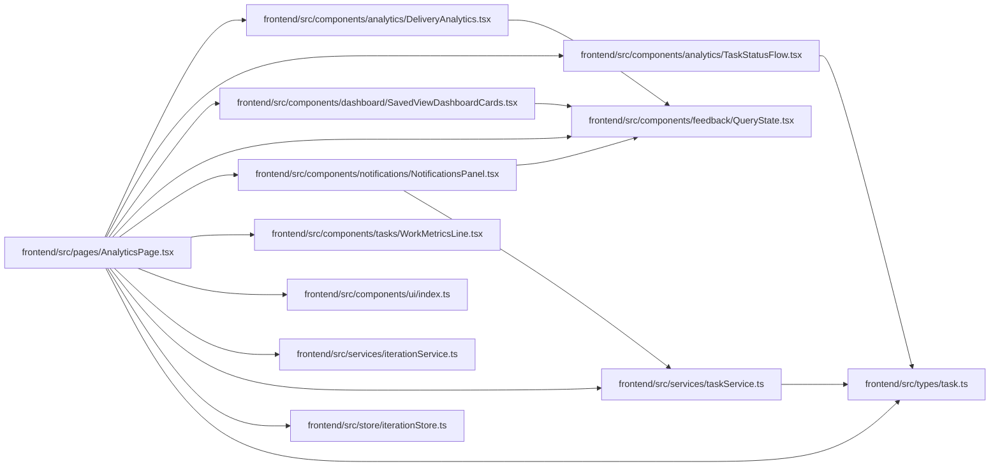

# AnalyticsPage Module

**Path:** `frontend/src/pages/AnalyticsPage.tsx`

## Description

_Auto-generated from `frontend/src/pages/AnalyticsPage.tsx`._

## Imports

| Source | Symbols |
|--------|---------|
| `../components/analytics/DeliveryAnalytics` | `DeliveryAnalytics` |
| `../components/analytics/TaskStatusFlow` | `TaskStatusFlow` |
| `../components/dashboard/SavedViewDashboardCards` | `SavedViewDashboardCards` |
| `../components/feedback/QueryState` | `QueryErrorState` |
| `../components/notifications/NotificationsPanel` | `NotificationsPanel` |
| `../components/tasks/WorkMetricsLine` | `WorkMetricsLine` |
| `../components/ui` | `PageHeader`, `PageLayout` |
| `../services/iterationService` | `iterationService` |
| `../services/taskService` | `taskService` |
| `../store/iterationStore` | `useIterationStore` |
| `../types/task` | `TaskStatusLog` |
| `@tanstack/react-query` | `useQuery` |
| `react-i18next` | `useTranslation` |
| `react-router-dom` | `useNavigate` |

## Module Signals

| Signal | Values |
|--------|--------|
| Exports | `default` |

## Local dependency map

<!-- Auto-generated local dependency summary. Do not edit by hand. -->

### Internal neighbors

| Direction | Module |
|---|---|
| Outbound | [DeliveryAnalytics](../modules/DeliveryAnalytics.md) |
| Outbound | [TaskStatusFlow](../modules/TaskStatusFlow.md) |
| Outbound | [SavedViewDashboardCards](../modules/SavedViewDashboardCards.md) |
| Outbound | [QueryState](../modules/QueryState.md) |
| Outbound | [NotificationsPanel](../modules/NotificationsPanel.md) |
| Outbound | [WorkMetricsLine](../modules/WorkMetricsLine.md) |
| Outbound | [index](../modules/index.md) |
| Outbound | [iterationService](../modules/iterationService.md) |
| Outbound | [taskService](../modules/taskService.md) |
| Outbound | [iterationStore](../modules/iterationStore.md) |
| Outbound | [types_task](../modules/types_task.md) |

### External packages

| Language | Used packages | Undeclared packages |
|---|---:|---:|
| typescript | 3 | 0 |

## Classes

| Class | Kind | Line | Bases / Target | Description |
|-------|------|------|----------------|-------------|
| [HistoryGroup](../entities/HistoryGroup.md) | Class | 16 | — | — |
