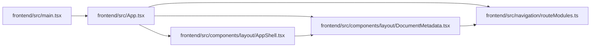

# App Module

**Path:** `frontend/src/App.tsx`

## Description

_Auto-generated from `frontend/src/App.tsx`._

## Imports

| Source | Symbols |
|--------|---------|
| `./components/layout/AppShell` | `AppShell` |
| `./components/layout/DocumentMetadata` | `DocumentMetadata` |
| `./navigation/routeModules` | `routeModuleLoaders` |
| `lucide-react` | `LoaderCircle` |
| `react` | `lazy`, `Suspense` |
| `react-i18next` | `useTranslation` |
| `react-router-dom` | `Route`, `Routes` |

## Module Signals

| Signal | Values |
|--------|--------|
| Exports | `RouteLoadingState`, `default` |
| Constants | `OverviewPage`, `LandingPage`, `PlanPage`, `PlanMasterPage`, `PlanSharePage`, `CalendarPage`, `IterationsPage`, `TeamPage`, `TasksPage`, `TriagePage`, `ProjectsPage`, `ProjectDetailPage`, `ProjectReleaseDetailPage`, `RoadmapPage`, `GanttPage`, `AnalyticsPage`, `SettingsPage`, `AgentPipelinePage`, `AgentTeamSetupMasterPage`, `NotFoundPage` |
| Module calls | `OverviewPage = lazy`, `LandingPage = lazy`, `PlanPage = lazy`, `PlanMasterPage = lazy`, `PlanSharePage = lazy`, `CalendarPage = lazy`, `IterationsPage = lazy`, `TeamPage = lazy`, `TasksPage = lazy`, `TriagePage = lazy`, `ProjectsPage = lazy`, `ProjectDetailPage = lazy`, `ProjectReleaseDetailPage = lazy`, `RoadmapPage = lazy`, `GanttPage = lazy`, `AnalyticsPage = lazy`, `SettingsPage = lazy`, `AgentPipelinePage = lazy`, `AgentTeamSetupMasterPage = lazy`, `NotFoundPage = lazy` |

## Local dependency map

<!-- Auto-generated local dependency summary. Do not edit by hand. -->

### Internal neighbors

| Direction | Module |
|---|---|
| Inbound | [src_main](../modules/src_main.md) |
| Outbound | [AppShell](../modules/AppShell.md) |
| Outbound | [DocumentMetadata](../modules/DocumentMetadata.md) |
| Outbound | [routeModules](../modules/routeModules.md) |

### External packages

| Language | Used packages | Undeclared packages |
|---|---:|---:|
| typescript | 4 | 0 |

## Functions

| Function | Signature | Decorators | Description |
|----------|-----------|------------|-------------|
| `App` | `()` | — | — |
| `RouteLoadingState` | `()` | — | — |
