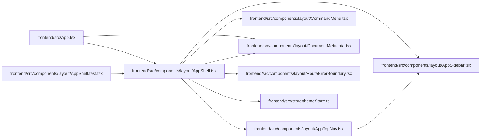

# AppShell Module

**Path:** `frontend/src/components/layout/AppShell.tsx`

## Description

_Auto-generated from `frontend/src/components/layout/AppShell.tsx`._

## Imports

| Source | Symbols |
|--------|---------|
| `../../store/themeStore` | `useThemeStore` |
| `./AppSidebar` | `AppSidebar` |
| `./AppTopNav` | `AppTopNav` |
| `./CommandMenu` | `CommandMenu` |
| `./DocumentMetadata` | `DocumentMetadata` |
| `./RouteErrorBoundary` | `RouteErrorBoundary` |
| `framer-motion` | `MotionConfig` |
| `react` | `ReactNode`, `useEffect`, `useRef` |
| `react-i18next` | `useTranslation` |
| `react-router-dom` | `useLocation` |

## Module Signals

| Signal | Values |
|--------|--------|
| Exports | `AppShell` |
| Constants | `SCROLL_LOCK_PATHS` |

## Local dependency map

<!-- Auto-generated local dependency summary. Do not edit by hand. -->

### Internal neighbors

| Direction | Module |
|---|---|
| Inbound | [App](../modules/App.md) |
| Inbound | [AppShell.test](../modules/AppShell.test.md) |
| Outbound | [AppSidebar](../modules/AppSidebar.md) |
| Outbound | [AppTopNav](../modules/AppTopNav.md) |
| Outbound | [CommandMenu](../modules/CommandMenu.md) |
| Outbound | [DocumentMetadata](../modules/DocumentMetadata.md) |
| Outbound | [RouteErrorBoundary](../modules/RouteErrorBoundary.md) |
| Outbound | [themeStore](../modules/themeStore.md) |

### External packages

| Language | Used packages | Undeclared packages |
|---|---:|---:|
| typescript | 4 | 0 |

## Functions

| Function | Signature | Decorators | Description |
|----------|-----------|------------|-------------|
| `AppShell` | `({ children }: { children: ReactNode })` | — | — |
