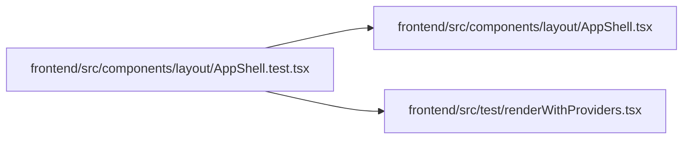

# AppShell.test Module

**Path:** `frontend/src/components/layout/AppShell.test.tsx`

## Description

_Auto-generated from `frontend/src/components/layout/AppShell.test.tsx`._

## Imports

| Source | Symbols |
|--------|---------|
| `../../test/renderWithProviders` | `renderWithProviders` |
| `./AppShell` | `AppShell` |
| `@testing-library/react` | `screen` |
| `react` | `useLayoutEffect`, `useRef`, `ReactNode` |
| `react-router-dom` | `useLocation`, `useNavigate` |
| `vitest` | `describe`, `expect`, `it`, `vi` |

## Module Signals

| Signal | Values |
|--------|--------|
| Module calls | `mock`, `mock`, `mock`, `mock`, `mock`, `describe` |

## Local dependency map

<!-- Auto-generated local dependency summary. Do not edit by hand. -->

### Internal neighbors

| Direction | Module |
|---|---|
| Outbound | [AppShell](../modules/AppShell.md) |
| Outbound | [renderWithProviders](../modules/renderWithProviders.md) |

### External packages

| Language | Used packages | Undeclared packages |
|---|---:|---:|
| typescript | 4 | 0 |
