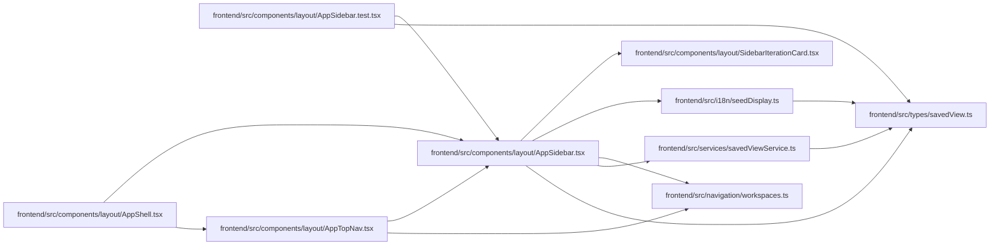

# AppSidebar Module

**Path:** `frontend/src/components/layout/AppSidebar.tsx`

## Description

_Auto-generated from `frontend/src/components/layout/AppSidebar.tsx`._

## Imports

| Source | Symbols |
|--------|---------|
| `../../i18n/seedDisplay` | `savedViewDisplay` |
| `../../navigation/workspaces` | `getWorkspaceForPath`, `NavItem` |
| `../../services/savedViewService` | `savedViewService` |
| `../../types/savedView` | `SavedView` |
| `./SidebarIterationCard` | `SidebarIterationCard` |
| `@tanstack/react-query` | `useQuery` |
| `lucide-react` | `ArrowRight`, `Bookmark`, `ChevronRight`, `ListFilter`, `Search`, `Sparkles`, `TriangleAlert` |
| `react` | `useEffect`, `useId`, `useRef`, `useState` |
| `react-i18next` | `useTranslation` |
| `react-router-dom` | `Link`, `useLocation` |

## Module Signals

| Signal | Values |
|--------|--------|
| Exports | `AppSidebar`, `SidebarAttentionAction`, `SidebarContent` |
| Constants | `SYSTEM_VIEW_ORDER`, `SAVED_VIEW_ROUTE_PATHS`, `COMPACT_SAVED_VIEW_LIMIT`, `SAVED_VIEW_SEARCH_LIMIT`, `SAVED_VIEW_TYPES` |
| Module calls | `SAVED_VIEW_ROUTE_PATHS = Set` |

## Local dependency map

<!-- Auto-generated local dependency summary. Do not edit by hand. -->

### Internal neighbors

| Direction | Module |
|---|---|
| Inbound | [AppShell](../modules/AppShell.md) |
| Inbound | [AppSidebar.test](../modules/AppSidebar.test.md) |
| Inbound | [AppTopNav](../modules/AppTopNav.md) |
| Outbound | [SidebarIterationCard](../modules/SidebarIterationCard.md) |
| Outbound | [seedDisplay](../modules/seedDisplay.md) |
| Outbound | [workspaces](../modules/workspaces.md) |
| Outbound | [savedViewService](../modules/savedViewService.md) |
| Outbound | [savedView](../modules/savedView.md) |

### External packages

| Language | Used packages | Undeclared packages |
|---|---:|---:|
| typescript | 5 | 0 |

## Classes

| Class | Kind | Line | Bases / Target | Description |
|-------|------|------|----------------|-------------|
| [SidebarAttentionAction](../entities/SidebarAttentionAction.md) | Class | 24 | — | — |

## Functions

| Function | Signature | Decorators | Description |
|----------|-----------|------------|-------------|
| `SidebarContent` | `({     attentionAction,     onNavigate, }: {     attentionAction?: SidebarAttentionAction;     onNavigate?: () => void; })` | — | — |
| `AppSidebar` | `()` | — | — |
