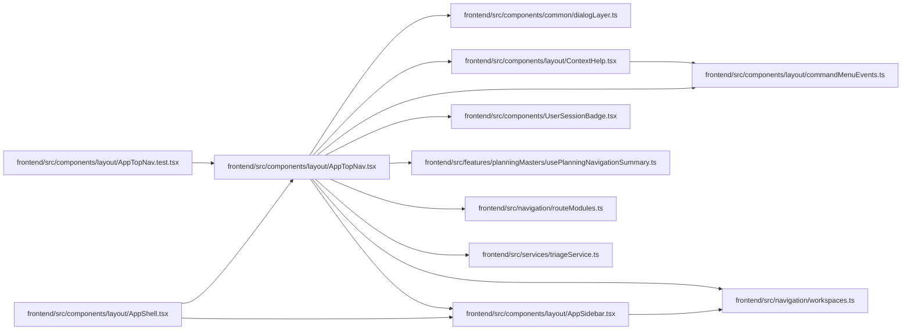

# AppTopNav Module

**Path:** `frontend/src/components/layout/AppTopNav.tsx`

## Description

_Auto-generated from `frontend/src/components/layout/AppTopNav.tsx`._

## Imports

| Source | Symbols |
|--------|---------|
| `../../features/planningMasters/usePlanningNavigationSummary` | `usePlanningNavigationSummary` |
| `../../navigation/routeModules` | `warmRouteModule` |
| `../../navigation/workspaces` | `getWorkspaceForPath`, `WORKSPACES`, `WorkspaceMetadata` |
| `../../services/triageService` | `triageService` |
| `../UserSessionBadge` | `UserSessionBadge` |
| `../common/dialogLayer` | `useDialogLayer` |
| `./AppSidebar` | `SidebarContent`, `SidebarAttentionAction` |
| `./ContextHelp` | `ContextHelp` |
| `./commandMenuEvents` | `openCommandMenu` |
| `@tanstack/react-query` | `useQuery` |
| `lucide-react` | `AlertTriangle`, `Command`, `Menu`, `X` |
| `react` | `useEffect`, `useRef`, `useState` |
| `react-i18next` | `useTranslation` |
| `react-router-dom` | `Link`, `useLocation` |

## Module Signals

| Signal | Values |
|--------|--------|
| Exports | `AppTopNav` |
| Constants | `MOBILE_NAV_TITLE_ID` |

## Local dependency map

<!-- Auto-generated local dependency summary. Do not edit by hand. -->

### Internal neighbors

| Direction | Module |
|---|---|
| Inbound | [AppShell](../modules/AppShell.md) |
| Inbound | [AppTopNav.test](../modules/AppTopNav.test.md) |
| Outbound | [dialogLayer](../modules/dialogLayer.md) |
| Outbound | [AppSidebar](../modules/AppSidebar.md) |
| Outbound | [commandMenuEvents](../modules/commandMenuEvents.md) |
| Outbound | [ContextHelp](../modules/ContextHelp.md) |
| Outbound | [UserSessionBadge](../modules/UserSessionBadge.md) |
| Outbound | [usePlanningNavigationSummary](../modules/usePlanningNavigationSummary.md) |
| Outbound | [routeModules](../modules/routeModules.md) |
| Outbound | [workspaces](../modules/workspaces.md) |
| Outbound | [triageService](../modules/triageService.md) |

### External packages

| Language | Used packages | Undeclared packages |
|---|---:|---:|
| typescript | 5 | 0 |

## Classes

| Class | Kind | Line | Bases / Target | Description |
|-------|------|------|----------------|-------------|
| [WorkspaceAttention](../entities/WorkspaceAttention.md) | Class | 18 | — | — |

## Functions

| Function | Signature | Decorators | Description |
|----------|-----------|------------|-------------|
| `AppTopNav` | `()` | — | — |
