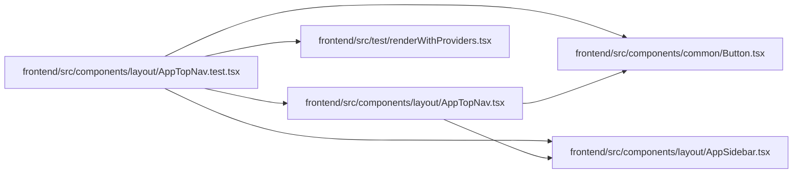

# AppTopNav.test Module

**Path:** `frontend/src/components/layout/AppTopNav.test.tsx`

## Description

_Auto-generated from `frontend/src/components/layout/AppTopNav.test.tsx`._

## Imports

| Source | Symbols | Type-only | Runtime emission |
|--------|---------|-----------|------------------|
| `../../components/common/Button` | `Button` | — | compiler-dependent |
| `../../test/renderWithProviders` | `renderWithProviders` | — | compiler-dependent |
| `./AppSidebar` | `AppSidebar` | — | compiler-dependent |
| `./AppTopNav` | `AppTopNav` | — | compiler-dependent |
| `@testing-library/react` | `screen`, `waitFor`, `within` | — | compiler-dependent |
| `vitest` | `beforeEach`, `describe`, `expect`, `it`, `vi` | — | compiler-dependent |

## Module Signals

| Signal | Values |
|--------|--------|
| Constants | `planningSummaryMock`, `triageServiceMock`, `scopeServiceMocks`, `DESTINATION_NAMES` |
| Module calls | `planningSummaryMock = hoisted`, `triageServiceMock = hoisted`, `scopeServiceMocks = hoisted`, `mock`, `mock`, `mock`, `mock`, `mock`, `mock`, `describe` |

## Local dependency map

<!-- Auto-generated local dependency summary. Do not edit by hand. -->

```mermaid
flowchart LR
    n0["frontend/src/components/common/Button.tsx"]
    n1["frontend/src/components/layout/AppSidebar.tsx"]
    n2["frontend/src/components/layout/AppTopNav.test.tsx"]
    n3["frontend/src/components/layout/AppTopNav.tsx"]
    n4["frontend/src/test/renderWithProviders.tsx"]
    n2 --> n0
    n2 --> n1
    n2 --> n3
    n2 --> n4
    n3 --> n0
    n3 --> n1
    click n0 "../modules/Button.md"
    click n1 "../modules/AppSidebar.md"
    click n2 "../modules/AppTopNav.test.md"
    click n3 "../modules/AppTopNav.md"
    click n4 "../modules/renderWithProviders.md"
```

### Internal neighbors

| Direction | Module |
|---|---|
| Outbound | [Button](../modules/Button.md) |
| Outbound | [AppSidebar](../modules/AppSidebar.md) |
| Outbound | [AppTopNav](../modules/AppTopNav.md) |
| Outbound | [renderWithProviders](../modules/renderWithProviders.md) |

### External packages

| Language | Used packages | Undeclared packages |
|---|---:|---:|
| typescript | 2 | 0 |
